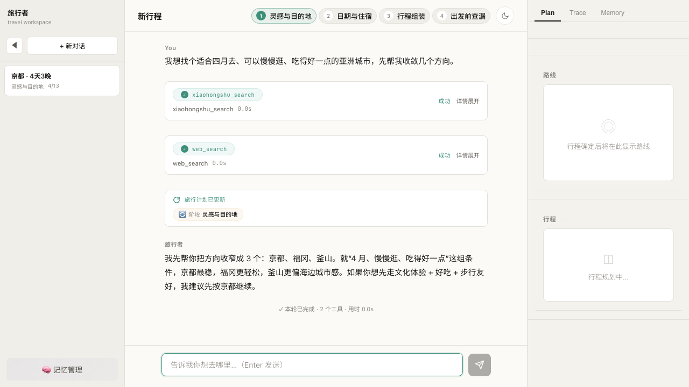

English | [简体中文](README.zh-CN.md)

<p align="center">
  
</p>

# Travel Agent Pro — Reliable Long-Horizon Planning Agent

A travel-planning agent whose real subject is the **agent runtime**: bounded autonomy,
parallel workers with versioned candidates, mid-run steering, partial replanning, and
trace-based evaluation. Travel planning is the validation domain.

> **Portfolio prototype** — independent work, no production users. Reliability claims are
> backed by automated tests, executable golden evals, fault injection, and deterministic
> trace grading — not live traffic.

[](https://github.com/melonxi/travel_agent_pro/actions/workflows/ci.yml)



*UI captured from the scripted demo fixture (deterministic playback, no live LLM).
Engineering evidence lives in [`docs/evidence/`](docs/evidence/portfolio-proof.md).*

## Three problems this runtime actually solves

**1. Parallel workers must not silently lose a day.**
Phase 3 fans out per-day workers. Every proposal lands in a versioned candidate store
(`accepted` / `rejected`; superseded proposals are tracked via `status_reason`); only
accepted versions commit to the plan, all commits flow through a single writer, and a
failed redispatch rolls back instead of leaving a half-written day.
Code: [`agent/phase3/orchestrator.py`](backend/agent/phase3/orchestrator.py) ·
[`agent/phase3/candidate_store.py`](backend/agent/phase3/candidate_store.py) ·
[`state/plan_writers.py`](backend/state/plan_writers.py) —
Tests: [`test_orchestrator.py`](backend/tests/test_orchestrator.py) ·
[`test_phase3_candidate_store.py`](backend/tests/test_phase3_candidate_store.py) ·
[`test_day_worker.py`](backend/tests/test_day_worker.py)

**2. Users must be able to steer a run that is already executing.**
`POST /api/chat/{session_id}/steer` queues guidance while the agent runs; the queue
drains only at safe boundaries — never between an assistant `tool_call` and its
`tool_result` — so steering cannot corrupt the tool protocol.
Code: [`agent/steering.py`](backend/agent/steering.py) —
Tests: [`test_steering.py`](backend/tests/test_steering.py)

**3. “It works” must be checkable after the fact.**
Every run writes a SQLite flight recorder (LLM calls, tool I/O, state diffs, phase
gates). A deterministic trace grader evaluates rubrics over those events; 40 YAML golden
cases and fault-injection scenarios assert on the results.
Code: [`telemetry/trace_recorder.py`](backend/telemetry/trace_recorder.py) ·
[`evals/trace_grader.py`](backend/evals/trace_grader.py) ·
[`evals/runner.py`](backend/evals/runner.py) —
Tests: [`test_trace_api.py`](backend/tests/test_trace_api.py) ·
[`test_eval_pipeline.py`](backend/tests/test_eval_pipeline.py)

## Verified status (2026-07-17)

| Signal | Result | How to verify |
|--------|--------|---------------|
| CI on every push | A0 core suite + golden-case count + frontend build | [`ci.yml`](.github/workflows/ci.yml) |
| Full unit suite | **2054 passed** | `cd backend && OTEL_SDK_DISABLED=true uv run pytest -q -m "not integration"` |
| A0 core reliability suite | **269 passed** (no API keys needed) | `./scripts/run-a0-core.sh` |
| Golden eval cases | **40** executable YAML cases (count asserted in CI) | [`backend/evals/golden_cases/`](backend/evals/golden_cases) |
| Fault injection | **F1–F6 pass**, F7 partial | [`fault-injection-report.md`](docs/evidence/fault-injection-report.md) |
| Baseline pass@3 | **1.00** on 12 cases — mock executor, not live LLM | [`baseline-summary.md`](docs/evidence/baseline-summary.md) |

How each number was produced, plus what is deliberately **not** claimed:
[`docs/evidence/portfolio-proof.md`](docs/evidence/portfolio-proof.md).

## Architecture

```text
Human-Agent Loop    React UI · SSE · sessions · steer · backtrack
        │  runtime input rebuilt per turn (system / history / user / turn context)
        ▼
Agent Loop          backend/agent/loop.py — bounded think-act-observe iterations
  LLM turn → tool calls → Tool Engine → Plan Writers → validation · phase gate
        │                  (reads run parallel, writes sequential, single writer)
        ├─▶ Phase 3 Orchestrator–Workers    backend/agent/phase3/
        │     parallel day workers · versioned candidates · accepted-only commit
        └─▶ Flight Recorder (SQLite) → Trace Grader → Golden Evals
              backend/telemetry/trace_recorder.py · backend/evals/
```

The outer loop explains why the user keeps interacting (send / stop / continue / steer /
backtrack / switch session); the inner loop explains how one turn advances
`TravelPlanState`. The two-loop mental model is documented in
[`docs/agent/START_HERE.md`](docs/agent/START_HERE.md).

**Why an explicit loop instead of a framework:** phase boundaries, single-writer plan
mutations, the tool protocol, and failure recovery stay under precise, testable control.
The contracts are framework-portable (e.g. to LangGraph); the point is owning the
invariants, not avoiding frameworks.

### Planning phases

| Phase | Purpose | Representative tools |
|-------|---------|----------------------|
| 1 · Inspiration & Destination Lock | Narrow vague intent into a destination | `web_search` (UGC domain-scoped), `quick_travel_search` |
| 2 · Framework Planning | Trip brief, candidate pool, skeletons, transport & lodging locks | `set_trip_brief`, `set_skeleton_plans`, `search_flights`, `search_trains`, `search_accommodations` |
| 3 · Daily Itinerary Assembly | Expand the chosen skeleton into validated day-by-day plans | `optimize_day_route`, `save_day_plan`, `replace_all_day_plans` |
| 4 · Pre-Departure Checklist | Final checks, freeze `travel_plan.md` + `checklist.md` deliverables | `check_weather`, `search_travel_services`, `generate_summary` |

[`PhaseRouter`](backend/phase/router.py) advances phases from plan-state completeness;
Phase 2 opens tools progressively across four substeps (`brief → candidate → skeleton →
lock`). Users can backtrack any phase via `POST /api/backtrack/{session_id}`.

### Quality harness

Five independent layers wrap the loop: **Guardrail** (input sanitization, Chinese
prompt-injection patterns) → **Validator** (hard constraints: budget, dates, null
safety) → **Judge** (LLM soft scoring 1–5 with clamping) → **Feasibility Gate**
(rule-based budget/duration checks over 30+ destination tables, before expensive
planning) → **Cost & latency tracking** per session. Details:
[`docs/agent/deep/harness-architecture.md`](docs/agent/deep/harness-architecture.md).

## Reviewing this repo? Ten-minute tour

1. [`backend/agent/loop.py`](backend/agent/loop.py) — the bounded iteration contract:
   LLM turn, parallel-read / sequential-write tool batches, repair notices, runtime
   rebuild on phase transitions.
2. [`backend/agent/steering.py`](backend/agent/steering.py) — mid-run steering with
   safe-boundary draining.
3. [`backend/agent/phase3/`](backend/agent/phase3) — orchestrator, day workers,
   candidate store: parallelism without lost updates.
4. [`backend/state/plan_writers.py`](backend/state/plan_writers.py) — every plan
   mutation goes through here; workers never write `TravelPlanState` directly.
5. [`backend/telemetry/trace_recorder.py`](backend/telemetry/trace_recorder.py) +
   [`backend/evals/trace_grader.py`](backend/evals/trace_grader.py) — flight recorder
   and deterministic grading.
6. [`backend/evals/runner.py`](backend/evals/runner.py) +
   [`golden_cases/`](backend/evals/golden_cases) — YAML cases → state / tool / text /
   itinerary / trace-grade assertions → JSON reports.
7. [`docs/agent/`](docs/agent) — the docs system agents (and humans) navigate by:
   `START_HERE.md` → task routing → slices → deep dives.

## Stack

- **Backend** — Python 3.12 · FastAPI + `sse-starlette` · Pydantic v2 · OpenAI + Anthropic
  SDKs (dual provider) · OpenTelemetry · pytest (~2000 tests, A0 core subset in CI)
- **Frontend** — TypeScript · React 19 · Vite 6 · Leaflet maps · SSE streaming UI

## Three-minute start

Prerequisites: Python ≥ 3.12, [uv](https://docs.astral.sh/uv/) (or pip), Node ≥ 18.
An OpenAI/Anthropic key is needed **only** for live runs — tests need no keys.

### Configure and run

```bash
# From the repository root:
cp .env.example .env
cp config.example.yaml config.yaml  # optional non-secret overrides

# Edit .env and fill exactly one live provider key.
# Tests and scripted demos do not require provider keys.

cd backend
uv sync --all-extras --frozen
# fallback without uv:
# python -m venv .venv && source .venv/bin/activate && pip install -e ".[dev]"
uv run uvicorn main:app --reload --port 8000
```

`.env` and `config.yaml` belong in the **repository root**, not `backend/`. Environment
variables override the main provider/model in YAML; `config.yaml` controls non-secret
runtime settings and per-phase LLM overrides. Both local files are git-ignored.

### Frontend

```bash
cd frontend
npm ci
npm run dev
# http://localhost:5173 — proxies /api to the backend
```

### Tests

```bash
# One-shot: backend A0 core + frontend build (mirrors CI, no API keys)
./scripts/run-a0-core.sh

# Full unit suite (OTEL_SDK_DISABLED avoids needing Jaeger)
cd backend && OTEL_SDK_DISABLED=true uv run pytest -q -m "not integration"
```

## Observability

OpenTelemetry tracing is on by default — start Jaeger with
`docker compose -f docker-compose.observability.yml up -d` (UI at `localhost:16686`),
or disable with `OTEL_SDK_DISABLED=true`. Independently of OTel, every run persists a
**flight recorder** to SQLite: `trace_runs` / `trace_events` / `trace_artifacts` /
`trace_grades`, with ~20 event families spanning `llm_call`, `tool_result`,
`state_diff`, `phase_gate`, `context_compression`, `phase3_worker`, and more. Large
prompt/tool/deliverable bodies are stored as redacted artifacts with hashes.

Debug one run:

```bash
curl http://127.0.0.1:8000/api/traces/<run_id>
curl -X POST http://127.0.0.1:8000/api/traces/<run_id>/grade
sqlite3 backend/data/sessions.db \
  "select event_type,count(*) from trace_events where run_id='<run_id>' group by event_type;"
```

When a grading rubric fails, `evidence_event_ids` in `trace_grades` points at the exact
`tool_call` / `state_diff` / `phase_gate` rows — so you fix the owning prompt, tool, or
validator instead of guessing from the final answer.

Honest scope: run-scoped persistence, artifact metadata, trace grading, and 40 golden
cases are implemented; retention enforcement, artifact permissions, sampled online eval,
and CI release gates remain future work. Details:
[`docs/agent/slices/observability.md`](docs/agent/slices/observability.md) ·
[`docs/agent/deep/trace-flight-recorder.md`](docs/agent/deep/trace-flight-recorder.md).

## API endpoints (selected)

| Method | Path | Description |
|--------|------|-------------|
| POST | `/api/sessions` | Create a session |
| GET | `/api/sessions` | List all sessions |
| DELETE | `/api/sessions/{session_id}` | Delete a session |
| POST | `/api/chat/{session_id}` | SSE streaming chat |
| POST | `/api/chat/{session_id}/continue` | Continue a paused or interrupted run |
| POST | `/api/chat/{session_id}/steer` | Mid-run steering (queued, safe-boundary drain) |
| POST | `/api/chat/{session_id}/cancel` | Cancel in-flight run |
| POST | `/api/backtrack/{session_id}` | Phase / plan backtrack |
| GET | `/api/plan/{session_id}` | Current travel plan state |
| GET | `/api/memory/{user_id}` | User memory (profile, working memory, episodes) |
| GET | `/api/traces/{run_id}` | Flight-recorder trace |
| POST | `/api/traces/{run_id}/grade` | Deterministic trace grading |
| GET | `/api/sessions/{session_id}/stats` | Cost / token / latency stats |
| GET | `/api/sessions/{session_id}/deliverables/{filename}` | Frozen deliverables |

## Environment variables

| Variable | Required | Description |
|----------|----------|-------------|
| `DEFAULT_PROVIDER` | No | `openai` (default) or `anthropic` |
| `OPENAI_API_KEY` / `ANTHROPIC_API_KEY` | For the chosen provider | API key |
| `OPENAI_MODEL` / `ANTHROPIC_MODEL` | No | Model override |
| `OPENAI_BASE_URL` / `ANTHROPIC_BASE_URL` | No | SDK-compatible custom endpoint |
| `GOOGLE_MAPS_API_KEY` | No | POI details, routes, accommodation and availability tools |
| `OPENWEATHER_API_KEY` | No | Weather and feasibility tools |
| `TAVILY_API_KEY` | No | Web-search fallback |
| `AMADEUS_API_KEY` / `AMADEUS_API_SECRET` | No | Amadeus flight-search branch |
| `FLYAI_API_KEY` | No | FlyAI-backed travel tools |
| `XHS_CLI_BIN` / `XHS_CLI_TIMEOUT` | No | Xiaohongshu CLI executable and timeout overrides |
| `OTEL_SDK_DISABLED` | No | `true` disables tracing (used by CI) |

Start from [`.env.example`](.env.example). Keep secrets out of `config.yaml`; its
`${VARIABLE}` entries resolve values from `.env` or the process environment.

## Project structure

```
travel_agent_pro/
├── backend/
│   ├── main.py                # FastAPI app (health, sessions, plan, chat SSE)
│   ├── agent/                 # Agent loop, steering, hooks, phase3 orchestrator-workers
│   ├── llm/                   # OpenAI / Anthropic providers + factory
│   ├── state/                 # TravelPlanState models + plan writers (single write path)
│   ├── tools/                 # Domain tools: @tool decorated, JSON Schema from type hints
│   ├── phase/                 # Phase prompts, PhaseRouter, backtrack
│   ├── context/               # 4-layer system message assembly + soul.md
│   ├── memory/                # Profile / working memory / episodes + staged recall
│   ├── harness/               # Guardrail, validator, judge, feasibility gate
│   ├── telemetry/             # OTel setup + SQLite flight recorder + session stats
│   ├── evals/                 # Golden cases, runner, trace grader, stability
│   └── tests/                 # ~2000 pytest tests (A0 core subset runs in CI)
├── frontend/                  # React 19 + Vite 6: chat, map, timeline, trace viewer, memory center, recall diagnostics
├── docs/
│   ├── agent/                 # START_HERE → slices → deep (agent-navigable docs)
│   ├── evidence/              # Portfolio proof: baselines, fault injection, traces
│   └── public-source-boundary.md
├── scripts/                   # run-a0-core.sh · demo + failure-analysis harnesses
└── .github/workflows/ci.yml   # A0 core suite + golden-case count + frontend build
```

## Documentation

- [`docs/agent/START_HERE.md`](docs/agent/START_HERE.md) — two-loop mental model, then
  task-routed slices and deep dives ([`docs/agent/INDEX.md`](docs/agent/INDEX.md))
- [`docs/evidence/portfolio-proof.md`](docs/evidence/portfolio-proof.md) — 30-second
  evidence scan: what is claimed, what is measured, what is mock
- [`PROJECT_OVERVIEW.md`](PROJECT_OVERVIEW.md) — full-reference tour
- [`docs/public-source-boundary.md`](docs/public-source-boundary.md) — what is public
  vs. local-only

## License

MIT — see [`LICENSE`](LICENSE).
