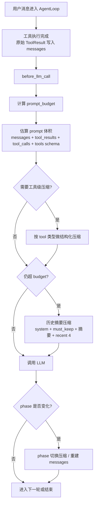
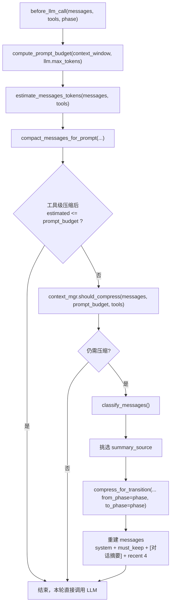
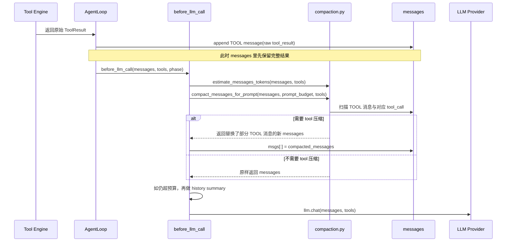
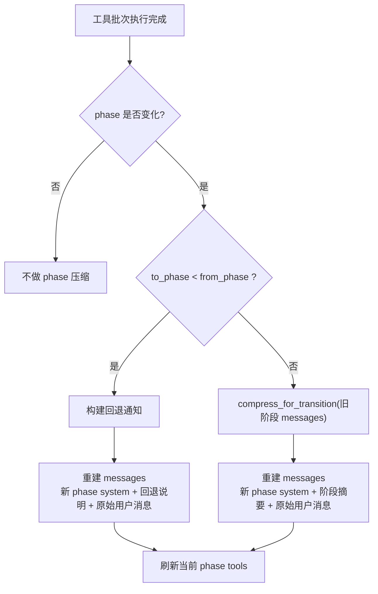

# Context-Aware Compaction Mechanism

## 文档定位

这份文档是项目里描述“当前生效的上下文压缩机制”的权威入口。

如果你想回答下面这些问题，优先看这份文档：

- 系统现在到底有几层压缩
- 每次 LLM 调用前会不会压缩，何时触发
- `prompt_budget` 怎么算
- `web_search` / `xiaohongshu_search` 的压缩规则是什么
- phase 切换时如何重建消息

相关文档的定位：

- `docs/context-aware-compaction-implementation.md`
  - 当前实现说明，和代码保持同步
- `docs/context-aware-compaction-plan.md`
  - 本轮改造前的设计计划，不作为最终行为说明
- `docs/learning/2026-04-06-上下文压缩机制.md`
  - 旧版本学习笔记，描述的是历史实现，不再代表当前代码

## 总览

当前版本把压缩机制收敛为两层：

1. `before_llm_call` 的 pre-LLM 总压缩
2. phase 切换时的阶段压缩

原先独立存在的“工具结果写入时立刻截断”已经移除，其职责并入第一层的 pre-LLM 总压缩。



## 核心原则

这套机制的目标不是“尽量把文本截短”，而是：

1. 让真正发给 LLM 的 prompt 保持在安全预算内。
2. 优先压缩富结果工具 payload，而不是过早压缩普通对话。
3. 保留用户偏好、结构化状态和后续可追踪句柄。
4. 把跨 phase 的上下文传递变成确定性的摘要重建，而不是整段历史搬运。

## 术语说明

### 什么是“富结果工具 payload”

文档里说的“富结果工具 payload”，指的是那些不是简单 `success / failed` 回执，而是会返回大量结构化内容的工具结果。

它们通常有两个特征：

- 字段多
- 单次返回内容长，或者列表很多

在这个项目里，典型例子就是：

- `web_search`
  - `answer`
  - `results[].content`
  - `results[].title / url / score`
- `xiaohongshu_search.search_notes`
  - `items[]`
  - 每条 note 的 `title / liked_count / url`
- `xiaohongshu_search.read_note`
  - `note.desc`
  - `tags`
  - 若干计数字段
- `xiaohongshu_search.get_comments`
  - `comments[]`
  - 每条评论的 `nickname / content / like_count`

和它相对的，是轻量工具结果，例如：

- 只返回一个布尔值
- 只返回一个状态码
- 只返回简短确认文本

当前压缩机制优先处理的，就是这类“内容重、但并不是每个字段都值得继续塞进 LLM 上下文”的富结果 payload。

### “估算 prompt 体积”里的四部分分别是什么

文档里提到：

```text
messages + tool_results + tool_calls + tools schema
```

这里不是说 API 请求里有 4 个完全独立的顶层数组，而是在说明“真正会消耗 prompt token 的 4 类内容”：

- `messages`
  - 普通消息文本本身
  - 例如 system prompt、用户输入、助手自然语言回复
- `tool_results`
  - `messages` 里的 TOOL 消息所携带的 `tool_result.data`
  - 也就是工具真正返回的结果正文
- `tool_calls`
  - `messages` 里的 assistant tool call 信息
  - 主要是 `tool_calls[].arguments`
  - 这部分虽然不是最终结果，但参数 JSON 也会占 token
- `tools schema`
  - 本轮调用时一起发给模型的工具定义
  - 包括工具名、描述、参数 schema
  - 这部分不在 `messages` 内，但每次请求 provider 时也会进入 prompt 成本

更准确地说：

- `tool_results` 和 `tool_calls` 是 `messages` 的内部组成部分
- `tools schema` 是请求体里和 `messages` 并列的另一块内容

之所以在文档里拆开写，是为了强调：旧实现主要只看到了“普通文本消息”，而当前实现把这些真正吃 token 的部分都算进去了。

## 实现落点

当前机制主要落在 4 个文件里：

- `backend/agent/compaction.py`
  - prompt budget 计算
  - prompt token 估算
  - rich tool payload 结构化压缩
- `backend/main.py`
  - `before_llm_call` 中编排 pre-LLM 总压缩
- `backend/context/manager.py`
  - `should_compress()` 的判定
  - `compress_for_transition()` 的规则驱动摘要
- `backend/agent/loop.py`
  - 原始 `ToolResult` 写回消息
  - phase 切换后的消息重建入口

## 第一层：Pre-LLM 总压缩

### 触发时机

它不是 phase 切换时才运行，而是每次真正调用 `llm.chat(...)` 之前都运行一次。

因此在一次用户请求里，可能出现这样的顺序：

1. 首轮 LLM 调用前执行一次 pre-LLM 压缩检查
2. LLM 发起 tool calls
3. tool results 写入 `messages`
4. 下一轮 LLM 调用前再次执行 pre-LLM 压缩检查

### Prompt Budget

`prompt_budget` 的公式是：

```text
prompt_budget = context_window - max_output_tokens - safety_margin
```

当前具体取值：

- `context_window`
  - 运行时探测得到的模型上下文窗口
- `max_output_tokens`
  - `config.llm.max_tokens`
- `safety_margin`
  - 固定为 `2000`
- `MIN_PROMPT_BUDGET`
  - 最低不小于 `1024`

这个预算不是估算输出长度，而是“本轮允许 prompt 本身最多占多少 token”的安全上限。

### 预算估算范围

预算估算不再只看 `message.content`。当前会一起估算：

- 用户 / 助手 / system 文本
- assistant 的 `tool_calls.arguments`
- tool message 的 `tool_result.data`
- 当前可用工具的 description + schema

这也是现在 `should_compress()` 会比旧版本更早、更准确感知富工具 payload 的原因。

### 分段阈值

Pre-LLM 总压缩分为 4 个行为分段：

| 分段 | 条件 | 行为 |
|------|------|------|
| No compaction | `usage_ratio < 0.6` 且没有 oversized tool | 原样保留 `messages` |
| Tool compaction / moderate | 进入压缩区，但未达到 aggressive | 仅压 rich tool payload，保留更多正文和更多条目 |
| Tool compaction / aggressive | `usage_ratio >= 0.85`，或单条 TOOL 消息极大 | 更激进地裁剪正文和列表规模 |
| History summary | 工具级压缩后仍超预算 | 生成 `[对话摘要]`，只保留关键消息骨架 |

其中：

- `SOFT_COMPACT_RATIO = 0.6`
- `AGGRESSIVE_COMPACT_RATIO = 0.85`
- `OVERSIZED_TOOL_RATIO = 0.2`
- `OVERSIZED_TOOL_MIN_TOKENS = 600`

### Oversized Tool 判定

系统不会只看整体 `usage_ratio`，还会检查是否存在单条 TOOL 消息过大。

当前 oversized tool 条件为：

- 超过 `prompt_budget * 0.2`
- 同时超过绝对下限 `600 tokens`

进入 aggressive 的单条 TOOL 条件更高：

- 超过比例阈值 `prompt_budget * 0.32`
- 同时超过绝对下限 `1200 tokens`

在当前实现里，aggressive 的单条大消息判定等价于：

```text
largest_tool_tokens >= max(prompt_budget * 0.32, 1200)
```

绝对下限的目的是避免 `read_note` 这类中等正文，在预算还宽松时被过早压缩。

### 执行流程



### Tool 压缩的真实数据流

tool 压缩不是“工具返回时先压，再写入消息”。

当前真实流程是：

1. tool 执行完成
2. `AgentLoop` 先把原始 `ToolResult` 直接写进 `messages`
3. 下一次准备调用 LLM 时，进入 `before_llm_call`
4. `compact_messages_for_prompt(...)` 扫描当前 `messages`
5. 如果判定需要压缩，就从 `messages` 里找出 TOOL 消息，生成压缩副本
6. 用压缩后的 TOOL 消息替换 `messages` 里的原位置
7. 再决定是否还要做历史摘要压缩
8. 最后把改写后的 `messages` 发给 LLM

所以更准确的说法是：

- 先写原始 tool result 到 `messages`
- 再在下次 LLM 调用前，按预算决定是否把其中的 TOOL 消息改写成压缩版本



上面这张图里要注意两点：

- `tool_results` 并不是独立存放在别处，而是作为 TOOL 消息的一部分先进入 `messages`
- tool 压缩本质上是“读当前 `messages`，产出一份替换了部分 TOOL 消息的新 `messages`”

### History Summary 的保留规则

当工具级压缩仍然不足以回到预算内时，系统才进入历史摘要压缩。

此时会：

- 保留原 `system` message
- 保留 `must_keep` 用户偏好消息
- 用一条 `[对话摘要]` 表示旧历史
- 保留最近 `4` 条消息

摘要内容复用 `compress_for_transition()` 的规则驱动渲染逻辑，并且只取最后 `12` 行摘要文本写回。

### Tool 压缩行为

#### `web_search`

| 模式 | answer | snippet | results 数量 | 保留字段 |
|------|--------|---------|--------------|----------|
| moderate | `600` | `300` | 最多 `8` 条 | `title` / `url` / `score` / 截断后的 `content` |
| aggressive | `400` | `200` | 最多 `5` 条 | `title` / `url` / `score` / 截断后的 `content` |

额外行为：

- 保留 `results_omitted_count`

#### `xiaohongshu_search.search_notes`

| 模式 | items 数量 | 保留字段 |
|------|------------|----------|
| moderate | 最多 `12` 条 | `note_id` / `title` / `liked_count` / `note_type` / `url` |
| aggressive | 最多 `8` 条 | `note_id` / `title` / `liked_count` / `note_type` / `url` |

额外行为：

- URL 会被规范化为不带 query 的 canonical URL
- `xsec_token` 等 query 参数不会进入 LLM 上下文
- 保留 `items_omitted_count`

#### `xiaohongshu_search.read_note`

| 模式 | `desc` 限制 | 保留字段 |
|------|-------------|----------|
| moderate | `400` | `note_id` / `title` / `desc` / `liked_count` / `collected_count` / `comment_count` / `share_count` / `tags` / `note_type` / `url` |
| aggressive | `300` | 同上 |

#### `xiaohongshu_search.get_comments`

| 模式 | comments 数量 | 单条评论限制 | 保留字段 |
|------|---------------|--------------|----------|
| moderate | 最多 `12` 条 | `260` | `nickname` / `content` / `like_count` |
| aggressive | 最多 `8` 条 | `200` | `nickname` / `content` / `like_count` |

额外行为：

- 保留 `comments_omitted_count`

### 为什么先压工具，再压历史

在真实旅行规划对话里，最容易膨胀的通常不是普通聊天文本，而是：

- `web_search.results[].content`
- `xiaohongshu_search.search_notes.items`
- `xiaohongshu_search.read_note.note.desc`
- `xiaohongshu_search.get_comments.comments`

如果先摘要普通历史，而不先压这些 payload，大量预算会浪费在重复 snippet、长 URL 和评论列表上。

### 基于真实输出做过的调参

这套规则不是只靠静态阅读代码拍脑袋定的，后续还拿真实 `web_search` 和 `xiaohongshu_search` 输出做过一轮调参。


真实样本带来的结论：

- `xiaohongshu_search.search_notes`
  - 压力主要来自“很多条 item + 很长的 URL”
  - `xsec_token` 的 query 很占空间，但对后续上下文引用价值有限
- `xiaohongshu_search.read_note`
  - 正文长度分布波动很大，不能只用比例阈值粗暴触发 oversized 压缩
- `xiaohongshu_search.get_comments`
  - 压力通常来自条数，而不是超长单条评论
- `web_search`
  - 压力主要来自多条 `results[].content` 叠加，而不是 `answer` 本身

因此当前实现额外做了两件事：

1. `search_notes` 压缩副本移除 URL query，只保留 canonical URL
2. oversized-tool heuristic 加入绝对 token 下限，避免中等长度 `read_note` 被过早压缩

## 第二层：Phase 切换压缩

phase 压缩和 pre-LLM 总压缩是独立的第二层机制。

它只在以下情况触发：

- phase 正常前进
- phase 回退

### 流程图



### 行为规则

phase 压缩不会额外调用摘要 LLM；当前是规则驱动的确定性压缩。

`compress_for_transition()` 的规则是：

- 用户消息原样保留
- 助手文本截到前 `200` 字
- `update_plan_state` 渲染成 `决策: field = value`
- 其他工具渲染成一行结果指纹
- system 消息不进入摘要

换句话说，phase 压缩解决的是“跨阶段如何带着必要上下文继续走”，不是“如何给当前 prompt 省 token”。

## 与旧机制相比的关键变化

### 1. 工具结果不再写入时立刻截断

现在的行为是：

- frontend SSE 仍然收到完整 tool result
- `messages` 里先写入完整 `ToolResult`
- 只有在下一次真正调用 LLM 前，才根据实际 budget 决定是否压缩

这让压缩行为与真实 prompt 成本一致，也避免了无条件早截断。

### 2. 总压缩不再忽略 TOOL 消息

旧实现里，富工具 payload 很容易逃过判定或在摘要阶段被粗暴丢失。

新实现里：

- TOOL payload 会参与预算估算
- TOOL payload 会优先做结构化压缩
- 只有工具级压缩不够时，才会继续压普通历史

### 3. 两层职责更清晰

- pre-LLM 总压缩
  - 负责“这一轮 prompt 能不能安全发出去”
- phase 切换压缩
  - 负责“跨阶段后保留哪些上下文骨架”

## 测试与验证

本轮机制对应的主要测试文件：

- `backend/tests/test_loop_payload_compaction.py`
- `backend/tests/test_context_manager.py`

覆盖重点包括：

- prompt budget 计算
- token estimator 是否覆盖 tool call / tool result / tools schema
- `web_search` 压缩后的正文截断与列表截断
- `xiaohongshu_search.search_notes`
- `xiaohongshu_search.read_note`
- `xiaohongshu_search.get_comments`
- `should_compress()` 是否会把 tool payload 和 tool schema 算进去

本次已通过的回归命令：

```bash
cd backend && .venv/bin/pytest tests/test_loop_payload_compaction.py tests/test_context_manager.py tests/test_agent_loop.py tests/test_api.py -q
```

结果：

- `64 passed`

额外还做过真实输出验证，用于校正压缩策略本身，而不是只验证单测：

- `web_search`
  - `东京迪士尼 官网 门票价格 只看官方`
  - `京都 樱花 几月去最好 攻略`
- `xiaohongshu_search`
  - `search_notes`
  - `read_note`
  - `get_comments`
  - 样本关键词包括：
    - `京都 三日游 攻略`
    - `东京 亲子 攻略`
    - `大阪 美食 攻略`

并额外确认：

- `search_notes` 压缩后得到的 canonical URL，后续真实调用 `read_note` / `get_comments` 仍可成功

## 不变的部分

这次没有改动以下内容：

- `ContextManager.compress_for_transition()` 的核心规则驱动摘要思路
- 前端 tool result 展示协议
- 各工具本身的返回结构定义
- phase 路由与状态推进逻辑

## 一句话总结

当前系统的压缩机制可以概括为：

1. 每次 LLM 调用前，先按真实 prompt 预算对 rich tool payload 做渐进式压缩，必要时再压历史。
2. phase 切换时，再用独立的规则驱动摘要重建跨阶段上下文。
