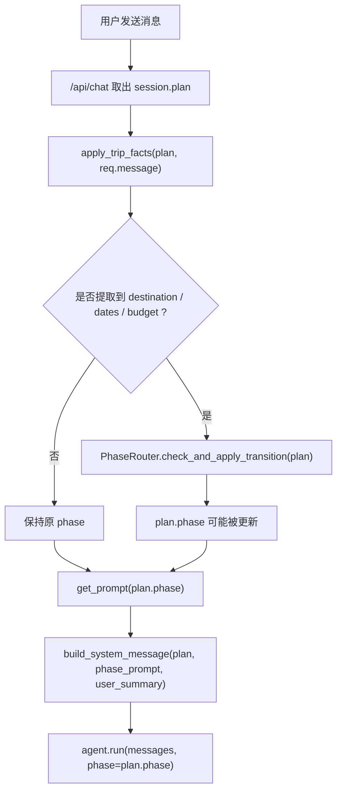
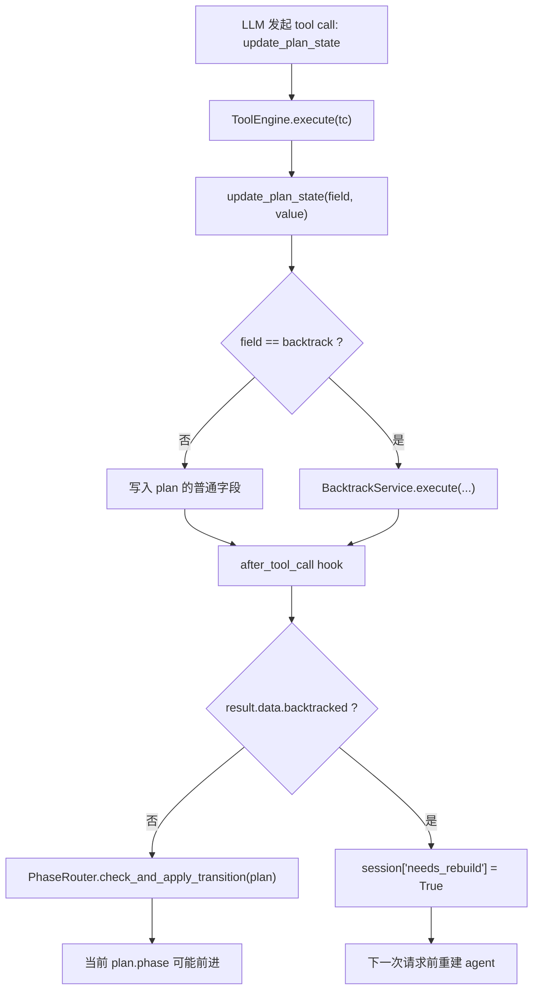
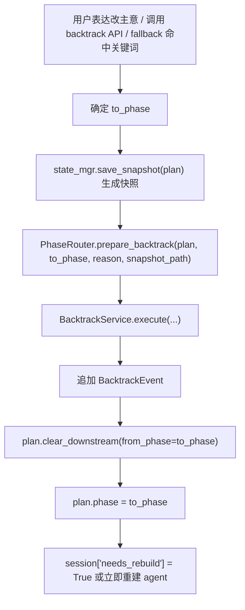
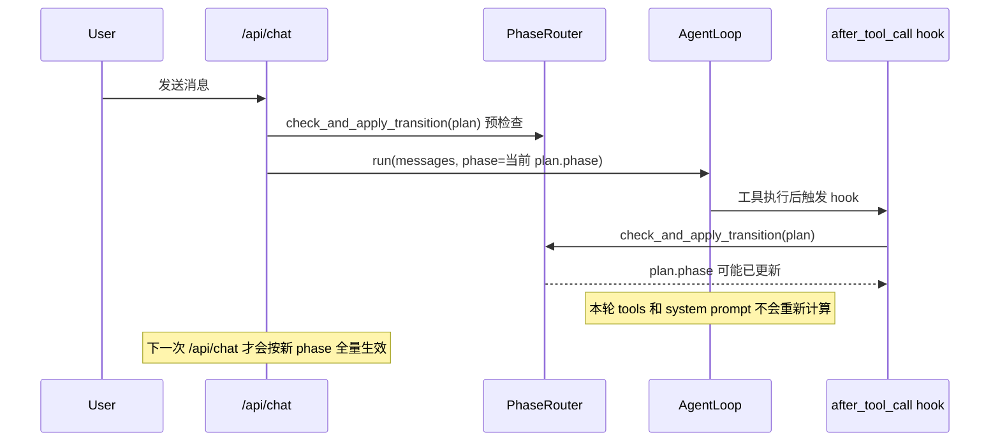

# Travel Agent Pro 的 Phase 更新机制详解

这篇文档专门回答一个问题：

> 当前项目里的 `phase` 到底是怎么被更新的？

结论先说清楚：当前项目的 `phase` 更新机制，不是一个单独函数完成的，而是一条完整的状态链路：

1. 某个入口先把业务事实写进 `TravelPlanState`
2. `PhaseRouter.infer_phase(plan)` 根据状态推断“应该处于哪个阶段”
3. `PhaseRouter.check_and_apply_transition(plan)` 把推断结果写回 `plan.phase`
4. 下一次构建 system prompt、挑选工具、重建 agent 时，再按新的 `phase` 生效

所以，`phase` 本质上是 `TravelPlanState` 上的一个**推断式状态字段**，而不是模型自己声明“我要切换到下一阶段”。

---

## 1. 先建立整体心智模型

在这个项目里，`phase` 不是“流程引擎自己往前走一步”的计数器，而是“当前规划状态的业务标签”。

也就是说：

- 不是先决定 `phase`，再决定状态
- 而是先更新状态，再由状态反推 `phase`

可以把它理解成：

```text
TravelPlanState 是事实层
phase 是对事实层的解释结果
```

比如：

- `destination` 还没有，且 `preferences` 也没有 -> `phase = 1`
- `destination` 有了，但 `dates` 还没有 -> `phase = 3`
- `dates` 和 `accommodation` 都有了，但 `daily_plans` 不够 -> `phase = 5`

这就是为什么这个系统的 phase 会“跳跃式前进”。如果一条消息一次性提供了多个字段，系统可能直接从 1 跳到 4，而不是严格经历 1 -> 2 -> 3 -> 4。

---

## 2. 参与者总览

### 2.1 `TravelPlanState`

文件：`backend/state/models.py`

这是整个 phase 机制的核心状态对象。你可以把它理解为“当前旅行规划的唯一业务真相”。

关键字段含义：

| 字段 | 类型 | 含义 |
|---|---|---|
| `session_id` | `str` | 当前会话 ID |
| `phase` | `int` | 当前阶段编号 |
| `destination` | `str \| None` | 是否已经确定目的地 |
| `dates` | `DateRange \| None` | 是否已经确定日期范围 |
| `accommodation` | `Accommodation \| None` | 是否已经确定住宿区域/酒店 |
| `daily_plans` | `list[DayPlan]` | 已经生成了多少天的日程 |
| `preferences` | `list[Preference]` | 用户偏好，例如节奏、风格、预算倾向 |
| `constraints` | `list[Constraint]` | 约束，例如预算上限、忌口等 |
| `backtrack_history` | `list[BacktrackEvent]` | 历史回退记录 |

这里有一个很重要的认知：

- `phase` 不是独立于其他字段存在的
- `phase` 是对这些字段当前组合状态的压缩表达

### 2.2 `PhaseRouter`

文件：`backend/phase/router.py`

`PhaseRouter` 负责两件事：

1. **根据状态推断 phase**
2. **在需要时把 phase 写回 plan**

它的关键方法有三个：

#### `infer_phase(self, plan: TravelPlanState) -> int`

参数含义：

- `self`: 当前 `PhaseRouter` 实例
- `plan`: 当前会话的旅行规划状态

返回值含义：

- 返回“按当前状态看，系统应该处于哪个 phase”

注意，这个函数**只推断，不落库，不发消息，不重建 agent**。

#### `check_and_apply_transition(self, plan: TravelPlanState) -> bool`

参数含义：

- `plan`: 当前旅行规划状态

返回值含义：

- `True`: `plan.phase` 被改动了
- `False`: 推断结果和原值一样，没有变化

这个函数做的是：

1. 调用 `infer_phase(plan)`
2. 如果结果和 `plan.phase` 不同，就直接执行 `plan.phase = inferred`
3. 同时打一个 OpenTelemetry 的 `phase.transition` span

#### `prepare_backtrack(self, plan, to_phase, reason, snapshot_path) -> None`

参数含义：

- `plan`: 当前旅行规划状态
- `to_phase`: 要回退到的阶段
- `reason`: 回退原因
- `snapshot_path`: 回退前保存的快照路径

这个函数本身不写复杂逻辑，而是把真正的回退执行委托给 `BacktrackService.execute(...)`。

### 2.3 `BacktrackService`

文件：`backend/phase/backtrack.py`

这个类专门处理“向后退”的 phase 更新。

关键方法：

#### `execute(self, plan, to_phase, reason, snapshot_path) -> None`

它的职责是：

1. 校验 `to_phase < plan.phase`
2. 追加一条 `BacktrackEvent`
3. 调用 `plan.clear_downstream(from_phase=to_phase)` 清理下游产物
4. 执行 `plan.phase = to_phase`

所以它和 `PhaseRouter.check_and_apply_transition()` 的差异是：

- `check_and_apply_transition()` 是**推断式前进/跳转**
- `BacktrackService.execute()` 是**显式回退**

### 2.4 `update_plan_state` 工具

文件：`backend/tools/update_plan_state.py`

这是运行时最重要的状态写入口。

它不是一个全局单例函数，而是工厂函数生成的闭包：

#### `make_update_plan_state_tool(plan: TravelPlanState)`

参数含义：

- `plan`: 当前 session 专属的状态对象

返回值含义：

- 返回一个绑定到该 `plan` 的异步工具函数 `update_plan_state(...)`

这意味着：这个工具并不是“接收 session_id 再去查 plan”，而是**在 agent 创建时就捕获了当前 plan 对象**。

真正给模型调用的函数签名是：

#### `update_plan_state(field: str, value: Any) -> dict`

参数含义：

- `field`: 想更新哪个字段，例如 `destination`、`dates`、`preferences`、`daily_plans`
- `value`: 新值，具体结构取决于 `field`

特殊分支：

- 当 `field == "backtrack"` 时，并不是普通字段更新，而是触发回退逻辑

### 2.5 `apply_trip_facts`

文件：`backend/state/intake.py`

函数签名：

#### `apply_trip_facts(plan: TravelPlanState, message: str, *, today: date | None = None) -> set[str]`

参数含义：

- `plan`: 当前状态对象
- `message`: 用户本轮输入
- `today`: 解析自然语言日期时使用的基准日期，默认今天

返回值含义：

- 返回本轮实际更新了哪些字段，例如 `{"destination", "dates", "budget"}`

它的职责不是完整理解用户，而是做一层**轻量事实提取**。当前只会直接抽取：

- `destination`
- `dates`
- `budget`

也就是说，这是一条“用户消息进入系统后的前置状态更新捷径”。

### 2.6 `AgentLoop` 和 `HookManager`

文件：

- `backend/agent/loop.py`
- `backend/agent/hooks.py`

`AgentLoop.run(messages, phase, tools_override=None)` 中，`phase` 参数不是装饰性的，它直接决定本轮给模型暴露哪些工具：

```python
tools = tools_override or self.tool_engine.get_tools_for_phase(phase)
```

而 `HookManager` 则负责在工具调用后追加业务逻辑。当前 phase 更新最关键的是 `after_tool_call` hook。

---

## 3. `infer_phase()` 才是 phase 规则的核心

当前项目的 phase 判断规则非常集中，几乎都写在 `PhaseRouter.infer_phase()` 里：

```python
def infer_phase(self, plan: TravelPlanState) -> int:
    if not plan.destination:
        if plan.preferences:
            return 2
        return 1
    if not plan.dates:
        return 3
    if not plan.accommodation:
        return 4
    if len(plan.daily_plans) < plan.dates.total_days:
        return 5
    return 7
```

这段代码表达的是一条**瀑布式决策链**：

1. 没目的地
2. 再看有没有偏好
3. 有目的地后再看日期
4. 有日期后再看住宿
5. 有住宿后再看日程是否补齐
6. 补齐后直接进入 7

注意两个细节。

### 3.1 phase 允许跳跃

例如用户说：

```text
我想五一去东京玩 5 天，预算 2 万
```

`apply_trip_facts(...)` 可能直接写入：

- `destination = "东京"`
- `dates = DateRange(...)`
- `budget = Budget(...)`

此时 `infer_phase()` 会看到：

- 目的地已有
- 日期已有
- 住宿还没有

于是直接返回 `4`。

### 3.2 当前没有 phase 6

当前状态机是：

- 1
- 2
- 3
- 4
- 5
- 7

代码里没有 phase 6 的推断分支，也没有 phase 6 的 prompt。它在当前实现中就是不存在的状态。

### 3.3 `DateRange.total_days` 影响 phase 5 -> 7

`len(plan.daily_plans) < plan.dates.total_days` 这一句，决定了什么时候从 5 进入 7。

其中 `DateRange.total_days` 的定义是：

```python
return (e - s).days
```

这意味着它使用的是“结束日期减起始日期”的差值，不是额外 `+1` 的闭区间算法。

例如：

- `2026-05-01` 到 `2026-05-06`
- `total_days == 5`

所以系统会认为需要 5 个 `DayPlan` 才算完成。

---

## 4. 正向更新路径一：用户消息触发的 phase 更新

这是最容易忽略的一条路径，因为它发生在模型调用之前。

对应位置：`backend/main.py` 的 `/api/chat/{session_id}`。

核心代码结构：

```python
updated_fields = apply_trip_facts(plan, req.message)
if updated_fields:
    phase_router.check_and_apply_transition(plan)
```

这段逻辑的含义是：

1. 用户发来一条消息
2. 后端先不问模型，先做一次轻量抽取
3. 如果抽到了关键事实，就立刻重算 phase
4. 然后再根据新的 phase 构造 system prompt

### 4.1 这条链路的流程图



### 4.2 为什么这里要先更新 phase，再构建 system prompt

因为 system prompt 里会包含：

- 当前阶段角色说明
- 当前规划状态摘要

如果先构建 prompt、后更新 phase，就会导致模型看到的是旧阶段角色。

所以这里的顺序是正确的：

1. 先改状态
2. 再推断 phase
3. 再构建 prompt

---

## 5. 正向更新路径二：工具调用触发的 phase 更新

第二条路径发生在 agent loop 内部。

对应位置：

- `backend/main.py` 里的 `_build_agent()`
- `backend/agent/loop.py` 里的 `after_tool_call`

当前 `_build_agent()` 注册了一个关键 hook：

```python
async def on_tool_call(**kwargs):
    if kwargs.get("tool_name") == "update_plan_state":
        result = kwargs.get("result")
        if result and result.data and result.data.get("backtracked"):
            session = sessions.get(plan.session_id)
            if session:
                session["needs_rebuild"] = True
            return
        phase_router.check_and_apply_transition(plan)
```

这段逻辑要分两种情况理解。

### 5.1 普通字段更新

如果本轮工具调用是：

```json
{"field": "accommodation", "value": {"area": "新宿", "hotel": "..." }}
```

那么 `update_plan_state(...)` 会先修改 `plan.accommodation`，然后 hook 再调用：

```python
phase_router.check_and_apply_transition(plan)
```

这时 phase 可能从 4 变成 5。

### 5.2 回退更新

如果本轮工具调用是：

```json
{"field": "backtrack", "value": {"to_phase": 3, "reason": "用户改日期"}}
```

那么 `update_plan_state(...)` 内部会直接调用 `BacktrackService.execute(...)`，此时 phase 已经在工具函数内部被改掉了。

hook 检测到返回结果包含：

- `backtracked = True`

就不会再去做普通的 `check_and_apply_transition(plan)`，而是只标记：

- `session["needs_rebuild"] = True`

### 5.3 这条链路的流程图



---

## 6. 回退路径：为什么它和普通 phase 更新不是一套逻辑

普通 phase 更新是“状态成熟了，所以推断出新阶段”。

回退不是这样。回退是：

- 用户明确改变前置决策
- 需要丢弃下游产物
- 需要保留某些上游事实

所以回退必须是一个显式的、带副作用的过程，而不能只靠 `infer_phase()`。

### 6.1 `BacktrackService.execute(...)` 做了什么

核心代码：

```python
if to_phase >= plan.phase:
    raise ValueError("只能回退到更早的阶段")

plan.backtrack_history.append(
    BacktrackEvent(
        from_phase=plan.phase,
        to_phase=to_phase,
        reason=reason,
        snapshot_path=snapshot_path,
    )
)
plan.clear_downstream(from_phase=to_phase)
plan.phase = to_phase
```

这一段的业务含义是：

1. 不能回退到当前阶段或未来阶段
2. 要留下审计记录
3. 要清掉“这个阶段之后生产出来的内容”
4. 最后才更新 `plan.phase`

### 6.2 `clear_downstream(from_phase)` 的含义

这个函数定义在 `TravelPlanState` 上：

```python
def clear_downstream(self, from_phase: int) -> None:
```

参数 `from_phase` 的真正含义不是“从当前 phase 清理”，而是：

- “我要回到哪个 phase，就把这个 phase 以及之后对应的下游产物清理掉”

它依赖 `_PHASE_DOWNSTREAM` 这张映射表：

| phase | 回退到该阶段时要清掉的字段 |
|---|---|
| 1 | `destination`, `destination_candidates`, `dates`, `accommodation`, `daily_plans` |
| 2 | `destination`, `dates`, `accommodation`, `daily_plans` |
| 3 | `dates`, `accommodation`, `daily_plans` |
| 4 | `accommodation`, `daily_plans` |
| 5 | `daily_plans` |

注意这里保留了：

- `preferences`
- `constraints`

因为当前实现把它们看作用户持续偏好，而不是必须随着回退被删除的下游产物。

### 6.3 回退全流程图



---

## 7. 真正的生效边界：phase 何时影响 prompt 和工具

这是理解当前实现最重要的一节。

很多人会自然以为：

> 只要 `plan.phase` 在本轮里变了，当前这轮 agent 就立刻切换到新阶段 prompt 和新工具。

但当前实现**不是这样**。

### 7.1 为什么不是“本轮立即切换”

看 `AgentLoop.run(...)`：

```python
async def run(self, messages: list[Message], phase: int, tools_override=None):
    tools = tools_override or self.tool_engine.get_tools_for_phase(phase)
```

注意：

- `phase` 是进入 `run(...)` 时传进去的参数
- `tools` 在函数开头就按这个 `phase` 固定下来了

而 system prompt 也在进入 `agent.run(...)` 之前就已经构建完成了：

```python
phase_prompt = phase_router.get_prompt(plan.phase)
sys_msg = context_mgr.build_system_message(plan, phase_prompt, user_summary)
...
agent.run(messages, phase=plan.phase)
```

所以在当前一轮请求里：

- system prompt 是进入 loop 前定好的
- 工具列表也是进入 loop 前定好的

即使某次 `update_plan_state(...)` 把 `plan.phase` 从 4 改成 5，本轮 loop 后续继续跑时，仍然沿用旧的 `phase` 入参和旧的 `tools` 列表。

### 7.2 那么新 phase 什么时候真正影响行为

分两种情况。

#### 情况 A：普通前进

例如 phase 4 -> 5。

这时：

- `plan.phase` 已经变了
- 但本轮的 prompt 和工具不变
- **下一次用户再发消息时**，`/api/chat` 会重新根据新 `plan.phase` 构建 system prompt，并调用 `agent.run(..., phase=plan.phase)`

也就是说，普通前进的“全面生效时机”是**下一次 chat 请求**。

#### 情况 B：回退

回退对工具集影响更大，所以当前代码额外做了 agent 重建策略。

有两条路径：

1. `POST /api/backtrack/{session_id}`
   - 回退后会立刻执行 `session["agent"] = _build_agent(plan)`
2. 在聊天过程中通过 `update_plan_state(field="backtrack", ...)`
   - 本轮只设置 `session["needs_rebuild"] = True`
   - 下一次 `/api/chat` 开始前再重建 agent

所以回退比普通前进更强调“下一轮重新装配 agent”。

### 7.3 生效边界图



---

## 8. 你可以把 phase 更新机制拆成三层

为了便于记忆，可以把整套机制拆成三层。

### 8.1 第一层：状态写入层

负责“事实进入 plan”。

主要入口：

- `apply_trip_facts(plan, message)`
- `update_plan_state(field, value)`
- `BacktrackService.execute(...)`

### 8.2 第二层：阶段推断层

负责“根据 plan 当前事实推断应该在哪个阶段”。

核心函数：

- `PhaseRouter.infer_phase(plan)`

### 8.3 第三层：执行生效层

负责“让新的 phase 影响 prompt、工具和 agent 行为”。

主要入口：

- `phase_router.get_prompt(plan.phase)`
- `context_mgr.build_system_message(...)`
- `agent.run(..., phase=plan.phase)`
- `_build_agent(plan)` / `session["needs_rebuild"]`

---

## 9. 用一个完整例子把整个过程串起来

假设当前状态是：

- `phase = 1`
- `destination = None`
- `dates = None`
- `accommodation = None`

用户输入：

```text
我想五一去东京玩 5 天，预算 2 万
```

系统内部会这样走：

1. `/api/chat` 收到消息
2. `apply_trip_facts(plan, message)` 提取出 `destination`、`dates`、`budget`
3. `PhaseRouter.check_and_apply_transition(plan)` 调用 `infer_phase(plan)`
4. `infer_phase(plan)` 发现目的地和日期都有了，但住宿没有，所以返回 4
5. `plan.phase` 从 1 变成 4
6. `get_prompt(4)` 取到 phase 4 的“住宿区域顾问” prompt
7. `build_system_message(...)` 生成新的 system message
8. `agent.run(..., phase=4)` 本轮以 phase 4 工具集运行

再假设模型随后调用：

```json
{"field": "accommodation", "value": {"area": "新宿"}}
```

那么：

1. `update_plan_state(...)` 写入 `plan.accommodation`
2. `after_tool_call` hook 调用 `PhaseRouter.check_and_apply_transition(plan)`
3. `infer_phase(plan)` 返回 5
4. `plan.phase` 变成 5
5. 但本轮 `agent.run()` 已经启动，工具集不会重算
6. 下一次用户再发消息时，系统才会以 phase 5 的 prompt 和工具重新运行

---

## 10. 最后给出一句准确总结

当前项目里的 phase 更新机制，可以准确描述为：

> `phase` 是 `TravelPlanState` 的推断式业务状态。系统先通过 `apply_trip_facts`、`update_plan_state` 或 `BacktrackService` 改写状态，再由 `PhaseRouter.infer_phase()` 计算应处阶段，并通过 `check_and_apply_transition()` 或显式回退写回 `plan.phase`。新的 phase 不一定在当前 agent loop 内立刻重装 prompt 和工具，而是在下一次 chat 请求或回退后的 agent 重建时全面生效。

如果你后面要继续深挖，下一步最值得看的两个点是：

1. 为什么普通 phase 前进不立即重建 agent
2. `phase` 变更发生在当前 loop 中时，是否会让模型继续拿着旧工具集完成当前回合
