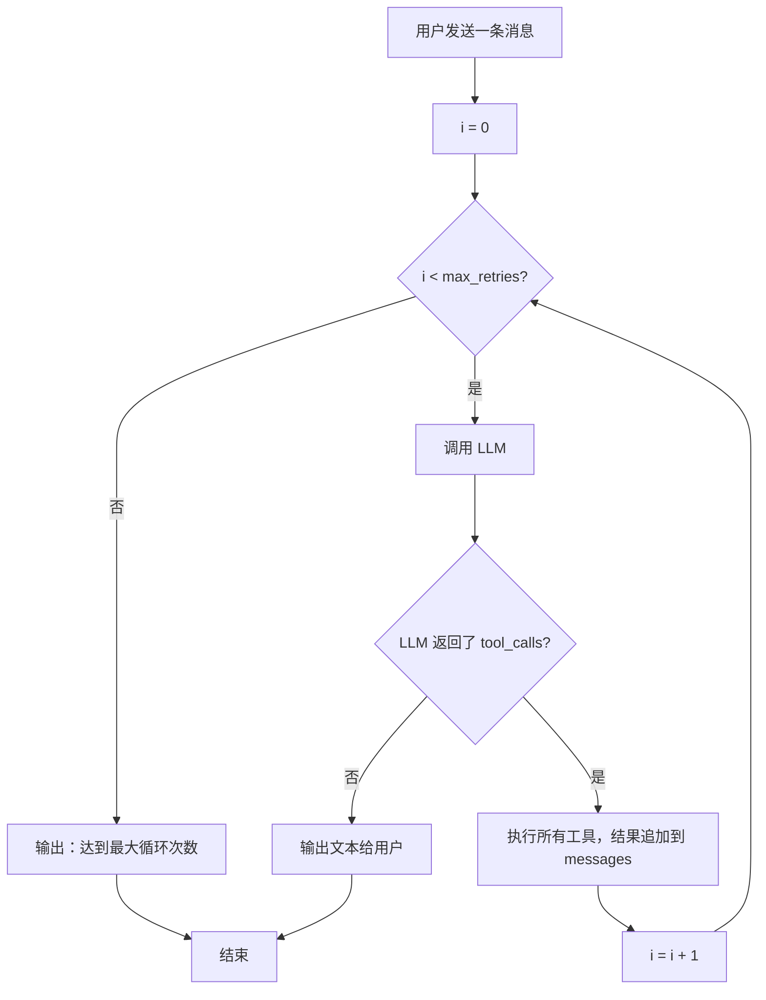
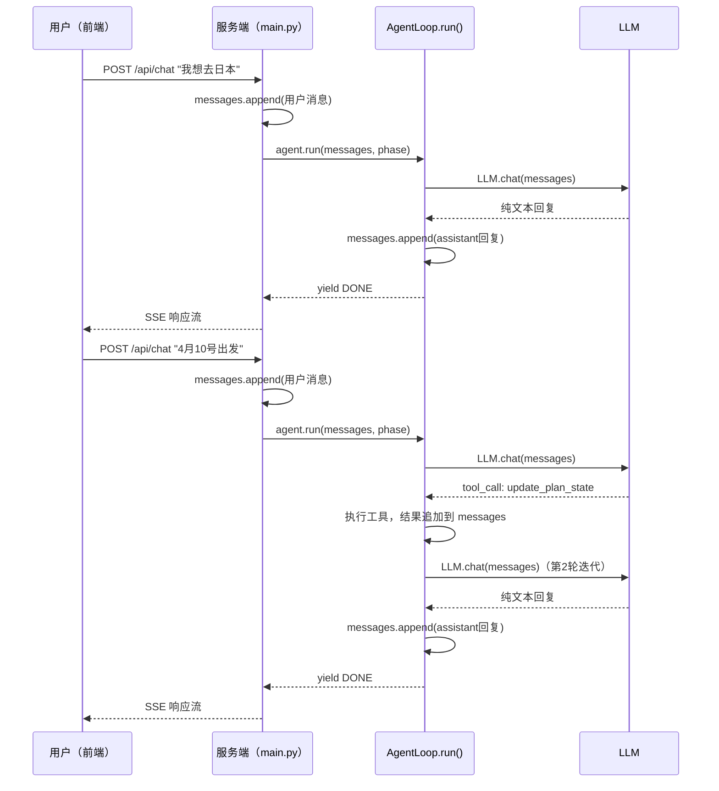
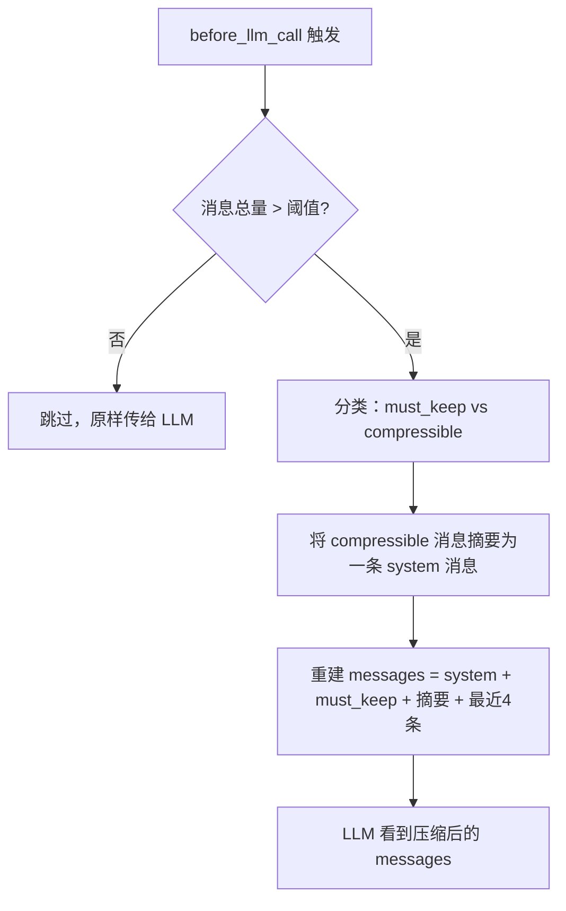
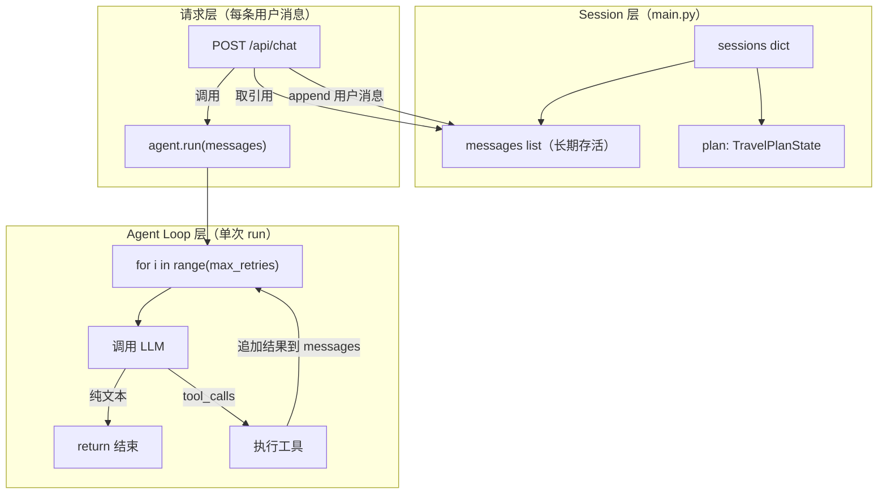

# Agent Loop、max_retries 与 Session 上下文维持机制

这篇文档回答三个问题：

> 1. `AgentLoop.run()` 里的 `max_retries` 到底限制了什么？
> 2. 用户每发一条消息，都会启动一个新的 agent loop 吗？
> 3. 如果是，那 session 中的上下文是怎么跨轮次维持的？

---

## 1. max_retries 的本质：单条消息内的工具调用步数上限

### 核心代码

```python
# backend/agent/loop.py, line 54
for iteration in range(self.max_retries):  # 默认 max_retries=3
    response = self.llm.chat(messages, tools=tools, stream=True)
    
    if not tool_calls:       # LLM 只返回了文本
        yield DONE
        return               # ← 正常退出，不管 iteration 是几
    
    # 有 tool_calls → 执行工具 → 结果追加到 messages → 继续下一轮
```

### 关键结论

- `max_retries` **不是**用户对话轮次的限制
- 它限制的是：**处理单条用户消息时，LLM 连续调用工具的最大轮次**
- 只要 LLM 在某一轮返回纯文本（不调工具），循环立刻 `return` 结束

### 流程图



### 三个典型场景

| 场景 | 迭代过程 | 是否触发限制 |
|------|---------|------------|
| 用户说"你好"，LLM 纯文本回复 | i=0 → 纯文本 → return | 否，1次即结束 |
| 用户说"搜目的地"，LLM 调 1 次工具后回复 | i=0 → tool → i=1 → 纯文本 → return | 否，2次结束 |
| LLM 连续 3 轮都调工具 | i=0 → tool → i=1 → tool → i=2 → tool → 循环耗尽 | **是** |

---

## 2. 每条用户消息都会触发一次 `agent.run()`

答案是**是的**。每次 `POST /api/chat/{session_id}` 请求都会调用一次 `agent.run()`。



---

## 3. Session 上下文维持：共享的 messages 引用

### 核心机制

上下文的维持不依赖 AgentLoop，而是依赖 **`main.py` 中 session 级别的 `messages` list**。

```python
# main.py, line 122
sessions: dict[str, dict] = {}   # 服务器级别字典

# 创建 session 时（line 307-313）
sessions[session_id] = {
    "plan":     TravelPlanState,
    "messages": [],        # ← 在整个 session 生命周期内共享
    "agent":    AgentLoop,
}

# 每次用户发消息时（line 353）
messages = session["messages"]   # ← 取引用，不是新建！
messages.append(用户消息)         # ← 追加到同一个 list
agent.run(messages, phase=...)   # ← 传入累积的全部历史
```

### 关键点

- `session["messages"]` 是一个**长期存活的 list 对象**
- 每次 `run()` 接收的是这个 list 的**引用**，不是副本
- `run()` 内部往 messages 里追加的内容（assistant 回复、tool_call、tool_result），会直接反映在 session 的 messages 中
- 下次用户再发消息时，LLM 能看到从 session 创建以来的**全部对话历史**

### messages 累积过程图

```mermaid
flowchart LR
    subgraph "Session 创建"
        M0["messages = [ ]"]
    end

    subgraph "第1轮对话"
        M1["[0] system: 系统提示"]
        M2["[1] user: 我想去日本"]
        M3["[2] assistant: 好的，请问出发日期..."]
    end

    subgraph "第2轮对话"
        M4["[0] system: 系统提示（更新）"]
        M5["[1] user: 我想去日本"]
        M6["[2] assistant: 好的，请问..."]
        M7["[3] user: 4月10号出发，5天"]
        M8["[4] assistant: tool_call"]
        M9["[5] tool: 执行结果"]
        M10["[6] assistant: 已记录！接下来..."]
    end

    M0 --> M1 --> M2 --> M3
    M3 -.->|"用户发第2条消息"| M4
    M4 --> M5 --> M6 --> M7 --> M8 --> M9 --> M10
```



> 注意：system 消息（`messages[0]`）每轮都会被**替换**（line 371-374），因为 phase 可能变化，需要更新系统提示。但其余消息只增不减。

### 上下文过长时的压缩

当 messages 累积过多，`before_llm_call` hook 会触发压缩（line 191-225）：



---

## 4. 完整架构：三层关系



| 层级 | 生命周期 | 职责 |
|------|---------|------|
| **Session 层** | 从创建到服务重启 | 持有 messages list 和 plan state |
| **请求层** | 单次 HTTP 请求 | 更新 system 消息，追加用户消息，发起 run |
| **Agent Loop 层** | 单次 `run()` 调用 | 在 max_retries 内循环：LLM → 工具 → LLM... |

---

## 5. 常见误解澄清

| 误解 | 实际情况 |
|------|---------|
| max_retries 限制用户能发多少条消息 | 不是。它只限制单条消息内 LLM 调工具的轮次 |
| 每次 run() 都是全新的上下文 | 不是。messages 是共享引用，包含全部历史 |
| agent loop 自己管理上下文 | 不是。上下文由 main.py 的 session 管理，agent loop 只负责往里追加 |
| messages 会无限增长 | 不会。before_llm_call hook 会在超过阈值时压缩 |
