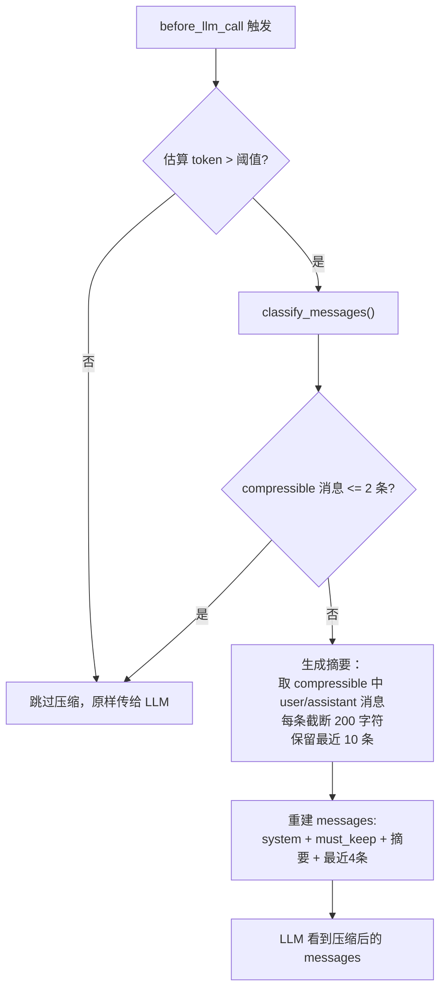
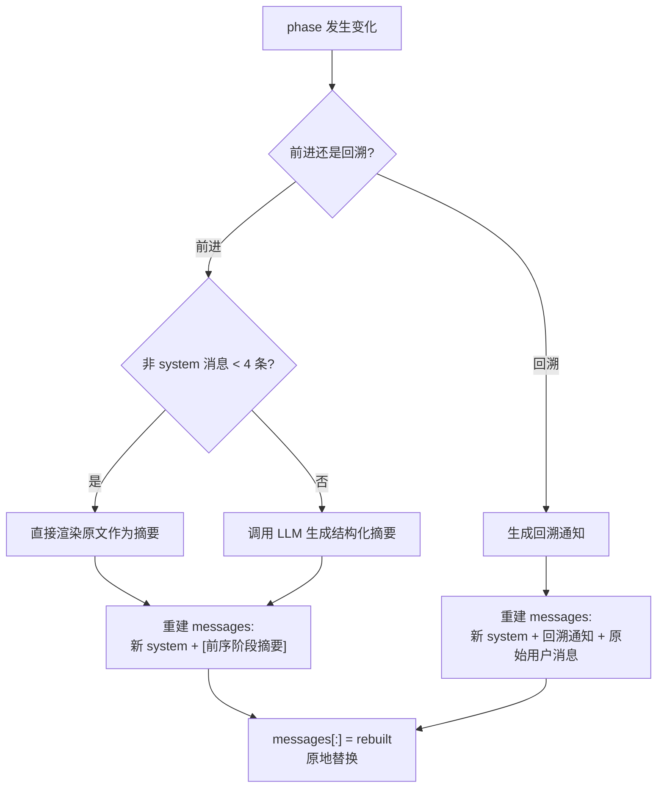

# 上下文压缩机制深度分析

本文档完整剖析 travel-agent-pro 项目中的上下文压缩机制，涵盖设计原理、执行流程、优缺点分析以及基于项目特点的改进方案。

---

## 1. 为什么需要上下文压缩

旅行规划 Agent 的对话有三个特点导致 messages 列表快速膨胀：

1. **多轮对话**：从灵感→日期→住宿→行程→清单，一个完整规划可能 30-50 轮对话
2. **大量工具调用**：每轮可能调 1-3 个工具（搜索、状态更新、信息查询），每个工具调用产生 tool_call + tool_result 两条消息
3. **工具结果体积大**：小红书搜索、web_search 等工具返回的内容往往很长

如果不做压缩，messages 会很快超过 LLM 的上下文窗口（当前配置 `max_tokens: 4096`），或者因为 token 过多导致 API 调用成本飙升、响应变慢。

---

## 2. 整体架构：两层压缩机制

项目中存在**两层独立的压缩机制**，分别在不同场景下触发：

```
┌─────────────────────────────────────────────────────┐
│                    压缩层 1                          │
│         会话内实时压缩（before_llm_call hook）        │
│         触发条件：消息总 token 估计值超过阈值           │
│         位置：main.py on_before_llm()                │
│         方式：本地规则分类 + 截断拼接                   │
├─────────────────────────────────────────────────────┤
│                    压缩层 2                          │
│         阶段切换时的 LLM 摘要压缩                     │
│         触发条件：phase 发生变化                       │
│         位置：context/manager.py compress_for_transition() │
│         方式：调用 LLM 生成结构化摘要                   │
└─────────────────────────────────────────────────────┘
```

这两层各自独立工作，互不干扰。

---

## 3. 压缩层 1：会话内实时压缩

### 3.1 触发链路

```
用户发消息 → POST /api/chat → agent.run(messages)
  → for iteration in range(max_retries):
      → hooks.run("before_llm_call")    ← 每次调 LLM 前都触发
          → on_before_llm()             ← 在这里判断是否需要压缩
      → llm.chat(messages)
```

### 3.2 触发条件：should_compress()

```python
# context/manager.py:137-154
def should_compress(self, messages, max_tokens):
    estimated = sum(len(m.content or "") // 3 for m in messages)  # 粗略估算 token 数
    return estimated > max_tokens * 0.5
```

- **token 估算方式**：每条消息的 `content` 字符数除以 3（中文约 1.5-2 字符/token，英文约 4 字符/token，取折中值 3）
- **阈值计算**：`max_tokens * context_compression_threshold`，即 `4096 * 0.5 = 2048` 个估算 token
- 实际在 `main.py` 中调用时：`threshold = int(config.llm.max_tokens * config.context_compression_threshold)`

### 3.3 消息分类：classify_messages()

当触发压缩后，首先将所有消息分为两类：

```python
# context/manager.py:156-171
_PREFERENCE_SIGNALS = [
    "不要", "不想", "不坐", "不住", "不去", "不吃",
    "必须", "一定要", "偏好", "喜欢", "讨厌",
    "预算", "上限", "最多", "至少",
    "过敏", "素食", "忌口",
]

def classify_messages(self, messages):
    must_keep = []      # 包含用户偏好关键词的消息，不可压缩
    compressible = []   # 其余消息，可以压缩

    for msg in messages:
        if msg.role == Role.USER and any(kw in content for kw in _PREFERENCE_SIGNALS):
            must_keep.append(msg)
        else:
            compressible.append(msg)
    return must_keep, compressible
```

**分类规则**：

| 条件 | 分类 |
|------|------|
| 用户消息 + 含偏好关键词 | must_keep（保留原文） |
| 用户消息 + 不含偏好关键词 | compressible（可压缩） |
| 助手消息（所有） | compressible |
| 工具消息（所有） | compressible |
| 系统消息（所有） | compressible |

### 3.4 压缩执行：on_before_llm()

```python
# main.py:187-221
async def on_before_llm(**kwargs):
    msgs = kwargs.get("messages")
    threshold = int(config.llm.max_tokens * config.context_compression_threshold)

    if not context_mgr.should_compress(msgs, threshold):
        return  # 未超阈值，不压缩

    must_keep, compressible = context_mgr.classify_messages(msgs)

    if len(compressible) <= 2:
        return  # 可压缩消息太少，不值得压缩

    # 将可压缩消息生成简单摘要
    summary_parts = []
    for m in compressible:
        if m.content and m.role in (Role.USER, Role.ASSISTANT):
            label = "用户" if m.role == Role.USER else "助手"
            summary_parts.append(f"{label}: {m.content[:200]}")  # 每条截断到200字符

    summary = Message(
        role=Role.SYSTEM,
        content=f"[对话摘要]\n" + "\n".join(summary_parts[-10:]),  # 只保留最近10条
    )

    # 重建 messages 列表
    sys_msg = msgs[0] if msgs[0].role == Role.SYSTEM else None
    recent = msgs[-4:]  # 保留最近 4 条消息

    msgs.clear()
    if sys_msg:
        msgs.append(sys_msg)       # 1. 系统消息
    for m in must_keep:
        if m not in msgs:
            msgs.append(m)         # 2. 必须保留的偏好消息
    msgs.append(summary)           # 3. 压缩摘要
    for m in recent:
        if m not in msgs:
            msgs.append(m)         # 4. 最近 4 条消息
```

### 3.5 压缩后的 messages 结构

```
压缩前（假设 20 条消息）：
[system, user_1, assistant_1, user_2, assistant_2, tool_call, tool_result,
 user_3("不坐红眼航班"), assistant_3, user_4, assistant_4, tool_call, tool_result,
 user_5, assistant_5, user_6, assistant_6, tool_call, tool_result, user_7]

压缩后（约 7-8 条消息）：
[system,                          ← 原 system 消息
 user_3("不坐红眼航班"),            ← must_keep：含偏好关键词
 [对话摘要] summary,               ← 压缩后的摘要（最多 10 条 × 200 字符）
 assistant_6,                      ← 最近 4 条
 tool_call,
 tool_result,
 user_7]
```

### 3.6 流程图



---

## 4. 压缩层 2：阶段切换时的 LLM 摘要

### 4.1 触发链路

当 `phase_router.check_and_apply_transition(plan)` 检测到阶段变化时（或回溯触发时），调用 `_rebuild_messages_for_phase_change()`。

```
工具执行后 → 检测 phase 变化
  → _rebuild_messages_for_phase_change()
      → 前进场景：compress_for_transition() → 调 LLM 生成摘要
      → 回溯场景：_build_backtrack_notice() → 生成回溯通知
```

### 4.2 前进方向的阶段切换

```python
# context/manager.py:173-211
async def compress_for_transition(self, messages, from_phase, to_phase, llm_factory):
    # 过滤掉 system 消息
    transition_messages = [m for m in messages if m.role != Role.SYSTEM]
    rendered = self._render_transition_messages(transition_messages)

    # 短路优化：消息太少时直接返回原文，不调 LLM
    if len(transition_messages) < 4:
        return rendered

    # 调用 LLM 生成摘要
    llm = llm_factory()
    prompt = [
        Message(role=Role.SYSTEM, content=(
            "你负责为旅行规划 agent 做阶段切换摘要。"
            "只保留用户偏好、约束、已确认事实、关键决策和待确认事项。"
            "输出简洁中文，不要杜撰，不要重复无关寒暄。"
        )),
        Message(role=Role.USER, content=(
            f"当前对话从阶段 {from_phase} 切换到阶段 {to_phase}。\n"
            "请基于下面的对话生成一个可供下阶段继续使用的摘要。\n\n"
            f"{rendered}"
        )),
    ]

    summary = "".join([chunk.content for chunk in llm.chat(prompt) if chunk.content])
    return summary or rendered  # LLM 失败时 fallback 到原文
```

### 4.3 重建后的 messages 结构

```python
# agent/loop.py:240-286
async def _rebuild_messages_for_phase_change(self, messages, from_phase, to_phase, ...):
    # 重新构建 system 消息（新阶段的 prompt）
    rebuilt = [context_manager.build_system_message(plan, phase_prompt, user_summary)]

    if to_phase < from_phase:
        # 回溯：添加回溯通知 + 原始用户消息
        rebuilt.append(Message(role=Role.SYSTEM, content=backtrack_notice))
        rebuilt.append(original_user_message)
    else:
        # 前进：添加 LLM 生成的前序阶段摘要
        summary = await context_manager.compress_for_transition(...)
        rebuilt.append(Message(role=Role.SYSTEM, content=f"[前序阶段摘要]\n{summary}"))

    messages[:] = rebuilt  # 原地替换整个 messages 列表
```

阶段切换后，messages 被彻底重建为：

```
前进场景（如 phase 1 → phase 3）:
[system（新阶段 prompt + 当前规划状态 + 用户画像）,
 [前序阶段摘要]（LLM 生成的压缩摘要）]

回溯场景（如 phase 5 → phase 3）:
[system（目标阶段 prompt + 当前规划状态 + 用户画像）,
 [阶段回退] 回退通知,
 original_user_message（触发回溯的用户消息）]
```

### 4.4 流程图



---

## 5. system 消息的动态构建

每次调 LLM 前，system 消息都会被重新构建，包含以下部分：

```
┌─────────────────────────────────────┐
│  Soul（身份定义，来自 soul.md）         │
│  ─────────────────────────────       │
│  当前时间（本地日期、时间、时区）         │
│  ─────────────────────────────       │
│  工具使用硬规则                        │
│  ─────────────────────────────       │
│  当前阶段指引（phase prompt）           │
│  ─────────────────────────────       │
│  当前规划状态（destination/dates/...） │
│  ─────────────────────────────       │
│  用户画像（偏好/出行历史/永久排除）      │
└─────────────────────────────────────┘
```

这意味着即使对话历史被压缩，LLM 仍然能通过 system 消息中的"当前规划状态"获取关键的结构化信息。

---

## 6. 可观测性：telemetry 支撑

压缩过程通过 OpenTelemetry 暴露了关键指标：

| 属性/事件 | 位置 | 含义 |
|-----------|------|------|
| `context.tokens.before` | should_compress() | 压缩前的估算 token 数 |
| `context.max_tokens` | should_compress() | 当前阈值 |
| `context.compression` 事件 | should_compress() | 触发压缩时记录消息数、估算 token、must_keep 数 |
| `phase.from` / `phase.to` | phase transition | 阶段变化的来源和目标 |

---

## 7. 优点分析

### 7.1 设计上的优点

1. **两层互补**：实时压缩处理单阶段内的对话膨胀，阶段切换压缩处理跨阶段的上下文传递，覆盖了两种不同场景

2. **偏好消息保护**：通过关键词匹配识别用户偏好消息并标记为 must_keep，确保"不坐红眼航班""预算 2 万"等关键约束不会在压缩中丢失

3. **结构化状态兜底**：即使对话历史被大幅压缩，`TravelPlanState` 中的结构化数据（destination、dates、budget 等）始终通过 system 消息传递给 LLM，核心规划信息不会丢失

4. **短路优化**：阶段切换时消息少于 4 条直接返回原文，避免了不必要的 LLM 调用开销

5. **可观测性**：通过 OpenTelemetry 记录压缩触发、token 估算等指标，便于监控和调优

6. **阶段切换时用 LLM 做摘要**：比纯规则截断更智能，能保留语义关键信息

### 7.2 工程上的优点

1. **非侵入式**：实时压缩通过 hook 机制实现（`before_llm_call`），不修改 AgentLoop 核心逻辑
2. **配置可调**：`context_compression_threshold` 可通过 config.yaml 调整
3. **原地修改**：`msgs.clear()` + 重新追加，不需要创建新的 messages 引用，session 层无感知

---

## 8. 缺点与潜在问题

### 8.1 token 估算不够准确

```python
estimated = sum(len(m.content or "") // 3 for m in messages)
```

- 中文实际约 1.5-2 字符/token，英文约 4 字符/token，取 3 是粗略折中
- 完全忽略了 `tool_calls`、`tool_result` 中的结构化数据（JSON 序列化后也会占用 token）
- 对于工具结果为 dict 类型的消息，`m.content` 可能为 None，但实际序列化后体积很大

**影响**：可能导致实际 token 已经超限但未触发压缩，或者远未到限但提前触发了压缩。

### 8.2 实时压缩不够智能

```python
summary_parts.append(f"{label}: {m.content[:200]}")  # 硬截断
summary_parts[-10:]  # 只保留最近 10 条
```

- **硬截断 200 字符**：可能截断关键信息的中间部分。例如"我想去京都，预算 2 万，4 月 10 号出发，两个人"如果前 200 字符刚好到预算信息就截断了
- **固定保留最近 10 条**：没有按语义重要性排序，最近 10 条可能全是工具调用的确认回复，而早期的关键决策被丢弃
- **只处理 user/assistant 消息**：tool_result 消息直接丢弃，但工具结果中可能包含搜索到的重要信息
- **纯文本拼接**：没有调用 LLM 做语义摘要，信息损失大

### 8.3 偏好关键词匹配局限

```python
_PREFERENCE_SIGNALS = ["不要", "不想", "不坐", ...]
```

- **容易误判**："我不想了解更多了"中的"不想"会触发 must_keep，但它不是偏好
- **容易漏判**："我只飞直飞""靠海的酒店""不超过 3 小时车程"等约束表达不在列表中
- **只检查 user 消息**：如果 assistant 消息中确认了一个关键偏好（"好的，已记录您不坐红眼航班"），它会被归为 compressible

### 8.4 最近 4 条消息的保留策略过于简单

```python
recent = msgs[-4:]
```

- 如果最近 4 条是：`[tool_call, tool_result, tool_call, tool_result]`，那么最近的用户消息和助手回复都可能被压缩掉了
- 没有保证保留最近一轮完整的对话（user + assistant + 可能的 tool 交互）

### 8.5 阶段切换压缩的消息渲染不够完整

```python
def _render_transition_message(self, message):
    if message.role == Role.TOOL and message.tool_result:
        result = message.tool_result
        if result.status == "success":
            return f"工具结果: {result.data}"  # data 可能是很大的 dict
```

- `result.data` 直接转字符串可能非常长（搜索结果、POI 信息等），导致传给 LLM 做摘要的文本过大
- 没有对工具结果做预处理截断

### 8.6 压缩后 messages 中的角色序列可能违反 API 要求

压缩后的消息序列可能出现：`[system, system, user]`（must_keep 中的 user 消息之前插入了 summary 这个 system 消息），或者 `[system, user, system, assistant]` 等不常规序列。不同 LLM provider 对消息角色序列的要求不同，可能导致 API 报错。

### 8.7 两层压缩没有协调

- 实时压缩（层 1）和阶段切换压缩（层 2）完全独立
- 可能出现：阶段切换刚做完 LLM 摘要，下一轮 before_llm_call 又把摘要中的内容当作 compressible 再次压缩
- 没有标记哪些消息是压缩产物，避免被二次压缩

---

## 9. 基于项目特点的改进方案

### 9.1 改进 token 估算

**问题**：`len(content) // 3` 不准确，且忽略了 tool_calls/tool_result 的体积。

**方案**：

```python
def estimate_tokens(self, messages: list[Message]) -> int:
    total = 0
    for m in messages:
        # 文本内容
        if m.content:
            total += len(m.content) // 2  # 中文为主的项目，用 2 更接近

        # 工具调用的参数
        if m.tool_calls:
            for tc in m.tool_calls:
                total += len(json.dumps(tc.arguments, ensure_ascii=False)) // 3

        # 工具结果
        if m.tool_result:
            if m.tool_result.data:
                data_str = json.dumps(m.tool_result.data, ensure_ascii=False)
                total += len(data_str) // 3
            if m.tool_result.error:
                total += len(m.tool_result.error) // 3

    return total
```

进一步的方案是接入 tiktoken 做精确计算（但会增加依赖和延迟）。

### 9.2 用 LLM 替换硬截断摘要

**问题**：实时压缩用硬截断 + 拼接，信息损失大。

**方案**：将层 1 的摘要生成也改为 LLM 调用（类似层 2 的做法），但需要控制成本：

```python
async def on_before_llm(**kwargs):
    # ...触发条件同上...

    must_keep, compressible = context_mgr.classify_messages(msgs)
    if len(compressible) <= 4:
        return

    # 用 LLM 做摘要（使用更便宜的模型）
    summary_text = await context_mgr.summarize_messages(
        compressible, llm_factory=lambda: create_llm_provider(config.llm_overrides.get("summary", config.llm))
    )

    summary = Message(role=Role.SYSTEM, content=f"[对话摘要]\n{summary_text}")
    # ...重建 messages 同上...
```

如果担心 LLM 调用延迟，可以采用分级策略：

| 可压缩消息数 | 策略 |
|-------------|------|
| <= 4 条 | 不压缩 |
| 5-15 条 | 规则截断（当前方式） |
| > 15 条 | LLM 摘要 |

### 9.3 增强偏好识别

**问题**：关键词列表不够全面，且缺乏上下文理解。

**方案 A**：扩展关键词 + 模式匹配：

```python
_PREFERENCE_SIGNALS = [
    # 原有关键词...
    # 新增：数值约束
    "不超过", "不低于", "不多于", "不少于",
    # 新增：时间偏好
    "早上不要太早", "不要赶", "节奏慢",
    # 新增：交通偏好
    "直飞", "高铁", "不转机",
    # 新增：住宿偏好
    "靠海", "市中心", "安静",
]

# 新增：正则模式匹配
_PREFERENCE_PATTERNS = [
    r"预算.*\d+",           # "预算2万"
    r"不超过.*\d+",          # "不超过3小时"
    r"\d+个人",              # "3个人"
    r"(必须|一定).+",        # "必须有早餐"
]
```

**方案 B**：将偏好提取也下沉到 TravelPlanState，压缩时从结构化状态中恢复偏好，而非依赖原始消息文本。

### 9.4 改进最近消息保留策略

**问题**：固定保留最近 4 条太死板。

**方案**：保留最近一轮完整的对话交互：

```python
def _get_recent_messages(self, messages: list[Message], min_count: int = 4) -> list[Message]:
    """从后往前找，保留最近一轮完整的 user→assistant 交互（含中间的工具调用）"""
    recent = []
    found_user = False
    for msg in reversed(messages):
        recent.insert(0, msg)
        if msg.role == Role.USER:
            found_user = True
            if len(recent) >= min_count:
                break
    return recent
```

### 9.5 防止压缩产物被二次压缩

**问题**：LLM 摘要消息可能被实时压缩再次处理。

**方案**：在摘要消息中添加标记：

```python
_COMPRESSION_MARKER = "[对话摘要]"
_TRANSITION_MARKER = "[前序阶段摘要]"

def classify_messages(self, messages):
    for msg in messages:
        content = msg.content or ""
        # 压缩产物不可再压缩
        if msg.role == Role.SYSTEM and (
            content.startswith(_COMPRESSION_MARKER)
            or content.startswith(_TRANSITION_MARKER)
        ):
            must_keep.append(msg)
            continue
        # ...原有逻辑...
```

### 9.6 工具结果预截断

**问题**：搜索类工具结果可能很长，传给 LLM 做摘要时占大量 token。

**方案**：在渲染阶段切换消息时，对工具结果做预截断：

```python
def _render_transition_message(self, message):
    if message.role == Role.TOOL and message.tool_result:
        result = message.tool_result
        if result.status == "success":
            data_str = str(result.data)
            if len(data_str) > 500:
                data_str = data_str[:500] + "...(截断)"
            return f"工具结果: {data_str}"
```

### 9.7 引入压缩效果评估

**问题**：当前只记录了压缩触发信息，没有记录压缩效果。

**方案**：在压缩前后都记录 token 估算值：

```python
# 压缩后记录效果
tracer = trace.get_tracer("travel-agent-pro")
with tracer.start_as_current_span("context.compression.applied") as span:
    span.set_attribute(CONTEXT_TOKENS_BEFORE, tokens_before)
    span.set_attribute(CONTEXT_TOKENS_AFTER, estimate_tokens(msgs))
    span.set_attribute("context.compression.kept_count", len(must_keep))
    span.set_attribute("context.compression.removed_count", original_count - len(msgs))
```

---

## 10. 总结：两层压缩的完整数据流

```mermaid
flowchart TB
    subgraph "用户发消息"
        U["POST /api/chat"]
    end

    subgraph "Session 层"
        ML["messages list（累积全部历史）"]
    end

    subgraph "Agent Loop 每次迭代"
        H["before_llm_call hook"]
        SC{"should_compress?"}
        CL["classify_messages"]
        CP["规则截断摘要<br/>system + must_keep + summary + recent4"]
        LLM["调用 LLM"]
    end

    subgraph "工具执行后"
        TC["检测 phase 变化"]
        PC{"phase changed?"}
        FW{"前进 or 回溯?"}
        LS["调 LLM 生成阶段摘要"]
        BK["生成回溯通知"]
        RB["重建 messages:<br/>新 system + 摘要/通知"]
    end

    U --> ML
    ML --> H
    H --> SC
    SC -- 否 --> LLM
    SC -- 是 --> CL --> CP --> LLM
    LLM --> TC
    TC --> PC
    PC -- 否 --> |"继续迭代或返回"| H
    PC -- 是 --> FW
    FW -- 前进 --> LS --> RB
    FW -- 回溯 --> BK --> RB
    RB --> |"messages[:] = rebuilt"| ML
```

| 维度 | 层 1：实时压缩 | 层 2：阶段切换压缩 |
|------|--------------|------------------|
| 触发时机 | 每次调 LLM 前 | 阶段变化时 |
| 触发条件 | token 估算超阈值 | phase 值改变 |
| 压缩方式 | 规则分类 + 硬截断拼接 | LLM 语义摘要 |
| 信息保留策略 | must_keep + 最近 4 条 | 结构化摘要 + 新 system |
| LLM 调用 | 无 | 是（额外一次 LLM 调用） |
| 压缩粒度 | 渐进式（每轮都可能触发） | 一次性（彻底重建） |
| 适用场景 | 单阶段内对话过长 | 跨阶段上下文传递 |
