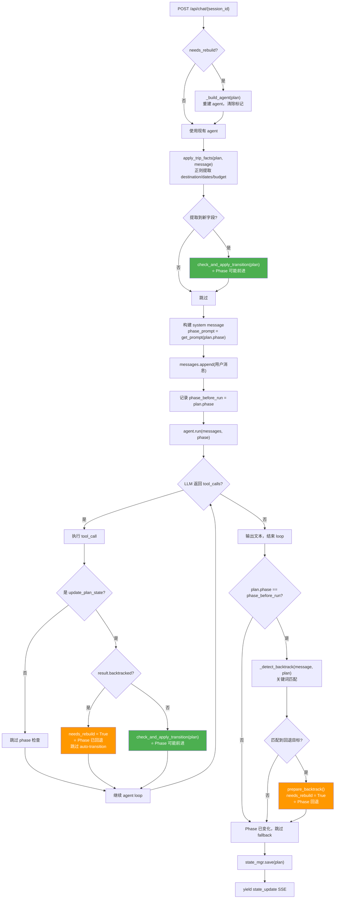
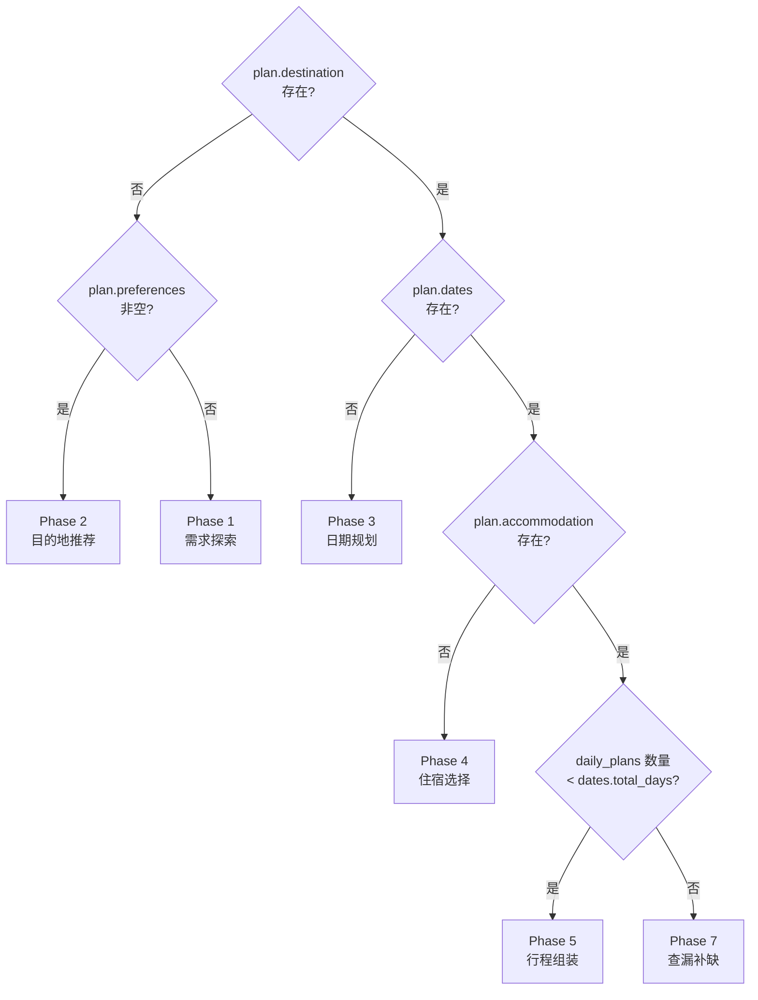
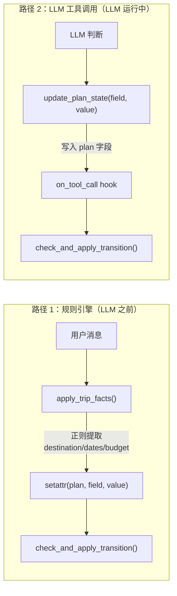
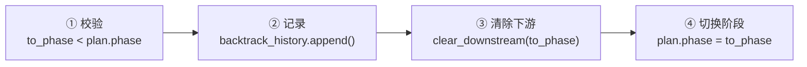
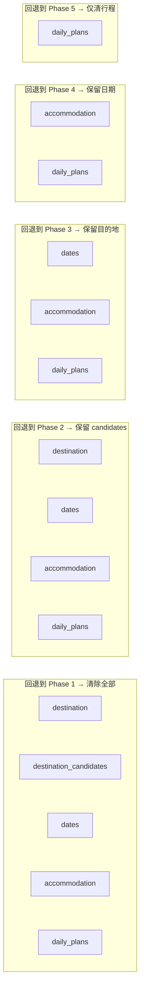
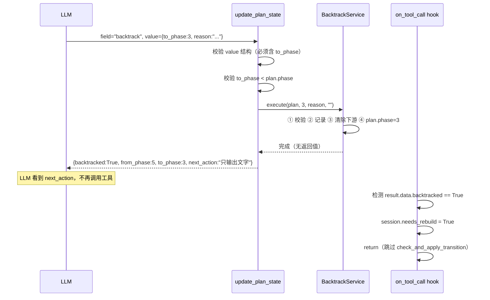
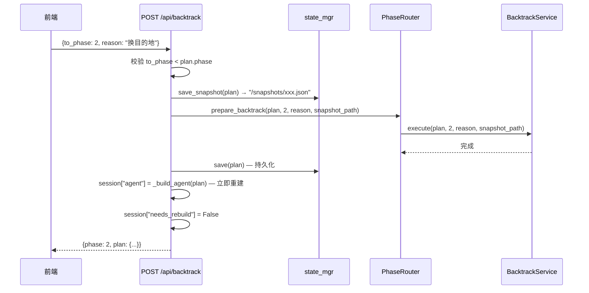
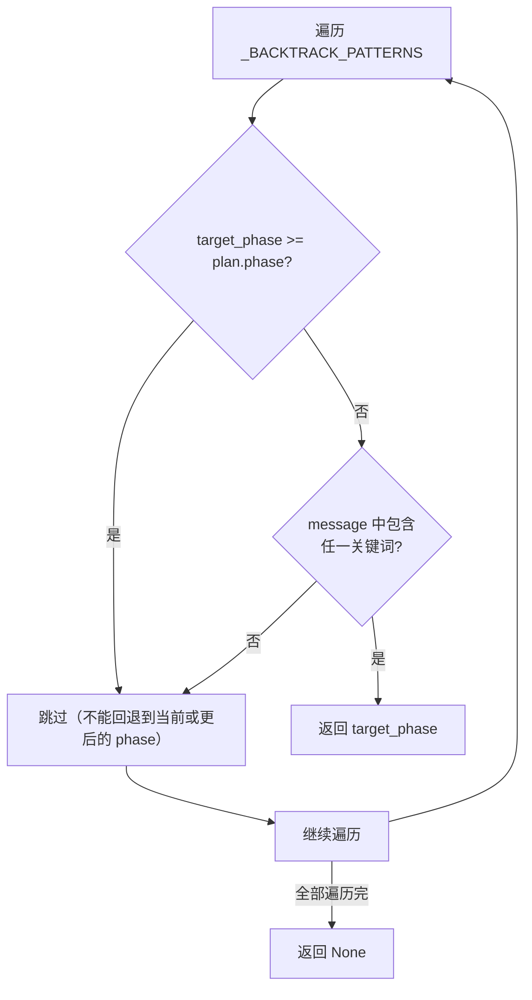
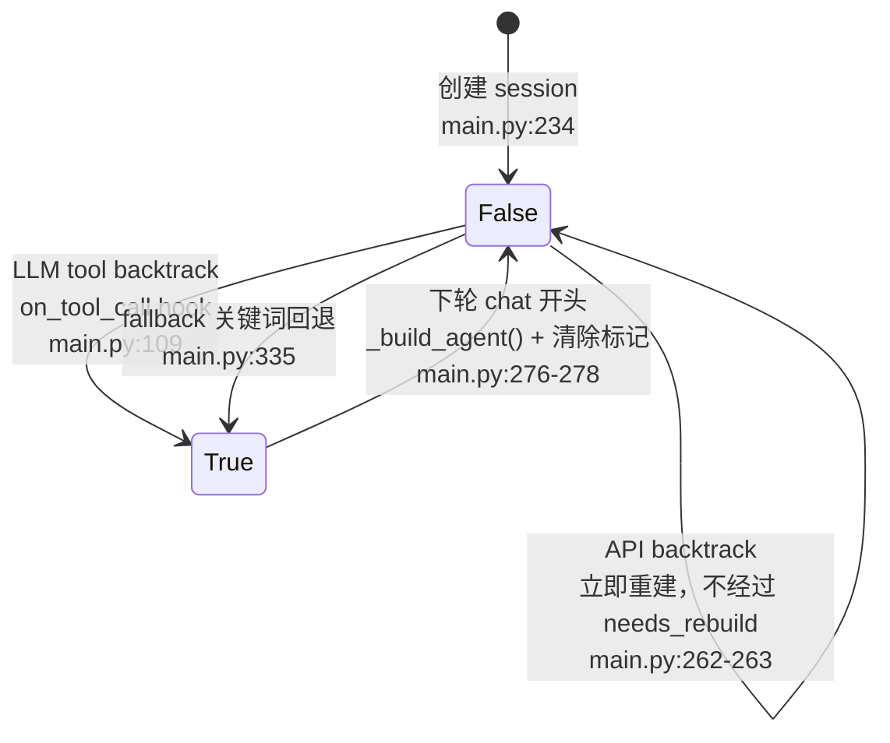

# Phase 更新机制深度解析

> 本文档详细拆解 travel_agent_pro 项目中 Phase（阶段）更新的完整机制，涵盖前进、回退、fallback 三条路径，以及 agent 重建、prompt 切换等关联行为。

## 1. Phase 是什么

Phase 是规划流程的阶段标识，存储在 `TravelPlanState.phase` 字段中（`backend/state/models.py:227`），类型为 `int`，默认值为 `1`。

| Phase | 角色 | 做什么 | 产出物 |
|-------|------|--------|--------|
| 1 | 旅行灵感顾问 | 开放式提问，具象化模糊需求 | `preferences` |
| 2 | 目的地推荐专家 | 推荐 2-3 个候选目的地 | `destination`, `destination_candidates` |
| 3 | 行程节奏规划师 | 确定日期和天数 | `dates` |
| 4 | 住宿区域顾问 | 推荐住宿区域 | `accommodation` |
| 5 | 行程组装引擎 | 按天组装具体行程 | `daily_plans` |
| 7 | 出发前查漏清单 | 证件、天气、注意事项 | 最终摘要 |

> 注意：没有 Phase 6，从 5 直接跳到 7。

每个 Phase 对应一段 system prompt（`backend/phase/prompts.py:3-30`），通过 `PhaseRouter.get_prompt(phase)` 获取。Phase 变化 → prompt 变化 → LLM 的行为模式切换。

---

## 2. 全局流程总览

一次 Chat 请求中，Phase 可能在 4 个时刻发生变化。下面用 Mermaid 流程图展示完整生命周期：



绿色 = Phase 前进 | 橙色 = Phase 回退

---

## 3. Phase 前进机制

Phase 前进的核心是一个**数据驱动的推断函数** — 它不关心当前 phase 是几，只看 plan 中的数据字段是否填充。

### 3.1 `PhaseRouter.infer_phase(plan)` — 推断应处阶段

**文件**: `backend/phase/router.py:16-27`

```python
def infer_phase(self, plan: TravelPlanState) -> int:
    if not plan.destination:        # 没有目的地
        if plan.preferences:        #   但有偏好 → 该推荐目的地了
            return 2
        return 1                    #   偏好也没 → 还在探索需求
    if not plan.dates:              # 有目的地没日期
        return 3
    if not plan.accommodation:      # 有日期没住宿
        return 4
    if len(plan.daily_plans) < plan.dates.total_days:  # 行程天数不足
        return 5
    return 7                        # 全部就绪
```

| 参数 | 类型 | 含义 |
|------|------|------|
| `plan` | `TravelPlanState` | 当前规划状态对象 |
| **返回值** | `int` | 推断的目标 phase |

判断链可以用一张决策树来表示：



**关键设计**：`infer_phase` 是纯函数，不读取 `plan.phase` 的当前值。这意味着只要修改数据字段（不管是填充还是清除），就能间接驱动 phase 变化。回退正是利用了这一点 — 清除下游字段后，`infer_phase` 自然会返回更早的 phase。

### 3.2 `PhaseRouter.check_and_apply_transition(plan)` — 检测并执行切换

**文件**: `backend/phase/router.py:35-57`

```python
def check_and_apply_transition(self, plan: TravelPlanState) -> bool:
    inferred = self.infer_phase(plan)
    if inferred != plan.phase:
        # OpenTelemetry 记录 phase 变迁
        plan.phase = inferred
        return True
    return False
```

| 参数 | 类型 | 含义 |
|------|------|------|
| `plan` | `TravelPlanState` | 当前规划状态 |
| **返回值** | `bool` | phase 是否发生了变化 |

**被调用的两个位置**：

| 调用点 | 文件位置 | 触发条件 |
|--------|----------|----------|
| `apply_trip_facts` 之后 | `main.py:285` | 正则从用户消息中提取到新字段 |
| `on_tool_call` hook 中 | `main.py:111` | LLM 调用 `update_plan_state` 更新了普通字段（非 backtrack） |

### 3.3 两条前进路径



**路径 1** 是一个前置优化 — 在 LLM 运行前先用正则快速提取明显的旅行事实（如 `"去东京"` → `plan.destination = "东京"`），让 phase 尽早切换，这样 LLM 拿到的 system prompt 就已经是新 phase 的了。

**路径 2** 是主路径 — LLM 在对话中理解用户意图后，主动调用 `update_plan_state` 工具写入结构化数据，hook 在每次工具调用后检查 phase。

---

## 4. Phase 回退机制

回退有三条路径，按优先级从高到低排列：

```mermaid
flowchart TD
    subgraph "路径 A：LLM 主动回退（最高优先级）"
        A1["LLM 判断用户想回退"] --> A2["调用 update_plan_state<br/>field='backtrack'<br/>value={to_phase: N, reason: '...'}"]
        A2 --> A3["BacktrackService.execute()"]
        A3 --> A4["on_tool_call hook<br/>检测 backtracked=True"]
        A4 --> A5["needs_rebuild = True<br/>跳过 auto-transition"]
    end

    subgraph "路径 B：前端 API 回退"
        B1["用户点击 UI 按钮"] --> B2["POST /api/backtrack/{session_id}<br/>body: {to_phase, reason}"]
        B2 --> B3["save_snapshot()"]
        B3 --> B4["prepare_backtrack()"]
        B4 --> B5["BacktrackService.execute()"]
        B5 --> B6["立即 _build_agent()"]
    end

    subgraph "路径 C：关键词 Fallback（最低优先级）"
        C1["agent.run() 结束"] --> C2{"plan.phase 没变?"}
        C2 -->|是| C3["_detect_backtrack(message, plan)"]
        C3 --> C4{"关键词匹配?"}
        C4 -->|是| C5["save_snapshot()"]
        C5 --> C6["prepare_backtrack()"]
        C6 --> C7["needs_rebuild = True"]
    end
```



### 4.1 `BacktrackService.execute()` — 回退事务的统一执行器

**文件**: `backend/phase/backtrack.py:8-28`

三条路径最终都通过这个方法执行回退。它完成四件事：



| 参数 | 类型 | 含义 |
|------|------|------|
| `plan` | `TravelPlanState` | 要回退的规划状态（就地修改） |
| `to_phase` | `int` | 目标回退阶段（必须 < `plan.phase`，否则抛 `ValueError`） |
| `reason` | `str` | 回退原因（记入历史） |
| `snapshot_path` | `str` | 回退前快照的文件路径（工具路径传 `""`，API 路径传实际路径） |

### 4.2 `_PHASE_DOWNSTREAM` — 下游数据映射

**文件**: `backend/state/models.py:209-221`

这张表定义了"回退到某个 phase 时，需要清除哪些字段"：

```python
_PHASE_DOWNSTREAM = {
    1: ["destination", "destination_candidates", "dates", "accommodation", "daily_plans"],
    2: ["destination", "dates", "accommodation", "daily_plans"],
    3: ["dates", "accommodation", "daily_plans"],
    4: ["accommodation", "daily_plans"],
    5: ["daily_plans"],
}
```

可视化表示：



**关键**：`preferences` 和 `constraints` 不在任何 phase 的下游列表中，回退时始终保留。这是有意的设计 — 用户的偏好和约束是跨阶段的通用信息。

### 4.3 `TravelPlanState.clear_downstream(from_phase)` — 清除下游字段

**文件**: `backend/state/models.py:242-248`

```python
def clear_downstream(self, from_phase: int) -> None:
    for phase in sorted(_PHASE_DOWNSTREAM):        # 遍历 1,2,3,4,5
        if phase >= from_phase:                     # 只清除目标及之后的 phase
            for attr in _PHASE_DOWNSTREAM[phase]:
                default = [] if isinstance(getattr(self, attr), list) else None
                setattr(self, attr, default)        # 列表字段重置为 []，其余为 None
```

| 参数 | 类型 | 含义 |
|------|------|------|
| `from_phase` | `int` | 回退目标阶段，该阶段及之后的所有下游字段被清除 |

**示例**：`clear_downstream(3)` 会遍历 phase 3、4、5 的下游字段列表，将 `dates`, `accommodation`, `daily_plans` 全部重置。

### 4.4 路径 A 详解：LLM 通过工具触发回退

**文件**: `backend/tools/update_plan_state.py:66-92`

当 LLM 调用 `update_plan_state(field="backtrack", value={"to_phase": 3, "reason": "用户想换日期"})` 时：



返回值中的 `next_action: "请向用户确认回退结果，不要继续调用其他工具"` 是给 LLM 的指令，引导它只输出文字确认，不再发起工具调用。这样 agent loop 自然结束，避免用旧 tools 执行后续操作。

**为什么 hook 要跳过 `check_and_apply_transition`**：如果不跳过，`infer_phase` 可能会根据残留数据把 phase 推回去。例如回退到 phase 3 后 `destination` 仍在，`infer_phase` 会返回 3（正确），但如果 `dates` 清除后某些边界条件导致返回其他值，就会冲突。直接跳过是最安全的做法。

### 4.5 路径 B 详解：前端 API 触发回退

**文件**: `backend/main.py:249-264`



与路径 A 的**关键区别**：
- **快照**：API 路径会在回退前保存快照（`save_snapshot`），工具路径不保存
- **Agent 重建**：API 路径立即重建，工具路径延迟到下一轮 chat
- **持久化**：API 路径立即保存，工具路径随 `event_stream` 结束时统一保存

### 4.6 路径 C 详解：关键词 Fallback

**文件**: `backend/main.py:207-220`（关键词映射）, `main.py:324-335`（调用点）

```python
_BACKTRACK_PATTERNS = {
    1: ["重新开始", "从头来", "换个需求"],
    2: ["换个目的地", "不想去这里", "不去了", "换地方"],
    3: ["改日期", "换时间", "日期不对"],
    4: ["换住宿", "不住这", "换个区域"],
}
```

`_detect_backtrack(message, plan)` 的逻辑：



| 参数 | 类型 | 含义 |
|------|------|------|
| `message` | `str` | 用户消息原文 |
| `plan` | `TravelPlanState` | 当前规划状态（用于获取 `plan.phase` 做过滤） |
| **返回值** | `int \| None` | 匹配到的回退目标 phase，或 `None` |

**触发条件**（`main.py:325`）：只有当 `plan.phase == phase_before_run`（本轮 agent 没有改变 phase）时才执行。这避免了与 LLM 主动 backtrack 的冲突 — 如果 LLM 已经处理了回退，phase 就已经变了，fallback 不会再触发。

---

## 5. `needs_rebuild` 标记的生命周期

`needs_rebuild` 是一个布尔标记，解决"回退后 agent 需要重建，但当前 agent loop 还在运行"的问题。



**为什么需要延迟重建**：`on_tool_call` hook 在 `AgentLoop.run()` 内部执行。如果在 hook 中重建 agent，当前正在运行的 agent loop 会使用已被替换的旧引用，行为不可预测。所以用 `needs_rebuild` 标记，等到下一轮 `POST /api/chat` 进入时再重建。

---

## 6. Agent 重建与 Phase 的关系

### 6.1 `_build_agent(plan)` 做什么

**文件**: `backend/main.py:71-204`

| 步骤 | 做什么 |
|------|--------|
| 1 | 创建 LLM provider |
| 2 | 创建 `ToolEngine`，注册 13 个 tools |
| 3 | 创建 `HookManager`，注册 4 个 hooks |
| 4 | 返回 `AgentLoop(llm, tool_engine, hooks, max_retries)` |

每个 tool 通过 `@tool(phases=[...])` 声明自己适用的 phase。`AgentLoop.run(messages, phase)` 入口处调用 `tool_engine.get_tools_for_phase(phase)` 过滤出当前 phase 可用的工具。

**重要**：`update_plan_state` 的 `phases=[1,2,3,4,5,7]`，即所有 phase 都可用。这确保了 LLM 在任何阶段都能触发回退。

### 6.2 Phase 变化后什么时候重建 Agent

| 场景 | 是否重建 | 时机 | 影响 |
|------|---------|------|------|
| Phase 前进（`apply_trip_facts`） | 否 | — | 当轮 system prompt 已更新，tools 列表要等下轮 |
| Phase 前进（`on_tool_call` hook） | 否 | — | 当轮 tools 在 `run()` 入口已固定，不影响 |
| LLM tool 回退 | 延迟 | 下轮 chat 开头 | 当轮 agent loop 自然结束 |
| 关键词 fallback 回退 | 延迟 | 下轮 chat 开头 | 同上 |
| API 回退 | 立即 | API handler 内 | 下次 chat 直接使用新 agent |

**设计权衡**：Phase 前进时不重建 agent，因为前进通常发生在当轮最后一次工具调用之后，LLM 不太可能再需要新 phase 的工具。而回退需要重建，因为回退后可用工具集可能完全不同。

---

## 7. 三条回退路径对比

| 特征 | 路径 A（LLM tool） | 路径 B（API） | 路径 C（Fallback） |
|------|-------------------|--------------|-------------------|
| **触发方** | LLM 自主判断 | 前端 UI 按钮 | 规则引擎（关键词） |
| **入口** | `update_plan_state(field="backtrack")` | `POST /api/backtrack` | `_detect_backtrack()` |
| **执行器** | `BacktrackService.execute()` | 同左 | 同左 |
| **快照保存** | 否（`snapshot_path=""`） | 是 | 是 |
| **Agent 重建** | 延迟（`needs_rebuild`） | 立即 | 延迟（`needs_rebuild`） |
| **持久化** | 随 `event_stream` 结束 | 路径内立即 | 随 `event_stream` 结束 |
| **优先级** | 最高（agent loop 内） | 独立 API | 最低（仅当 A 未触发） |

---

## 8. 完整调用链汇总

### Phase 前进

```
用户消息到达
├── apply_trip_facts(plan, message)        ← 正则提取
│   └── check_and_apply_transition(plan)   ← infer_phase() → plan.phase = inferred
│
└── agent.run() → LLM 调用 update_plan_state(field=X, value=Y)
    └── on_tool_call hook
        └── check_and_apply_transition(plan)  ← infer_phase() → plan.phase = inferred
```

### Phase 回退

```
路径 A: LLM 主动
  update_plan_state(field="backtrack", value={to_phase, reason})
  └── BacktrackService.execute(plan, to_phase, reason, "")
  └── on_tool_call hook → needs_rebuild = True, 跳过 auto-transition

路径 B: 前端 API
  POST /api/backtrack
  └── save_snapshot(plan)
  └── prepare_backtrack() → BacktrackService.execute()
  └── save(plan) → _build_agent(plan)

路径 C: 关键词 Fallback（仅当 A 未触发）
  event_stream 结束时
  └── _detect_backtrack(message, plan) → target_phase
  └── save_snapshot(plan)
  └── prepare_backtrack() → BacktrackService.execute()
  └── needs_rebuild = True
```
