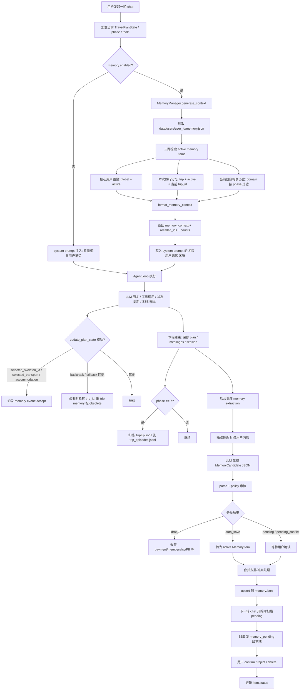
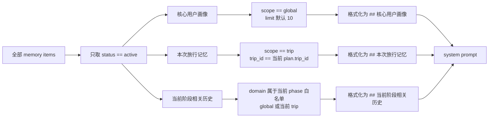
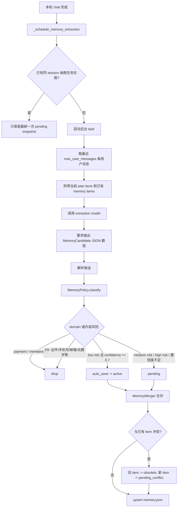
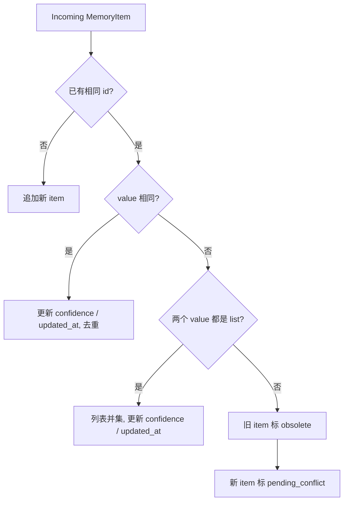
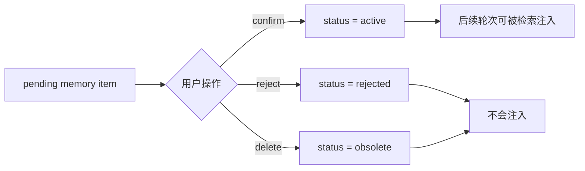
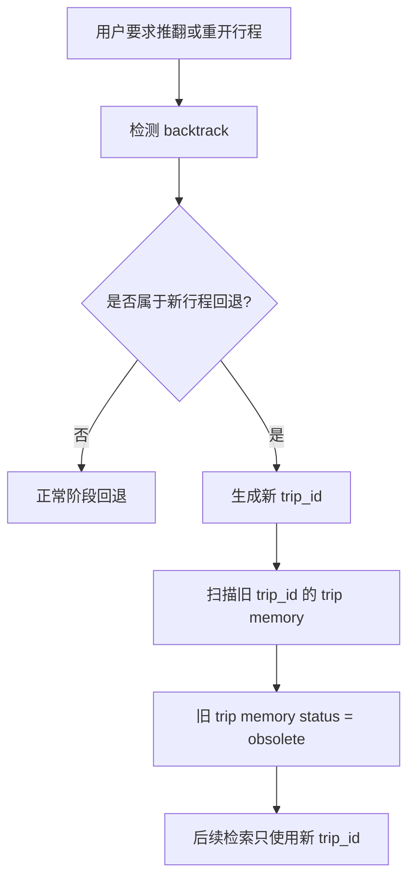

# 旅行 Agent 记忆系统运作流程

本文说明当前 Travel Agent Pro 的记忆系统如何读取、写入、确认、隔离和归档。

补充说明（2026-04-18 审核）：

- 本文描述的主链路仍然对应当前实现。
- `TripEpisode` 当前仍然只写入归档与 API，不参与 `generate_context()` 的主召回。
- `generate_context()` 现在除了返回 prompt 文本，也会返回命中的 item id 和分类计数，供 telemetry 与 `memory_recall` SSE 使用。

## 总览

当前记忆系统是一个异步、结构化、带审核策略的记忆层：

- 每轮对话开始前：从用户记忆文件中检索 `active` 记忆，按当前行程和阶段组装进 system prompt。
- 每轮对话结束后：后台从最近用户消息中抽取候选记忆，经 policy 判断后自动保存或进入待确认状态。
- 用户确认后：`pending` 记忆变成 `active`，后续轮次才会被注入上下文。
- 行程回退或新行程开始时：通过 `trip_id` 隔离本次旅行记忆，必要时废弃旧 trip 记忆。
- 行程完成时：把本次旅行归档为 episode。



## 读记忆：进入 Agent 上下文

每轮 chat 开始前，后端先构建 system prompt。若 `config.memory.enabled` 为 true，会调用：

- `MemoryManager.generate_context(req.user_id, plan)`
- 入口：`backend/main.py`
- 检索：`backend/memory/manager.py`
- 排序与过滤：`backend/memory/retriever.py`
- 格式化：`backend/memory/formatter.py`

当前 `MemoryManager.generate_context(...)` 的返回值是：

- `memory_context`：真正写入 system prompt 的记忆文本
- `recalled_ids`：本轮命中的 `MemoryItem.id` 列表
- `core_count / trip_count / phase_count`：三类召回计数

其中后四项不会进入 prompt 本身，而是被 `backend/main.py` 用来：

- 记录 `SessionStats.memory_hits`
- 在 SSE 开始时向前端发送 `memory_recall`

读记忆流程如下：



### 三类上下文

| 类别 | 过滤条件 | 作用 |
|------|----------|------|
| 核心用户画像 | `status == active` 且 `scope == global` | 长期稳定偏好、约束、排除项 |
| 本次旅行记忆 | `status == active` 且 `scope == trip` 且 `trip_id == 当前 plan.trip_id` | 本次行程内的临时偏好和选择 |
| 当前阶段相关历史 | `status == active`，且 domain 在当前 phase 白名单中 | 只注入当前决策阶段需要的历史信息 |

### 阶段 domain 白名单

当前阶段相关历史由 `backend/memory/retriever.py` 中的 `_PHASE_DOMAINS` 控制：

| Phase | 允许 domain |
|-------|-------------|
| 1 | `destination`, `pace`, `budget`, `family`, `planning_style` |
| 3 | `destination`, `pace`, `budget`, `family`, `hotel`, `flight`, `train`, `accessibility` |
| 5 | `pace`, `food`, `accessibility`, `family`, `budget` |
| 7 | `documents`, `flight`, `train`, `food`, `accessibility` |

注意：`pending` 和 `pending_conflict` 不会进入 prompt。只有 `active` 记忆会被检索和注入。

## 写记忆：每轮结束后后台抽取

记忆抽取不是在用户发消息时同步执行，而是在一轮 agent 跑完、状态和消息保存后，调用 `_schedule_memory_extraction` 后台调度。



### 抽取输入

抽取 prompt 会包含：

- 最近 `config.memory.extraction.max_user_messages` 条用户消息，当前配置为 8。
- 当前解析出的本次行程事实，例如 `trip_id`、目的地、日期、预算、人数等。
- 已有 memory items，用于避免重复抽取。

### 抽取输出

LLM 被要求输出 `MemoryCandidate` JSON 数组。每个候选包含：

- `type`
- `domain`
- `key`
- `value`
- `scope`
- `polarity`
- `confidence`
- `risk`
- `evidence`
- `reason`
- `attributes`

候选再由 parser 和 policy 处理，不直接写入最终记忆。

## Policy：哪些记忆会保存

`MemoryPolicy.classify` 当前规则：

| 情况 | 结果 |
|------|------|
| domain 是 `payment` 或 `membership` | `drop` |
| 含禁止保存的 PII | `drop` |
| `risk == high` | `pending` |
| `risk == low` 且 `confidence >= 0.7` 且允许自动保存 | `auto_save` |
| `risk == low` 但置信度不足 | `pending` |
| `risk == medium` | 默认 `pending` |

PII 检测覆盖：

- 证件号相关短语，例如身份证、护照号。
- 邮箱。
- 9 到 18 位连续数字。
- 带空格或连字符的长数字序列。
- 字典字段名为 `number` 的值。

写入前还会对 value、attributes 和 evidence 做脱敏处理。

## 合并与冲突

候选转成 `MemoryItem` 后，会通过 `MemoryMerger.merge` 合并：



这意味着冲突不会被静默覆盖，而是转为等待用户确认的 `pending_conflict`。

## 用户确认链路

`pending` 记忆不会直接进入 Agent 上下文。下一轮 SSE 开始时，后端会扫描未推送过的 `pending` 和 `pending_conflict`，向前端发送 `memory_pending` 事件。



相关 API：

- `GET /api/memory/{user_id}`
- `POST /api/memory/{user_id}/confirm`
- `POST /api/memory/{user_id}/reject`
- `DELETE /api/memory/{user_id}/{item_id}`
- `GET /api/memory/{user_id}/episodes`

## 存储结构

当前配置为 JSON 文件存储：

```mermaid
flowchart TD
    A[data/users/user_id/] --> B[memory.json]
    A --> C[memory_events.jsonl]
    A --> D[trip_episodes.jsonl]

    B --> B1[schema_version: 2]
    B --> B2[items: MemoryItem[]]
    B --> B3[legacy: 旧 UserMemory 兼容数据]

    C --> C1[accept / reject 等行为事件]
    D --> D1[Phase 7 完成后的行程 episode 归档]
```

### MemoryItem 核心字段

| 字段 | 含义 |
|------|------|
| `id` | 由 user、type、domain、key、scope、trip_id 等生成的稳定 ID |
| `user_id` | 用户 ID |
| `type` | 记忆类型，例如 preference、constraint、rejection |
| `domain` | 领域，例如 hotel、flight、food、budget |
| `key` | 具体记忆键 |
| `value` | 记忆值 |
| `scope` | `global` 或 `trip` |
| `polarity` | 正向、负向或中性倾向 |
| `confidence` | 置信度 |
| `status` | `active`、`pending`、`pending_conflict`、`rejected`、`obsolete` |
| `source` | 来源消息或迁移来源 |
| `trip_id` | trip 级记忆所属行程 |
| `attributes` | 额外解释、原因、原始字段等 |

## MemoryEvent：行为事件

当用户或 agent 通过 `update_plan_state` 接受关键规划结果时，系统会记录 memory event：

- 选择骨架方案：`event_type = accept`, `object_type = skeleton`
- 选择交通：`event_type = accept`, `object_type = transport`
- 选择住宿：`event_type = accept`, `object_type = hotel`
- 回退阶段输出：`event_type = reject`, `object_type = phase_output`

事件写入 `memory_events.jsonl`。当前它更像行为审计和未来学习素材，不是普通 prompt 检索的 MemoryItem。

## TripEpisode：行程完成归档

当 `plan.phase == 7` 时，系统会归档一次 `TripEpisode`：

- `session_id`
- `trip_id`
- 目的地
- 日期
- 旅行人数
- 预算
- 选中的 skeleton
- 最终方案摘要
- 本 session 或本 trip 下的 accepted/rejected memory items
- lessons

归档写入 `trip_episodes.jsonl`。

补充说明：当前 `TripEpisode` 只用于归档与 `/api/memory/{user_id}/episodes` 读取，还没有进入 `MemoryManager.generate_context(...)` 的召回路径，因此不会直接出现在 system prompt 中。

## 回退与 trip_id 隔离

如果用户触发新行程语义的回退，系统会：

1. 记录旧 `trip_id`。
2. 给当前 plan 生成新的 `trip_id`。
3. 将旧 `trip_id` 下的 `scope == trip` 记忆标为 `obsolete`。



这样可以避免旧旅行中的临时偏好污染新旅行。

## 当前配置

`config.yaml` 中与 memory 相关的配置：

```yaml
memory:
  enabled: true
  extraction:
    enabled: true
    model: "astron-code-latest"
    trigger: "each_turn"
    max_user_messages: 8
  policy:
    auto_save_low_risk: true
    auto_save_medium_risk: false
    require_confirmation_for_high_risk: true
  retrieval:
    core_limit: 10
    phase_limit: 8
    include_pending: false
  storage:
    backend: "json"
```

注意：配置里有 `core_limit`、`phase_limit` 和 `include_pending`，但当前 `MemoryManager.generate_context(...)` 没有把这些配置值传进 `MemoryRetriever`，实际仍使用 retriever 方法默认值，且检索路径只读取 `active` items。

## 关键代码入口

| 功能 | 文件 |
|------|------|
| chat 主链路与 SSE | `backend/main.py` |
| 构建 system prompt 并注入记忆 | `backend/context/manager.py` |
| 记忆 facade | `backend/memory/manager.py` |
| 结构化模型 | `backend/memory/models.py` |
| 文件存储与迁移 | `backend/memory/store.py` |
| 候选抽取 prompt 与 parser | `backend/memory/extraction.py` |
| policy、脱敏、合并 | `backend/memory/policy.py` |
| 三路检索与排序 | `backend/memory/retriever.py` |
| prompt 格式化 | `backend/memory/formatter.py` |

## 一句话总结

当前记忆系统的核心模式是：每轮前检索 `active` 记忆注入 prompt，每轮后后台抽取候选记忆，经 policy 自动保存或等待确认，再由 JSON 文件持久化；它用 `global` 和 `trip_id` 区分长期画像与本次旅行记忆，并用阶段 domain 白名单控制当前 prompt 里应该出现哪些历史信息。
