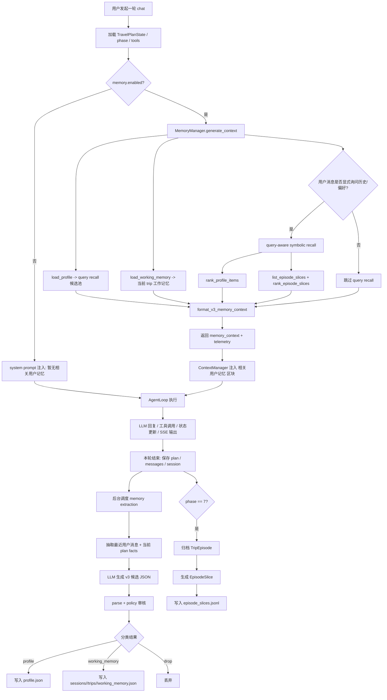
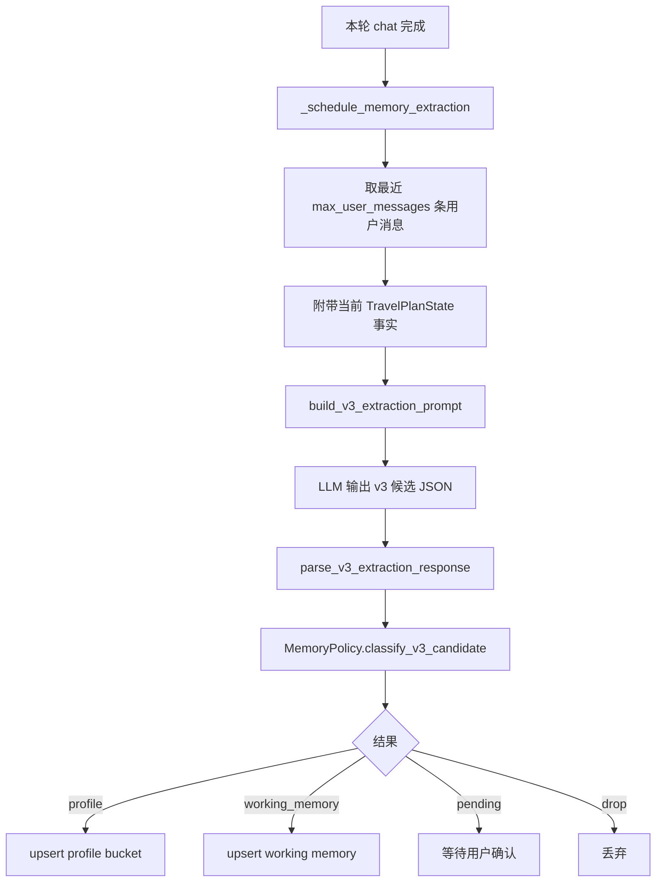

# 旅行 Agent 记忆系统运作流程

本文描述当前 Travel Agent Pro 的 v3-only 记忆系统：system prompt 固定注入当前 trip 的 working memory，并在显式历史/偏好问题上按查询召回 profile 与 episode slice；当前旅行事实始终由 `TravelPlanState` 权威提供。

## 总览

当前记忆系统是一个异步、分层、带审核策略的 v3-only 记忆层：

- 每轮对话开始前：`MemoryManager.generate_context()` 按 v3-only 架构组装 prompt 记忆区块。
- 每轮对话结束后：后台从最近用户消息中抽取 profile / working memory 候选，经 policy 审核后保存。
- 用户确认后：待确认的长期画像项才会变成 `active` 并进入后续召回。
- 行程完成时：系统归档完整 `TripEpisode`，并额外生成可进入 prompt 的 `EpisodeSlice`。
- 当前行程事实不从记忆系统回填，而是始终由 `TravelPlanState` 提供。



## 读记忆：进入 Agent 上下文

每轮 chat 开始前，后端会在 `backend/main.py` 中调用：

- `MemoryManager.generate_context(req.user_id, plan, user_message=req.message)`
- 入口：`backend/main.py`
- 召回编排：`backend/memory/manager.py`
- query-aware symbolic recall：`backend/memory/symbolic_recall.py`
- 格式化：`backend/memory/formatter.py`

当前 `generate_context(...)` 返回：

- `memory_context`：真正写入 system prompt 的记忆文本
- `MemoryRecallTelemetry`：召回来源计数、命中 id、matched reason，供 telemetry 与 SSE `memory_recall` 使用

### Prompt 中的两类记忆

| 层级 | 来源 | 何时进入 prompt | 作用 |
|------|------|------------------|------|
| working memory recall | 当前 `session_id + trip_id` 的 working memory | 每轮固定召回 | 当前 trip 里的临时拒绝、待避免方向、阶段性提醒 |
| query-aware symbolic recall | `rank_profile_items()` + `rank_episode_slices()` | 只在用户显式询问历史经验、以往选择、长期偏好时触发 | 把与当前问题直接相关的长期画像和 episode slice 补进上下文 |

### 没有“广义 trip memory prompt 区块”

v2 中的“本次旅行记忆”宽召回已经移除。当前 prompt assembly 不再做：

- `retrieve_trip_memory(...)`
- `retrieve_phase_relevant(...)`
- `format_memory_context(...)`
- 从 `memory.json` 中广泛读取 `scope == trip` 的记忆后直接拼 prompt

原因是：

- 当前旅行事实已经在 `TravelPlanState` 中完整存在，继续从记忆系统重复注入会造成双重信号。
- working memory 只保留当前会话真正需要记住、但不适合写进状态的短期信息。
- 历史旅行经验只在用户显式追问“上次怎样”“我以前偏好什么”时触发 query-aware symbolic recall。

### 召回细节

#### 1. Profile query recall

`MemoryManager.generate_context()` 会加载 `profile.json` 作为候选池，但 profile 不再每轮固定注入。只有 recall gate / retrieval plan 认为本轮需要历史或长期偏好时，才通过 `rank_profile_items()` 选择相关条目进入 prompt。

#### 2. Working memory recall

`FileMemoryV3Store.load_working_memory(user_id, session_id, trip_id)` 读取当前会话 working memory，只保留 `status == active` 的项目。

这类信息通常是：

- 当前候选阶段先不要再推荐某个区域
- 本轮筛选里暂时避开某种交通方式
- 会话结束或 trip 轮转后即可失效的临时偏好

#### 3. Query-aware symbolic recall

只有当用户消息满足显式历史/偏好查询信号时，才会触发：

- `should_trigger_memory_recall(user_message)`
- 或 `build_recall_query(user_message).needs_memory`

触发后会做两件事：

1. 从 profile 中按关键词、domain、实体线索排序相关长期画像。
2. 从 `episode_slices.jsonl` 中筛选并排序相关历史切片。

如果用户只是问“这次预算多少”“当前方案住哪里”，这类当前行程问题不应触发历史记忆召回，因为答案应直接来自 `TravelPlanState`。

#### 4. Episode slice recall

`EpisodeSlice` 不是整段完整 episode，而是从已完成旅行中切出的、可安全进入 prompt 的结构化片段，例如：

- 某次住宿决策
- 某次交通选择
- 某类节奏反馈
- 某个 destination 上的经验总结

这保证 prompt 里只出现和当前问题相关的短片段，而不是整份旧行程归档。

## 写记忆：每轮结束后后台抽取

记忆抽取仍然是异步后台任务，但输出目标已经从 v2 `MemoryItem(scope=global|trip)` 改为 v3 分层存储。



### 抽取输入

抽取 prompt 会包含：

- 最近 `config.memory.extraction.max_user_messages` 条用户消息
- 当前 `TravelPlanState` 中的事实：目的地、日期、预算、人数、阶段、已选骨架等
- 已有 profile / working memory 线索，用于避免重复抽取

### 抽取输出

抽取模型输出的是分层候选，而不是单一的 v2 `MemoryItem`：

- 长期 profile 候选
- working memory 候选
- 需要 drop 的敏感或无价值信息

最终由 parser 和 policy 决定落到哪个 v3 存储层。

## Policy：哪些记忆会保存

`MemoryPolicy` 负责：

- 区分 profile 与 working memory 的落点
- 拦截 payment、membership、证件号、手机号、邮箱等不应保存的信息
- 对高风险或置信度不足的长期画像要求确认
- 允许短期、上下文相关的信息进入 working memory，而不污染长期画像

核心原则：

- 长期稳定、跨行程复用的信息进入 profile
- 当前会话短期有效的信息进入 working memory
- 当前旅行的事实细节优先写入 `TravelPlanState`，不是写进记忆系统当 prompt 主来源

## 归档：TripEpisode 与 EpisodeSlice

当 `plan.phase == 7` 时，系统会归档完整 `TripEpisode`，包含：

- `session_id`
- `trip_id`
- destination / dates / travelers / budget
- 选中的 skeleton
- 最终方案摘要
- 本次相关 accepted / rejected 项
- lessons

但完整 `TripEpisode` 不直接进入 prompt。

真正参与后续召回的是根据它生成的 `EpisodeSlice`：

- 写入 `episode_slices.jsonl`
- 作为 query-aware symbolic recall 的候选池
- 按 destination / domain / keyword / entity 做筛选与排序

## TravelPlanState 与记忆系统的边界

这是当前 v3 架构最重要的边界：

- `TravelPlanState`：当前旅行的唯一权威事实源
- profile：跨会话、跨行程稳定偏好
- working memory：当前会话短期提醒
- episode slices：已完成旅行的可检索历史经验

因此像下面这些信息，应该直接读 `TravelPlanState`，而不是走历史记忆召回：

- 这次目的地是哪里
- 这次预算是多少
- 这次一共几天
- 当前 shortlist / skeleton / 住宿 /交通是什么

## 存储结构

当前用户记忆目录只保留 v3 主存储：

```mermaid
flowchart TD
    A[data/users/{user_id}/] --> B[memory/]
    B --> B1[profile.json]
    B --> B2[sessions/{session_id}/trips/{trip_id}/working_memory.json]
    B --> B3[episode_slices.jsonl]
    B --> B4[episodes.jsonl]
    B --> B5[events.jsonl]
```

说明：

- `memory/profile.json` 是 v3 长期画像主存储。
- `memory/sessions/<session_id>/trips/<trip_id>/working_memory.json` 是 v3 当前 trip 工作记忆主存储。
- `memory/episode_slices.jsonl` 是 v3 历史切片主存储。
- `memory/episodes.jsonl` 是 v3 完整旅行归档。
- `memory/events.jsonl` 是 v3 记忆审计事件流。

## 对外接口

当前前后端使用 v3 接口：

- `GET /api/memory/{user_id}/profile`
- `GET /api/memory/{user_id}/episode-slices`
- `GET /api/memory/{user_id}/sessions/{session_id}/working-memory`
- `GET /api/memory/{user_id}/episodes`
- `POST /api/memory/{user_id}/profile/{item_id}/confirm`
- `POST /api/memory/{user_id}/profile/{item_id}/reject`
- `DELETE /api/memory/{user_id}/profile/{item_id}`

## 关键代码入口

| 功能 | 文件 |
|------|------|
| chat 主链路与 SSE | `backend/main.py` |
| 构建 system prompt 并注入记忆 | `backend/context/manager.py` |
| v3 记忆编排 facade | `backend/memory/manager.py` |
| v3 模型 | `backend/memory/v3_models.py` |
| v3 文件存储 | `backend/memory/v3_store.py` |
| query-aware symbolic recall | `backend/memory/symbolic_recall.py` |
| v3 抽取 prompt 与 parser | `backend/memory/extraction.py` |
| policy、脱敏、落点路由 | `backend/memory/policy.py` |
| prompt 格式化 | `backend/memory/formatter.py` |

## 一句话总结

当前记忆系统的核心模式是：每轮前固定召回当前 trip working memory，并只在显式历史/偏好问题上触发 profile / episode slice 的 query-aware symbolic recall；每轮后异步抽取并写入 v3 分层存储；当前旅行事实始终由 `TravelPlanState` 权威提供，不再依赖 v2 的广义 trip memory prompt 注入。
