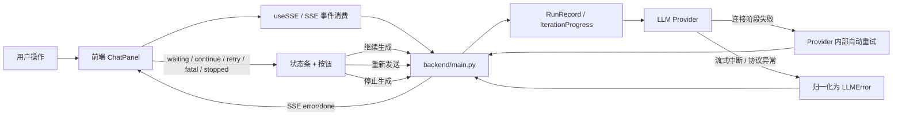
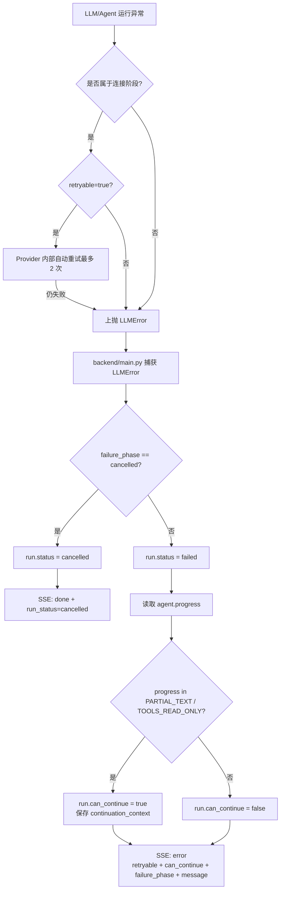
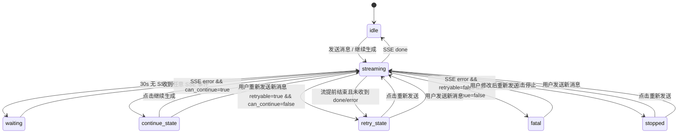
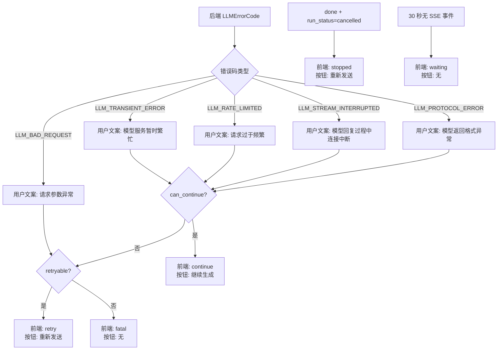
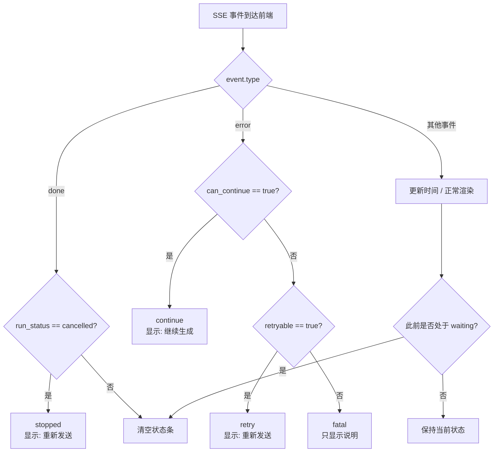
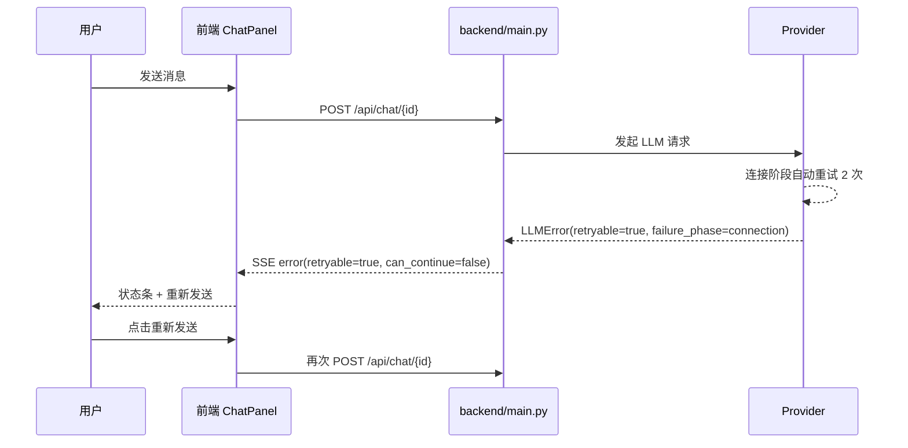
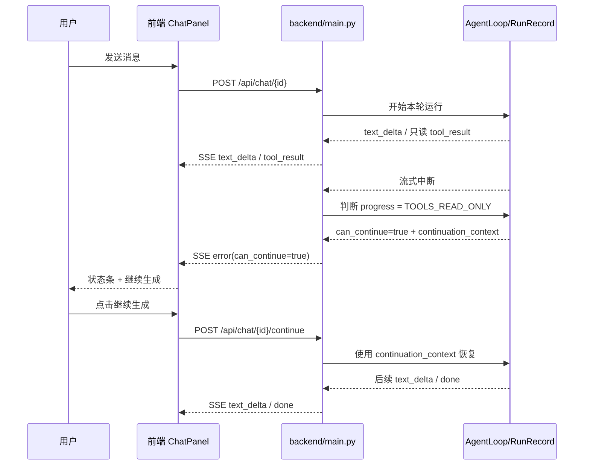
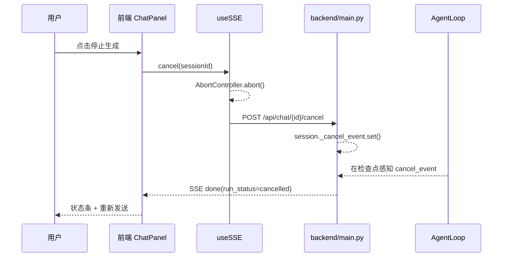

# 2026-04-14 重试与中断恢复机制：前后端如何配合

## 1. 文档目的

本文档描述当前项目中“重试 / 继续生成 / 停止生成 / 连接疑似断开”这套韧性机制是如何由后端和前端共同完成的。

它不是设计稿，而是对当前真实实现的工程说明，适合回答下面几类问题：

- 为什么有些失败会显示“继续生成”，有些只显示“重新发送”？
- 为什么前端不自己自动重试？
- 用户点击“停止生成”之后，后端到底发生了什么？
- `retryable`、`can_continue`、`run_status` 这些字段分别是谁决定的？
- 前端的 `waiting / continue / retry / fatal / stopped` 五种状态分别对应什么后端语义？

相关实现文件：

- 后端错误分类：`backend/llm/errors.py`
- 后端运行状态：`backend/run.py`
- 后端 SSE 主逻辑：`backend/main.py`
- 前端 SSE Hook：`frontend/src/hooks/useSSE.ts`
- 前端状态映射与 UI：`frontend/src/components/ChatPanel.tsx`
- 前端专项 E2E：`e2e-retry-experience.spec.ts`

---

## 2. 整体思路

当前机制的核心原则是：

1. 后端负责判断失败是否可恢复。
2. 后端负责判断是“重新发一轮”还是“可以从中断点继续”。
3. 前端不发明自己的业务重试策略，只消费后端给出的恢复语义。
4. 前端补一个“连接看起来卡住了，但后端还没明确报错”的等待态，用于改善用户感知。

换句话说，真正的恢复语义来自后端，前端做的是“把恢复语义翻译成用户可理解的状态和按钮”。

### 2.1 总览图：三层恢复职责



---

## 3. 后端职责：先把失败归一化，再决定能否恢复

### 3.1 Provider 层先把异常归一化

最底层的 LLM SDK 异常来源很多：

- 429 限流
- 5xx 服务端错误
- 连接失败
- 流式中途断开
- 协议解析失败

项目不会把这些底层异常直接抛给前端，而是先收敛成统一的 `LLMError`。

定义在：`backend/llm/errors.py`

核心字段：

- `code`
- `retryable`
- `provider`
- `model`
- `failure_phase`
- `raw_error`

当前错误码：

- `LLM_TRANSIENT_ERROR`
- `LLM_RATE_LIMITED`
- `LLM_BAD_REQUEST`
- `LLM_STREAM_INTERRUPTED`
- `LLM_PROTOCOL_ERROR`

这里最关键的不是错误码本身，而是这两个语义字段：

- `retryable`
  含义：这次失败是否值得再来一轮请求
- `failure_phase`
  含义：错误发生在连接阶段、流式阶段、解析阶段还是取消阶段

### 3.2 Provider 只在“连接阶段”做自动重试

项目当前把自动重试限制在 provider 层，而且只处理连接阶段错误。

原因是：

- 如果连接还没真正建立，自动重试不会重复输出内容
- 如果已经开始流式输出，再自动重试很容易造成重复 token 或重复工具调用

所以后端的策略是：

1. `failure_phase == connection` 且 `retryable == true`
2. provider 内部自动重试最多 2 次
3. 一旦进入真实流式输出阶段，就不再由 provider 自动重试

这意味着用户最终看到的“可重试”，通常是 provider 已经把自己的连接级重试用完之后，才上抛到上层的结果。

### 3.3 AgentLoop 追踪本轮执行进度

仅仅知道“这次失败可不可以重发”还不够，还需要知道“能不能从中断点继续”。

这部分由运行时进度模型来判断。

定义在：`backend/run.py`

关键结构：

- `IterationProgress`
  - `NO_OUTPUT`
  - `PARTIAL_TEXT`
  - `PARTIAL_TOOL_CALL`
  - `TOOLS_READ_ONLY`
  - `TOOLS_WITH_WRITES`
- `RunRecord`
  - `status`
  - `error_code`
  - `can_continue`
  - `continuation_context`

后端不是“只要失败就能继续”，而是根据本轮实际推进到哪里来判断。

当前 `backend/main.py` 中的判断是：

- 仅当 `progress` 属于以下两类时，才允许继续：
  - `PARTIAL_TEXT`
  - `TOOLS_READ_ONLY`

也就是说：

- 如果只是生成了一部分文本，可以继续
- 如果执行过的工具都是只读工具，也可以继续
- 如果已经执行了会修改状态的写工具，则不允许继续，只能重新发一轮

这是为了避免“继续生成”把系统带进不一致状态。

### 3.4 RunRecord 记录最近一轮运行是否可继续

当一次流式回复失败时，后端会把这轮运行记录进 `RunRecord`：

- `status = failed / cancelled / completed`
- `error_code`
- `can_continue`
- `continuation_context`

如果允许继续，后端还会把恢复所需的上下文保存下来，比如：

- 已经产出的部分 assistant 文本
- 当前属于纯文本中断还是只读工具中断
- 在只读工具场景下，已经完成了多少个 tool result

这就是 `/api/chat/{session_id}/continue` 能成立的基础。

### 3.5 后端恢复判定流程图



---

## 4. 后端如何通过 SSE 把恢复语义发给前端

### 4.1 正常流式输出

主逻辑在：`backend/main.py` 的 `_run_agent_stream()`

后端会持续发这些事件：

- `text_delta`
- `tool_call`
- `tool_result`
- `state_update`
- `context_compression`
- `memory_recall`
- `done`

同时还会启动 keepalive 循环，每 15 秒塞一个 `keepalive` 事件到队列里，避免前端长时间完全无感。

### 4.2 失败时发结构化 `error`

当 `_run_agent_stream()` 捕获到 `LLMError` 时，不会直接断流，而是先产出结构化的 SSE `error` 事件。

典型字段如下：

```json
{
  "type": "error",
  "error_code": "LLM_STREAM_INTERRUPTED",
  "retryable": true,
  "can_continue": true,
  "provider": "openai",
  "model": "gpt-4o",
  "failure_phase": "streaming",
  "message": "模型回复过程中连接中断。请重试。",
  "error": "...底层原始错误..."
}
```

这里前端真正依赖的是：

- `retryable`
- `can_continue`
- `failure_phase`
- `message`

### 4.3 取消不是 `error`，而是 `done + run_status=cancelled`

用户主动停止属于一个特殊分支。

当后端捕获到 `failure_phase == cancelled` 的 `LLMError` 时，不会发 `error`，而是发：

```json
{
  "type": "done",
  "run_id": "...",
  "run_status": "cancelled"
}
```

这表示：

- 本轮已被用户终止
- 这不是模型异常，也不是系统故障
- 前端应当进入“用户已停止”的语义，而不是“模型出错”的语义

这是当前机制里一个很重要的语义分界。

---

## 5. 前端职责：消费恢复语义，不自行发明恢复语义

### 5.1 `useSSE` 只做传输层，不做业务判断

`frontend/src/hooks/useSSE.ts` 当前只做三件事：

1. 用 `fetch + ReadableStream` 读取 SSE
2. 逐行解析 `data: ...`
3. 把事件原样交给 `onEvent`

它提供三个能力：

- `sendMessage(sessionId, message, onEvent)`
- `cancel(sessionId)`
- `continueGeneration(sessionId, onEvent)`

这说明：

- 业务级“该继续还是该重试”不在 `useSSE` 里判断
- 业务判断统一放在 `ChatPanel.tsx`

### 5.2 ChatPanel 建立前端状态机

当前前端的统一状态是：`streamFeedback`

定义在：`frontend/src/components/ChatPanel.tsx`

```ts
type StreamFeedbackKind = 'waiting' | 'continue' | 'retry' | 'fatal' | 'stopped'
```

这五种状态分别对应：

- `waiting`
  前端认为连接可能卡住，但后端还没明确报错
- `continue`
  后端明确表示可以从中断点继续
- `retry`
  后端明确表示可以重新来一轮，或前端检测到流异常提前结束
- `fatal`
  后端明确表示这次失败不适合自动恢复
- `stopped`
  用户主动停止

前端没有更多隐藏状态，也没有二次推导一套复杂恢复系统。这个设计故意做得很薄。

### 5.3 前端状态机图



---

## 6. 前端如何把后端字段映射成 UI

### 6.1 `createErrorFeedback()` 是核心映射点

在 `ChatPanel.tsx` 中，`createErrorFeedback(event)` 完成了后端语义到前端状态的映射。

规则如下。

#### 情况 A：`event.run_status === 'cancelled'`

映射到：`stopped`

前端文案：

- 主文案：`已停止生成。`
- 次文案：`可以重新发送上一条消息，或修改内容后再发。`
- 动作：`重新发送`

#### 情况 B：`event.can_continue === true`

映射到：`continue`

前端文案：

- 主文案：`回复已中断，可从当前位置继续生成。`
- 次文案：`{failure_phase 中文化} + {message}`
- 动作：`继续生成`

这里优先级高于 `retryable`。也就是说，只要能继续，前端优先给“继续生成”，而不是“重新发送”。

#### 情况 C：`event.retryable === true` 且不能继续

映射到：`retry`

前端文案：

- 主文案：`本轮生成失败，可重新发送上一条消息。`
- 次文案：`{failure_phase 中文化} + {message}`
- 动作：`重新发送`

#### 情况 D：既不能继续，也不可重试

映射到：`fatal`

前端文案：

- 主文案：`本轮生成未完成，请调整后重新发送。`
- 次文案：`{failure_phase 中文化} + {message}`
- 动作：无

这类场景中，前端刻意不再显示误导性按钮。

### 6.2 `failure_phase` 只负责补充解释，不决定按钮

前端会把：

- `connection`
- `streaming`
- `parsing`
- `cancelled`

映射成中文：

- `连接阶段`
- `回复阶段`
- `解析阶段`
- `取消阶段`

但它只用于展示次文案，例如：

- `回复阶段：模型回复过程中连接中断。`

真正决定按钮的是：

- `can_continue`
- `retryable`
- `run_status`

### 6.3 错误码、用户文案与前端动作的关系图

注意：前端按钮最终还是由 `can_continue / retryable / run_status` 决定，不是单纯由 `error_code` 决定。

但在用户感知层面，不同错误码通常会带来不同的中文提示，因此可以用下面这张图快速理解“错误码通常会落到什么体验上”。



---

## 7. 前端自己的补充机制：waiting 态

前端除了消费后端的 `error` / `done`，还额外实现了一个本地等待态。

### 7.1 进入条件

在流式中：

- `streaming = true`
- 超过 `30 秒` 没收到任何 SSE 事件

对应代码：

- `KEEPALIVE_TIMEOUT_MS = 30_000`
- `KEEPALIVE_CHECK_INTERVAL_MS = 5_000`

### 7.2 进入 waiting 后展示什么

前端显示：

- 主文案：`连接似乎不稳定，正在等待模型继续响应。`
- 次文案：`如果长时间没有恢复，可先停止，再重新发送上一条消息。`
- 动作：无

### 7.3 为什么要有这个状态

因为它覆盖的是一种“后端还没明确失败，但用户已经感知到卡住”的中间状态。

这个状态不是后端判出来的，而是前端为了用户体验自己补的。

它的边界很明确：

- 只用于提示，不代表真正失败
- 一旦收到新的 SSE 事件，就会自动清掉
- 一旦后端发来 `error` / `done`，就由后端语义接管

---

## 8. 用户动作如何反向驱动后端

### 8.1 停止生成

当用户点击停止按钮时：

1. 前端 `handleStop()` 先把 `userStoppedRef` 设为 `true`
2. 前端调用 `cancel(sessionId)`
3. `useSSE.cancel()` 会做两件事：
   - 本地 `AbortController.abort()` 中断浏览器请求
   - 再发 `POST /api/chat/{sessionId}/cancel`
4. 后端把 session 上的 `cancel_event` 置位
5. AgentLoop 在三个检查点响应取消
6. 后端把本轮 run 标记为 `cancelled`
7. SSE 最终以 `done + run_status=cancelled` 结束

前端这时显示 `stopped` 状态条。

### 8.2 继续生成

当用户点击 `继续生成`：

1. 前端调用 `continueGeneration(sessionId, onEvent)`
2. 前端请求 `POST /api/chat/{sessionId}/continue`
3. 后端读取最近一次 `RunRecord`
4. 只有 `run.can_continue == true` 且有 `continuation_context` 时，才允许继续
5. 后端基于保存的中断上下文重新进入 `_run_agent_stream()`
6. 前端像普通流式响应一样继续消费新的 `text_delta/tool_result/state_update/done`

前端不会自己拼“继续 prompt”，这部分完全由后端负责。

### 8.3 重新发送

当用户点击 `重新发送`：

1. 前端取 `lastUserMessageRef.current`
2. 重新走 `startMessageStream(lastUserMessage, false)`
3. 本质上就是重新调用一次 `sendMessage(sessionId, message, onEvent)`
4. 即重新请求 `POST /api/chat/{sessionId}`

它不是继续，而是“再跑一轮完整请求”。

这也是为什么 `retry` 和 `continue` 必须严格区分。

---

## 9. 五种前端状态与后端语义对照表

| 前端状态 | 触发来源 | 典型后端信号 | 前端动作 |
|------|------|------|------|
| `waiting` | 前端本地检测 | 流式中 30s 无事件 | 无按钮，仅提示等待或停止 |
| `continue` | 后端明确允许继续 | `error.can_continue = true` | `POST /api/chat/{id}/continue` |
| `retry` | 后端明确允许重来，或流异常提前结束 | `error.retryable = true` 且不能继续；或未收到 `done/error` 就结束 | 重新发送上一条用户消息 |
| `fatal` | 后端明确不可恢复 | `error.retryable = false` 且 `can_continue = false` | 不给动作按钮 |
| `stopped` | 用户主动停止 | `done.run_status = cancelled` 或本地 stop 分支 | 重新发送上一条用户消息 |

### 9.1 后端字段到前端按钮的映射图



---

## 10. 三条典型时序

### 10.1 场景一：连接阶段失败，可重新发送

```text
用户发送消息
  -> 前端 POST /api/chat/{id}
  -> Provider 建连失败，内部自动重试 2 次
  -> 仍失败，抛出 LLMError(retryable=true, failure_phase=connection)
  -> backend/main.py 发 SSE error
  -> 前端映射为 retry
  -> 用户点击“重新发送”
  -> 前端再次 POST /api/chat/{id}
```



### 10.2 场景二：流式中断，但可以继续

```text
用户发送消息
  -> 前端 POST /api/chat/{id}
  -> 后端已输出部分 text_delta
  -> 只读工具已执行，随后流中断
  -> AgentLoop progress = TOOLS_READ_ONLY
  -> RunRecord.can_continue = true
  -> backend/main.py 发 SSE error(can_continue=true)
  -> 前端映射为 continue
  -> 用户点击“继续生成”
  -> 前端 POST /api/chat/{id}/continue
  -> 后端利用 continuation_context 恢复本轮
```



### 10.3 场景三：用户主动停止

```text
用户发送消息
  -> 前端进入 streaming
  -> 用户点击“停止生成”
  -> 前端 abort 本地请求 + POST /api/chat/{id}/cancel
  -> 后端 cancel_event 被置位
  -> AgentLoop 在检查点抛出 cancelled LLMError
  -> backend/main.py 发 done(run_status=cancelled)
  -> 前端映射为 stopped
  -> 用户可点击“重新发送”再跑一轮
```



---

## 11. 为什么前端不做自动业务重试

这是当前实现里一个非常刻意的取舍。

原因有四个：

1. Provider 层已经做了连接阶段自动重试。
2. 进入流式阶段后自动重试风险很大，可能重复输出文本。
3. 如果中途有写工具执行，自动重试可能造成重复副作用。
4. 用户通常更需要知道“现在该继续、该重发、还是该修改输入”，而不是系统悄悄帮他多试几次。

因此目前策略是：

- 自动重试只在 provider 连接层
- 前端动作全部显式交给用户确认

---

## 12. 当前机制的边界与已知限制

### 12.1 “重新发送”不是幂等恢复

`retry` / `stopped` 下的“重新发送”本质是重新提交上一条用户消息。

它不是断点续传，也不保证与前一轮完全一致。

### 12.2 `waiting` 是前端推测，不代表后端确认异常

30 秒无事件时，前端只能说“连接似乎不稳定”，不能说“一定已经失败”。

### 12.3 `continue` 只覆盖安全子集

当前只允许：

- 部分文本中断
- 只读工具中断

一旦涉及写工具，当前设计更倾向于禁止继续，避免脏状态。

### 12.4 `useSSE` 仍然是轻量实现

它没有单独的连接状态枚举，也没有内建的自动恢复逻辑。所有恢复语义仍然在 `ChatPanel` 中统一处理。

---

## 13. 这套机制为什么是合理的

它把系统拆成了三层清晰职责：

### 第一层：Provider 韧性

负责处理最底层的连接问题。

关键词：

- 错误归一化
- 连接阶段自动重试

### 第二层：Run 韧性

负责判断这一轮执行推进到哪里，是否还能安全恢复。

关键词：

- `IterationProgress`
- `RunRecord`
- `can_continue`
- `continuation_context`

### 第三层：UI 韧性

负责把恢复语义翻译成用户可执行动作。

关键词：

- `waiting`
- `continue`
- `retry`
- `fatal`
- `stopped`

这个分层的最大好处是：

- 后端专注“能不能恢复”
- 前端专注“怎么让用户理解和操作恢复”

两边没有互相污染职责。

---

## 14. 对排查问题最有用的观察点

如果以后要排查“为什么用户看到的是继续生成而不是重新发送”，优先看这几个位置：

1. `backend/llm/errors.py`
看异常是否被归成了 `retryable=true/false`

2. `backend/main.py`
看 `_run_agent_stream()` 中 `progress -> can_continue` 的判定

3. `backend/run.py`
看 `RunRecord.can_continue` 和 `continuation_context`

4. `frontend/src/components/ChatPanel.tsx`
看 `createErrorFeedback()` 是否把后端字段映射成了正确的 UI 状态

5. `e2e-retry-experience.spec.ts`
看现有四类核心恢复路径是否还保持通过

---

## 15. 总结

当前项目的“重试机制”并不是单一的“失败后再试一次”，而是一整套分层恢复系统：

- Provider 层负责连接级自动重试
- Run 层负责判断是否可以安全继续
- SSE 层把恢复语义结构化传给前端
- 前端把恢复语义收敛成五种可理解状态
- 用户通过“继续生成”或“重新发送”驱动后端继续恢复

因此，前端看到的每个按钮，都对应后端真实存在的一种恢复能力：

- `继续生成` 对应后端 `can_continue`
- `重新发送` 对应重新调用 `/api/chat/{id}`
- `停止生成` 对应 `cancel_event + /cancel`
- `waiting` 对应前端本地 keepalive 超时感知

这就是当前系统中，前后端围绕重试与中断恢复的完整配合方式。
