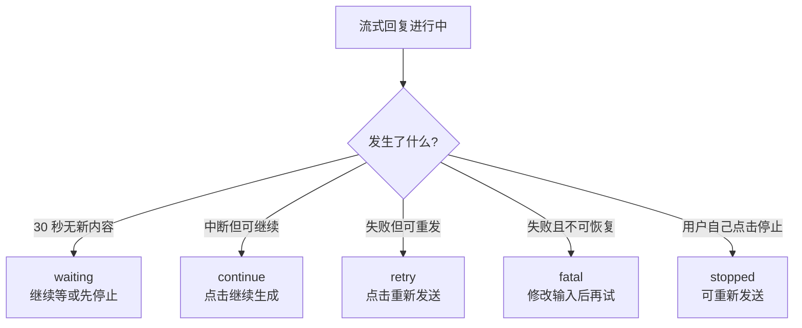
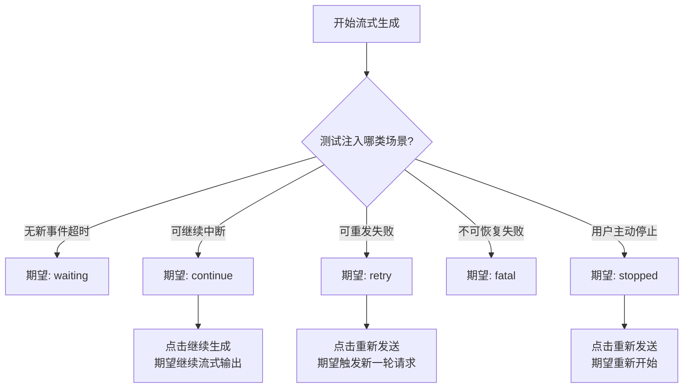

# 2026-04-14 重试与中断恢复机制说明（产品 / 测试版）

## 1. 这份文档是给谁看的

这份文档面向：

- 产品同学
- 测试同学
- 需要理解用户体验但不关心底层代码细节的人

它回答的重点不是“代码怎么写”，而是：

- 用户在什么情况下会看到什么提示
- 每个提示背后意味着什么
- 用户下一步能做什么
- 测试时应该重点验证哪些场景

如果你需要工程实现细节，请看：

- `docs/learning/2026-04-14-重试恢复机制.md`

---

## 2. 这套机制要解决什么问题

聊天型产品在流式生成时，经常会遇到这些问题：

- 连接暂时抖动
- 模型输出到一半中断
- 用户手动停止生成
- 请求本身有问题，不能继续

如果产品只给用户一句模糊提示，比如“连接可能已断开”，用户通常不知道下一步该做什么。

这次机制升级的目标，是把这些情况区分开，让用户明确知道：

1. 现在是继续等
2. 现在可以继续生成
3. 现在应该重新发送
4. 现在需要修改输入后再试

---

## 3. 用户现在会看到的 5 种状态

当前前端把所有中断/恢复场景，统一收敛成 5 种状态。

### 3.1 waiting：连接看起来不稳定，但系统还没确认失败

用户看到：

- `连接似乎不稳定，正在等待模型继续响应。`
- `如果长时间没有恢复，可先停止，再重新发送上一条消息。`

这代表：

- 页面已经很久没有收到新的流式内容
- 但系统还没有明确告诉前端“本轮失败了”

用户此时能做的事：

- 继续等待
- 点击停止
- 之后重新发送

这不是明确错误，更像“连接疑似卡住”的提醒。

### 3.2 continue：这轮回复中断了，但可以接着往下生成

用户看到：

- `回复已中断，可从当前位置继续生成。`
- 一个 `继续生成` 按钮

这代表：

- 系统认为这轮生成已经有一部分可用内容
- 并且当前状态允许从中断点继续，而不是整轮重来

用户此时最合理的动作：

- 点击 `继续生成`

### 3.3 retry：这轮失败了，适合重新发一次

用户看到：

- `本轮生成失败，可重新发送上一条消息。`
- 一个 `重新发送` 按钮

这代表：

- 这次没有办法从中断点继续
- 但重新来一轮是安全的

用户此时最合理的动作：

- 点击 `重新发送`

### 3.4 fatal：这轮失败了，而且不建议直接恢复

用户看到：

- `本轮生成未完成，请调整后重新发送。`
- 没有恢复按钮

这代表：

- 当前错误更像请求本身有问题，或者这次异常不适合继续恢复
- 系统不希望误导用户去点“继续生成”或“重新发送”

用户此时最合理的动作：

- 修改输入内容
- 缩短上下文
- 再次发送

### 3.5 stopped：用户自己主动停止了生成

用户看到：

- `已停止生成。`
- `可以重新发送上一条消息，或修改内容后再发。`
- 一个 `重新发送` 按钮

这代表：

- 不是系统故障
- 是用户主动中止了本轮生成

用户此时最合理的动作：

- 重新发送上一条消息
- 或者修改输入后再发

---

## 4. 这 5 种状态怎么理解

可以用一句话记住：

- `waiting`：先等等
- `continue`：接着写
- `retry`：整轮重来
- `fatal`：先改再试
- `stopped`：你自己停的，可以重发

### 4.1 一张总览图

---

## 5. 用户操作与系统行为的对应关系

### 5.1 点击“继续生成”

表示：

- 不重来
- 尝试在已有结果基础上继续往下生成

预期体验：

- 页面继续进入流式输出状态
- 之前已经生成出来的内容保留
- 后续内容继续接在后面

### 5.2 点击“重新发送”

表示：

- 把上一条用户消息重新发一次
- 重新走一轮完整请求

预期体验：

- 会新增一轮新的回复尝试
- 不是从中断点续写，而是重来一次

### 5.3 点击“停止生成”

表示：

- 用户主动要求本轮停止

预期体验：

- 当前流式输出停止
- 页面显示 `已停止生成`
- 用户可以选择重新发送

---

## 6. 最容易混淆的两组概念

### 6.1 “继续生成” 和 “重新发送” 的区别

`继续生成`：

- 在已有结果基础上往下接
- 更适合“回复到一半断了”的情况

`重新发送`：

- 把上一条用户消息整轮再跑一次
- 更适合“这轮失败了，但不适合从中间恢复”的情况

### 6.2 `waiting` 和 `retry` 的区别

`waiting`：

- 系统还没明确认定失败
- 更像“可能卡住了”

`retry`：

- 系统已经明确认定本轮失败
- 并且给出了可恢复动作

---

## 7. 产品视角下，这套机制带来的体验提升

### 7.1 从“模糊报错”变成“明确下一步”

过去用户更容易遇到：

- 看见一句断线提示
- 不知道应该等、停、继续还是重发

现在用户可以更明确地知道：

- 应该继续等
- 应该继续生成
- 应该重新发送
- 还是应该先改输入

### 7.2 减少误操作

如果一个错误不适合恢复，前端不会再展示误导性的恢复按钮。

这样可以减少：

- 无意义重复点击
- 反复失败
- 用户对系统状态的误解

### 7.3 保留已生成内容

当回复生成到一半中断时，页面不会直接把已有内容清空。

这样用户至少还能看到已经生成出来的部分，再决定是否继续或重发。

---

## 8. 测试应该重点覆盖什么

测试时建议至少覆盖下面 5 类场景。

### 8.1 长时间无新流式内容

验证点：

- 是否出现 `waiting` 状态
- 文案是否正确
- 是否没有误导性按钮

### 8.2 中断但可继续

验证点：

- 是否出现 `继续生成`
- 点击后是否能继续产出内容
- 已有内容是否被保留

### 8.3 失败但可重发

验证点：

- 是否出现 `重新发送`
- 点击后是否重新触发新一轮请求
- 是否确实复用了上一条用户消息

### 8.4 不可恢复错误

验证点：

- 是否只显示说明文案
- 是否没有 `继续生成` / `重新发送` 按钮

### 8.5 用户主动停止

验证点：

- 点击停止后是否立即结束流式状态
- 是否显示 `已停止生成`
- 是否允许重新发送

### 8.6 一张测试视角流程图

---

## 9. 一页式结论

如果只记住最重要的内容，可以记这几句：

1. 不是所有失败都该“重试”。
2. 有些失败应该“继续生成”，有些应该“重新发送”，有些应该“修改后再试”。
3. `waiting` 不是确定失败，只是连接疑似卡住。
4. `stopped` 不是系统报错，而是用户主动停止。
5. 这套机制的目标，是让用户永远知道“下一步该做什么”。

---

## 10. 建议怎么使用这份文档

### 给产品同学

重点看：

- 第 3 节：5 种状态
- 第 7 节：体验提升
- 第 9 节：一页式结论

### 给测试同学

重点看：

- 第 3 节：5 种状态
- 第 5 节：动作与行为对应关系
- 第 8 节：测试重点覆盖场景

### 给跨团队沟通

如果要对外解释，可以直接用下面这句话：

> 系统现在会把“等待、继续、重发、不可恢复、用户主动停止”明确区分开，并为每种情况提供对应的下一步操作，而不是只给一条模糊的断线提示。
