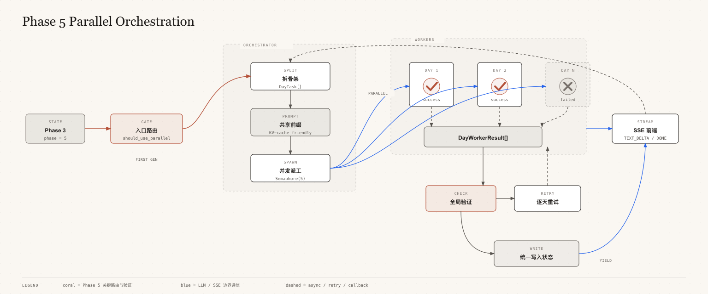
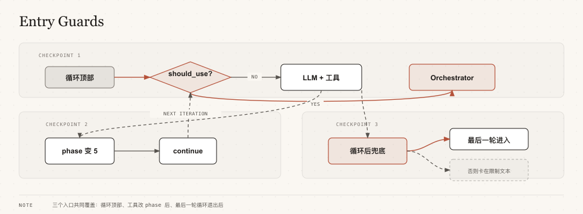
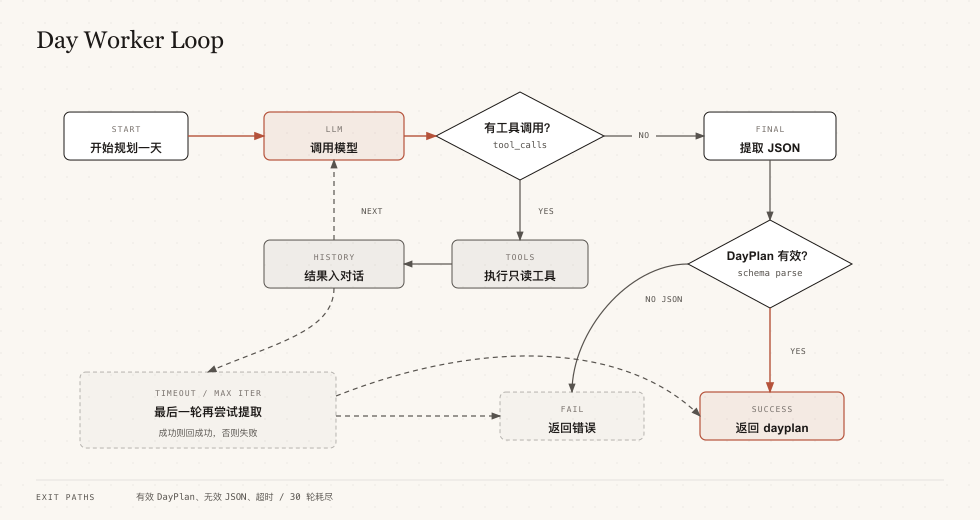
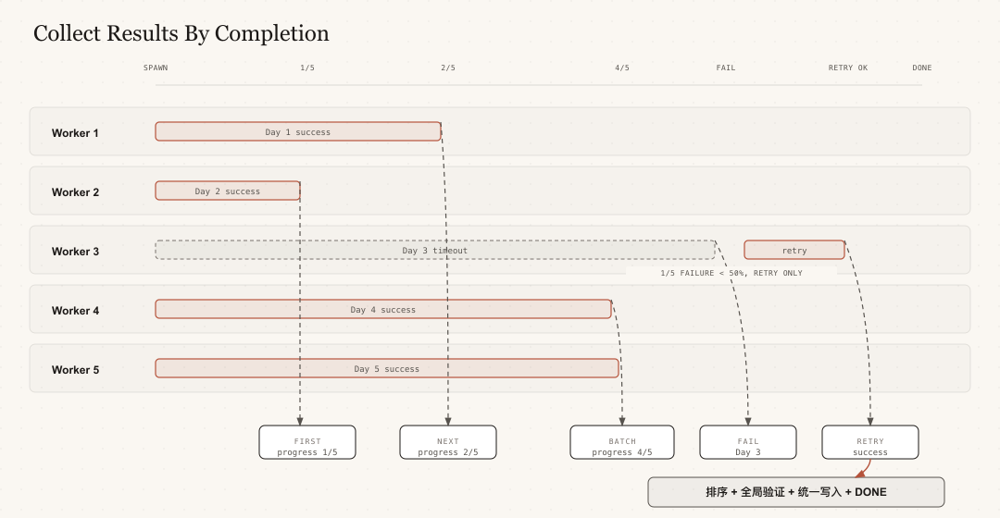

# Phase 5 并行编排架构详解

> 本文面向初学者，用伪代码 + 流程图 + 类比讲清 Orchestrator-Workers 的完整生命周期：
> 怎么进来的、怎么干活的、怎么收尾的、怎么回到主流程的。

---

## 一、宏观流程图



---

## 二、入口路由：怎么进入并行模式的？

### 2.1 路由判断伪代码

```python
def should_use_parallel_phase5(plan, config) -> bool:
    """只有5个条件同时满足才走并行模式"""
    if plan is None or config is None:
        return False
    if not config.enabled:                    # 配置没开
        return False
    if plan.phase != 5:                        # 不是 Phase 5
        return False
    if plan.daily_plans:                        # 已有行程（用户在修改，不是首次生成）
        return False
    if not plan.selected_skeleton_id:           # 没选骨架方案
        return False
    if not plan.skeleton_plans:                 # 没有骨架数据
        return False
    return True                                 # 全部满足 → 走并行
```

### 2.2 三个检查点

Phase 3 写入状态后 phase 变成 5，但 `run()` 方法开头的检查已经过了。
所以需要在**三个地方**再次检查：



**为什么需要循环后兜底？**

```
max_retries = 1（只允许1轮）

第1轮：
  LLM 调用写工具 → phase 从3变成5
  → continue 回到循环顶部
  → 但 for 循环只有1轮，结束了！
  → 不会再经过顶部检查

如果没有兜底检查 → 输出"[达到最大循环次数]" → 用户被卡住
有了兜底检查   → 触发 Orchestrator               → 正常进入并行模式
```

### 2.3 三轮修改的演进

| 版本 | 做了什么 | 还有什么问题 |
|------|---------|------------|
| `80a7398` 第一轮 | 在3个阶段切换点各加一个检查 | 4处重复代码 |
| `6d17027` 第二轮 | 合并到循环顶部，删掉4处重复 | 最后一轮迭代退出循环后漏掉 |
| `21792af` 第三轮 | 循环后加兜底检查 | 无，所有场景覆盖 |

---

## 三、Orchestrator：包工头做什么？

### 3.1 Orchestrator 是什么？

Orchestrator 是一个 **纯 Python 类**（不是 LLM，没有智能）。
它只做流程编排，不思考：

| 方法 | 做的事 | 需要智能吗 |
|------|--------|----------|
| `_find_selected_skeleton()` | 根据ID从骨架列表里找对应的方案 | 不需要，就是查字典 |
| `_split_tasks()` | 把骨架拆成每天一个任务单 | 不需要，就是遍历列表 |
| `_global_validate()` | 检查POI重复、预算超支、天数缺失 | 不需要，就是比数字 |
| `run()` | 按顺序调上面这些方法 | 不需要，就是流程编排 |

### 3.2 Orchestrator.run() 伪代码

```python
async def run(self) -> AsyncIterator[LLMChunk]:
    """Orchestrator 主流程：拆 → 派 → 收 → 验 → 写"""

    # ━━━━━━━━━━━━━━━━━━━━━━━━━━━━━━━━━━━━━━
    # 步骤1：拆骨架 → 每天一个任务单
    # ━━━━━━━━━━━━━━━━━━━━━━━━━━━━━━━━━━━━━━
    yield 发送进度事件("正在分解行程任务...")
    tasks = self._split_tasks()       # DayTask(day=1, date="2026-05-01", skeleton_slice=..., pace="relaxed")
    total_days = len(tasks)            # 比如说5天

    # ━━━━━━━━━━━━━━━━━━━━━━━━━━━━━━━━━━━━━━
    # 步骤2：构建共享 Prompt 前缀（所有Worker共享，只生成1次）
    # ━━━━━━━━━━━━━━━━━━━━━━━━━━━━━━━━━━━━━━
    shared_prefix = build_shared_prefix(self.plan)
    # 内容包括：
    #   - soul.md（Agent人格）
    #   - 旅行上下文（目的地、日期、人数、预算、偏好...）
    #   - Worker角色说明 + 硬法则
    #   - DayPlan JSON Schema
    # 约 3000 token，5个Worker完全一样 → KV-Cache命中率约93.75%

    # ━━━━━━━━━━━━━━━━━━━━━━━━━━━━━━━━━━━━━━
    # 步骤3：初始化进度追踪表
    # ━━━━━━━━━━━━━━━━━━━━━━━━━━━━━━━━━━━━━━
    worker_statuses = [
        {"day": 1, "status": "running"},
        {"day": 2, "status": "running"},
        ...
    ]
    yield 发送进度事件("正在并行规划5天行程...")

    # ━━━━━━━━━━━━━━━━━━━━━━━━━━━━━━━━━━━━━━
    # 步骤4：并行 spawn Worker（带并发控制）
    # ━━━━━━━━━━━━━━━━━━━━━━━━━━━━━━━━━━━━━━
    semaphore = asyncio.Semaphore(max_workers=5)  # 最多5个同时跑

    async def run_worker_with_semaphore(task):
        async with semaphore:              # 拿许可证（满了就等）
            return await run_day_worker(
                llm=self.llm,              # 同一个LLM实例
                tool_engine=self.tool_engine, # 同一个工具引擎
                plan=self.plan,            # 只读访问旅行状态
                task=task,                  # 专属任务单（第N天）
                shared_prefix=shared_prefix, # 共享手册前缀
                max_iterations=30,          # 最多30轮对话
                timeout_seconds=600,        # 最多600秒
            )

    # 为每个任务创建异步任务
    pending = {
        asyncio.create_task(run_worker_with_semaphore(task1)): task1,
        asyncio.create_task(run_worker_with_semaphore(task2)): task2,
        ...
    }

    # ━━━━━━━━━━━━━━━━━━━━━━━━━━━━━━━━━━━━━━
    # 步骤5：收集结果（谁先完成谁先回收）
    # ━━━━━━━━━━━━━━━━━━━━━━━━━━━━━━━━━━━━━━
    successes = []
    failures = []

    while pending:
        done_set, _ = await asyncio.wait(pending.keys(), return_when=FIRST_COMPLETED)

        for completed in done_set:
            task = pending.pop(completed)
            result = completed.result()

            if result.success:
                successes.append(result)        # DayWorkerResult(success=True, dayplan={...})
                标记该天状态为 "done"
            else:
                failures.append((task, result.error))  # DayWorkerResult(success=False, error="超时")
                标记该天状态为 "failed"

            yield 发送进度事件(f"已完成 {done_count}/5 天...")

    # ━━━━━━━━━━━━━━━━━━━━━━━━━━━━━━━━━━━━━━
    # 步骤6：检查是否需要降级到串行
    # ━━━━━━━━━━━━━━━━━━━━━━━━━━━━━━━━━━━━━━
    if config.fallback_to_serial and len(failures) > total_days / 2:
        yield 发送进度事件("并行模式失败率过高，切换到串行模式...")
        return  # 直接结束，上层 AgentLoop 会走串行路径

    # ━━━━━━━━━━━━━━━━━━━━━━━━━━━━━━━━━━━━━━
    # 步骤7：逐个重试失败的天
    # ━━━━━━━━━━━━━━━━━━━━━━━━━━━━━━━━━━━━━━
    for task, error_msg in failures:
        yield 发送进度事件(f"重试第{task.day}天...")
        retry_result = await run_day_worker(task=task, ...)

        if retry_result.success:
            successes.append(retry_result)
            标记该天状态为 "done"
        else:
            标记该天状态为 "failed"（不再重试）

    # ━━━━━━━━━━━━━━━━━━━━━━━━━━━━━━━━━━━━━━
    # 步骤8：排序 + 全局验证
    # ━━━━━━━━━━━━━━━━━━━━━━━━━━━━━━━━━━━━━━
    dayplans = sorted(successes, key=lambda r: r.day)
    issues = self._global_validate(dayplans)
    # 检查三项：
    #   A. 同一景点出现在多天 → 报 "poi_duplicate"
    #   B. 总花费超出预算     → 报 "budget_overrun"
    #   C. 有天数缺失         → 报 "coverage_gap"

    # ━━━━━━━━━━━━━━━━━━━━━━━━━━━━━━━━━━━━━━
    # 步骤9：写入状态
    # ━━━━━━━━━━━━━━━━━━━━━━━━━━━━━━━━━━━━━━
    if dayplans:
        replace_all_daily_plans(self.plan, dayplans)  # 一次性写入所有天
        yield 发送进度事件(f"已写入{len(dayplans)}天行程")

    # ━━━━━━━━━━━━━━━━━━━━━━━━━━━━━━━━━━━━━━
    # 步骤10：生成汇总文本
    # ━━━━━━━━━━━━━━━━━━━━━━━━━━━━━━━━━━━━━━
    summary = "已完成4/5天的行程规划。\n"
    for day in dayplans:
        summary += f"第{day.day}天：{day.notes} \n{'→'.join(活动名列表)}\n"
    if issues:
        summary += "\n⚠️ 发现以下问题需要关注："
        for issue in issues:
            summary += f"- {issue.description}"

    yield LLMChunk(type=TEXT_DELTA, content=summary)
    yield LLMChunk(type=DONE)
```

---

## 四、Worker：工人怎么干活？

### 4.1 Worker 是什么？

Worker 是一个**独立的迷你 Agent 循环**，每个 Worker 只负责一天。
它有自己的对话历史、自己的工具箱、自己的 Prompt，和其他 Worker 完全隔离。

### 4.2 Worker 的交接行李

| 传入参数 | 是什么 | Worker 怎么用 |
|---------|--------|-------------|
| `llm` | LLM 调用能力 | 用来调用 AI 模型 |
| `tool_engine` | 工具引擎 | 用来执行只读工具 |
| `plan` | 旅行规划状态 | 只读访问用户信息 |
| `task` | 第N天的任务单 | 构建专属 Prompt 后缀 |
| `shared_prefix` | 共享手册前缀 | 构建完整 System Prompt |
| `max_iterations` | 最大循环次数 | 防止无限循环 |
| `timeout_seconds` | 超时时间 | 防止卡死 |

### 4.3 Worker 内部流程伪代码

```python
async def run_day_worker(*, llm, tool_engine, plan, task, shared_prefix, ...):
    """一个 Worker 的完整生命周期"""

    # ━━━━━━━━━━━━━━━━━━━━━━━━━━━━━━━━━━━━━━
    # 阶段A：拼装专属工作手册
    # ━━━━━━━━━━━━━━━━━━━━━━━━━━━━━━━━━━━━━━
    day_suffix = build_day_suffix(task)
    # day_suffix 只包含：
    #   "你的任务：第3天（2026-05-03）
    #    主区域：岚山区
    #    主题：竹林温泉
    #    核心活动：岚山竹林、天龙寺
    #    疲劳等级：low
    #    节奏要求：relaxed → 本天2-3个核心活动"

    system_content = shared_prefix + day_suffix
    # 完整 Prompt = 共享前缀（~3000 token）+ 天级后缀（~200 token）

    messages = [
        SystemMessage(content=system_content),          # 手册全文
        UserMessage(content="请开始规划这一天的行程。"),  # 开始干活
    ]

    # ━━━━━━━━━━━━━━━━━━━━━━━━━━━━━━━━━━━━━━
    # 阶段B：构建工具箱（只有只读工具！）
    # ━━━━━━━━━━━━━━━━━━━━━━━━━━━━━━━━━━━━━━
    worker_tools = [
        "get_poi_info",            # 查景点信息
        "optimize_day_route",       # 优化路线顺序
        "calculate_route",          # 计算路线距离时间
        "check_availability",       # 查景点开放情况
        "check_weather",            # 查天气
        "xiaohongshu_search_notes",  # 搜索小红书
        "xiaohongshu_read_note",     # 读小红书笔记
        "xiaohongshu_get_comments",  # 读小红书评论
    ]
    # 注意：没有 save_day_plan / replace_all_day_plans
    # Worker 只能查，不能写！

    # ━━━━━━━━━━━━━━━━━━━━━━━━━━━━━━━━━━━━━━
    # 阶段C：迷你 Agent 循环
    # ━━━━━━━━━━━━━━━━━━━━━━━━━━━━━━━━━━━━━━
    try:
        async with timeout(600秒):
            for iteration in range(30):   # 最多30轮

                # 第1步：调用LLM
                response = await llm.chat(messages, tools=worker_tools, stream=True)
                tool_calls = response 中提取的工具调用
                text_content = response 中提取的文本

                # 第2步：LLM 没有调用工具？→ 最终回答
                if not tool_calls:
                    dayplan = extract_dayplan_json(text_content)
                    if dayplan is not None:
                        return DayWorkerResult(success=True, dayplan=dayplan)
                    return DayWorkerResult(success=False, error="未输出有效JSON")

                # 第3步：LLM 调用了工具？→ 执行，结果加到对话里
                messages.append(AssistantMessage(tool_calls=tool_calls))
                results = await tool_engine.execute_batch(tool_calls)
                for tc, result in zip(tool_calls, results):
                    messages.append(ToolMessage(result=result))

                # 继续循环，LLM 会看到工具结果并决定下一步

        # 循环结束还没返回 → 尝试从最后一轮提取
        dayplan = extract_dayplan_json(最后一条助手消息)
        if dayplan is not None:
            return DayWorkerResult(success=True, dayplan=dayplan)
        return DayWorkerResult(success=False, error="耗尽30轮迭代未输出DayPlan")

    except TimeoutError:
        return DayWorkerResult(success=False, error="超时(600s)")
```

### 4.4 Worker 的 Prompt 结构

```
┌──────────────────────────────────────────────┐
│  共享前缀（~3000 token，5个Worker完全一样）      │
│                                              │
│  ┌────────────────────────────────────────┐  │
│  │ soul.md（Agent人格）                     │  │
│  │ "你是一个旅行规划Agent..."               │  │
│  └────────────────────────────────────────┘  │
│  ┌────────────────────────────────────────┐  │
│  │ 旅行上下文                               │  │
│  │ - 目的地：京都                           │  │
│  │ - 日期：2026-05-01 至 2026-05-05         │  │
│  │ - 人数：2成人                           │  │
│  │ - 预算：20000 元                        │  │
│  │ - ...                                   │  │
│  └────────────────────────────────────────┘  │
│  ┌────────────────────────────────────────┐  │
│  │ 角色说明 + 硬法则                        │  │
│  │ "你是单日行程落地规划师..."               │  │
│  │ "严格基于骨架安排展开..."                 │  │
│  └────────────────────────────────────────┘  │
│  ┌────────────────────────────────────────┐  │
│  │ DayPlan JSON Schema                      │  │
│  │ {day, date, notes, activities: [...]}    │  │
│  └────────────────────────────────────────┘  │
│                                              │
│ ═══════════════════════════════════════════  │
│  天级后缀（~200 token，每个Worker不同）        │
│                                              │
│  ┌────────────────────────────────────────┐  │
│  │ 你的任务：第3天（2026-05-03）             │  │
│  │ 主区域：岚山区                           │  │
│  │ 主题：竹林温泉                           │  │
│  │ 核心活动：岚山竹林、天龙寺                │  │
│  │ 疲劳等级：low                           │  │
│  │ 节奏要求：relaxed → 2-3个核心活动         │  │
│  │ 请为这一天生成完整的DayPlan JSON。         │  │
│  └────────────────────────────────────────┘  │
└──────────────────────────────────────────────────┘
```

**为什么共享前缀和天级后缀要分开？**
5个Worker的共享前缀完全一样 → LLM 只需计算1次前缀，后4次直接命中缓存。
开销从 `5 × 3200 = 16000` 降到 `3200 + 4 × 200 = 4000`，节省约75%计算量。

### 4.5 Worker 退出循环的三种情况



---

## 五、Orchestrator 收尾：收集、验证、写入

### 5.1 收集结果的时序



### 5.2 全局验证三项检查

```python
def _global_validate(self, dayplans) -> list[GlobalValidationIssue]:
    issues = []

    # ━━━━━━━━━━━━━━━━━━━━━━━━━━━━━━━━━━━━━━
    # 检查A：POI 重复
    # ━━━━━━━━━━━━━━━━━━━━━━━━━━━━━━━━━━━━━━
    # 遍历每天每个活动的名称，统计出现在几天
    # 例：清水寺出现在第1天和第3天 → 报问题
    poi_to_days = {}
    for dayplan in dayplans:
        for activity in dayplan.activities:
            if activity.name in poi_to_days:
                poi_to_days[activity.name].append(dayplan.day)
            else:
                poi_to_days[activity.name] = [dayplan.day]

    for poi_name, days in poi_to_days.items():
        if len(days) > 1:
            issues.append("POI '{poi_name}' 出现在多天: {days}")

    # ━━━━━━━━━━━━━━━━━━━━━━━━━━━━━━━━━━━━━━
    # 检查B：预算超支
    # ━━━━━━━━━━━━━━━━━━━━━━━━━━━━━━━━━━━━━━
    # 所有活动的 cost 加起来，和用户预算比
    total_cost = sum(所有活动的cost)
    if total_cost > plan.budget.total:
        标出花钱最多的两天
        issues.append("总花费{total_cost}超出预算{budget}")

    # ━━━━━━━━━━━━━━━━━━━━━━━━━━━━━━━━━━━━━━
    # 检查C：天数缺失
    # ━━━━━━━━━━━━━━━━━━━━━━━━━━━━━━━━━━━━━━
    # 用户要5天，结果只有4天 → 第3天缺失
    expected = {1, 2, 3, 4, 5}
    actual = {dayplan.day for dayplan in dayplans}
    missing = expected - actual
    if missing:
        issues.append("缺少天数: {sorted(missing)}")

    return issues  # 只报告，不自动修复
```

**验证结果的影响**：
- 写进日志（`logger.warning`）
- 写进给用户的汇总文本（"⚠️ 发现以下问题需要关注"）
- **不会自动修复**（避免越改越乱，让用户决策）

---

## 六、Orchestrator 收尾后，怎么回到主流程？

### 6.1 完整的 yield 链

```
Orchestrator.run()
  yield AGENT_STATUS("planning", "正在分解行程任务...")
  yield AGENT_STATUS("parallel_progress", "正在并行规划5天行程...")
  yield AGENT_STATUS("parallel_progress", "已完成2/5天...")
  yield AGENT_STATUS("parallel_progress", "已完成4/5天...")
  yield AGENT_STATUS("parallel_progress", "重试第3天...")
  yield AGENT_STATUS("parallel_progress", "正在做最终验证...")
  yield AGENT_STATUS("parallel_progress", "已写入5天行程")
  yield TEXT_DELTA("已完成5/5天的行程规划。\n\n第1天：...")
  yield DONE
```

### 6.2 从 Orchestrator 到前端

```
Orchestrator.run()  yield chunk
        │
        ▼
AgentLoop._run_parallel_phase5_orchestrator()  yield chunk
        │
        ▼
AgentLoop.run()  yield chunk
        │
        ▼
main.py / api层  async for chunk in agent_loop.run(...)
        │
        ▼
SSE 推送到前端  yield chunk
```

每一步都是 `yield`，不是返回值。每个 `LLMChunk` 被立即推送到前端，
前端根据 `type` 字段决定渲染方式：

| chunk type | 前端渲染 |
|-----------|---------|
| `AGENT_STATUS` (stage="planning") | 显示"正在分解行程任务..." |
| `AGENT_STATUS` (stage="parallel_progress") | 显示并行进度条 |
| `TEXT_DELTA` | 显示最终汇总文本 |
| `DONE` | 关闭 SSE 连接 |

### 6.3 用户继续发消息时

Orchestrator yield DONE 后，`AgentLoop.run()` 就结束了。

用户继续发消息（比如"第2天换掉金阁寺"）→ 触发新的 `AgentLoop.run()`：

```
should_use_parallel_phase5()
  plan.phase == 5                     ✓
  config.enabled                      ✓
  plan.daily_plans 不为空              ✗  ← 已经有行程数据了
  → 返回 False → 走串行模式
```

串行模式下 LLM 拿到 `PHASE5_PROMPT` + 写工具（`save_day_plan`、`replace_all_day_plans`），
逐天修改。

---

## 七、串行 vs 并行：完整对比

| | 串行模式 | 并行模式 |
|---|---|---|
| **触发条件** | `daily_plans` 不为空（修改）或并行配置关闭 | `daily_plans` 为空（首次生成）且并行配置开启 |
| **Prompt** | `PHASE5_PROMPT`（300多行完整提示词） | `build_shared_prefix()` + `build_day_suffix()`（拼出来的） |
| **工具权限** | 全部工具含写工具 | 只有只读工具 |
| **谁写数据** | LLM 自己调 `save_day_plan` 写 | Orchestrator 统一调用 `replace_all_daily_plans` |
| **输出方式** | LLM 调用写工具 | Worker 输出 JSON，Orchestrator 解析后写入 |
| **全局一致性** | 靠 LLM 自己注意 | 靠 Orchestrator 的 `global_validate()` |
| **State Repair** | 有（检测到 LLM 输出了行程但没调写工具时自动提醒） | 不需要（Worker 本来就不写） |
| **耗时** | O(N) × 单次 LLM 交互时间 | O(1) × Worker 平均时间（并发） |
| **失败恢复** | LLM 自己重试 | Orchestrator 逐天重试 + 超半数失败自动降级 |

---

## 八、关键设计决策总结

### 8.1 Worker 为什么只能读不能写？

5 个 Worker 同时往同一个 `daily_plans` 写数据会冲突（类似5人同时编辑同一份Word）。
所以设计为：Worker 只负责"算"，Orchestrator 统一负责"写"。

### 8.2 为什么共享前缀和天级后缀分两段？

LLM 处理文本时，前面相同的部分可以缓存。5个Worker共享前缀（~3000 token），
后缀只差 ~200 token，缓存命中率约 93.75%。

### 8.3 为什么用 asyncio.Semaphore 而不是无限并发？

10天行程同时跑10个Worker会给LLM API造成压力。Semaphore 限制最多5个并发，
剩下的排队等，类似餐厅5个厨师同时最多做5份菜。

### 8.4 为什么全局验证不自动修复？

- 自动去重可能删掉合理重复（用户可能故意第1天和第3天都去清水寺）
- 自动砍预算可能删掉用户最在乎的体验
- 用户比代码更清楚"值不值""能不能接受"
- 验证结果报告给用户，由用户决策修改具体天数（这时走串行模式）

### 8.5 为什么需要循环后兜底检查？

`for iteration in range(max_retries)` 的最后一轮，如果工具写入导致 phase 变5，
`continue` 会跳回循环顶部但循环已结束，顶部检查不会被执行。
兜底检查确保即使最后一轮才触发 phase→5，Orchestrator 也能被启动。

### 8.6 降级后为什么不是自动走串行？

当前实现中，超过50%的Worker失败时，`run()` 直接 `return`。
`AgentLoop.run()` 也跟着结束。用户发下一条消息时，`should_use_parallel_phase5()`
返回 `True`（`daily_plans` 仍为空），会再次尝试并行模式。
如果希望降级真正走串行，需要额外逻辑记住"本次并行尝试失败过"。
