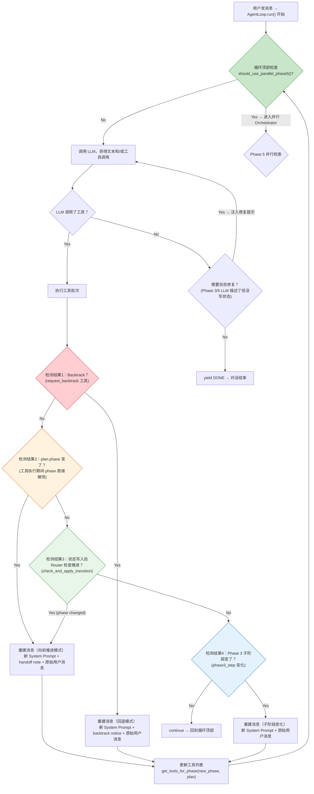
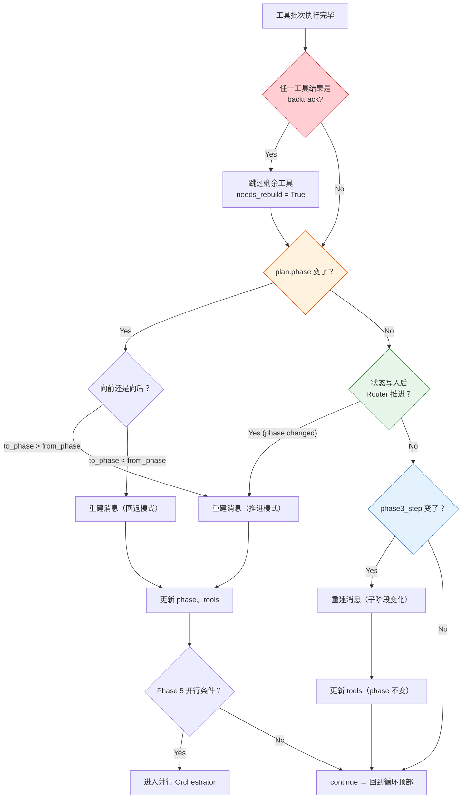
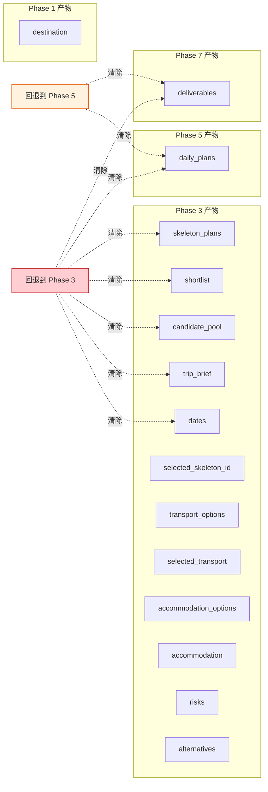
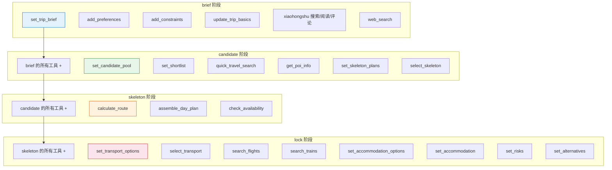
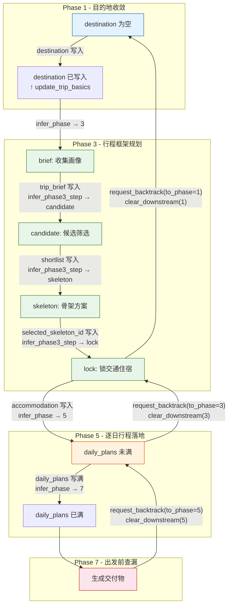

# Phase 转换机制详解

> 第二章：AgentLoop 中的阶段为什么会变？什么时候变？怎么变？
> 面向初学者，用伪代码 + 流程图 + 类比讲清楚。

---

## 一、先建立直觉：Phase 是什么？

整个旅行规划系统有 4 个阶段（Phase），就像办手续的 4 个窗口：

| Phase | 名称 | 干什么 | 关键产出 |
|-------|------|--------|----------|
| 1 | 目的地收敛 | 用户说"我想出去玩" → 帮用户确定去哪 | `destination` |
| 3 | 行程框架规划 | 确定画像、选候选、定骨架、锁交通住宿 | `trip_brief`、`skeleton_plans`、`accommodation` |
| 5 | 逐日行程落地 | 把骨架展开为每天的详细时间表 | `daily_plans` |
| 7 | 出发前查漏 | 做清单、查天气、生成交付物 | `deliverables` |

**注意：没有 Phase 2 和 Phase 4**（历史原因合并掉了），只有 1、3、5、7 四个合法值。

每个 Phase 有自己的 Prompt（角色说明、规则、工具契约）和自己的工具列表。
Phase 变了，LLM 拿到的指令和工具就全换了——就像换了一个窗口，办事员和表格都换了。

---

## 二、宏观流程：一次对话循环中的阶段转换检测



---

## 三、四种阶段转换检测，一个一个讲

### 3.1 检测1：Backtrack（用户主动回退）

**场景**：用户在 Phase 5 说了"我不满意行程，想回到骨架选择阶段"

LLM 调用 `request_backtrack(to_phase=3, reason="用户想重选骨架")`，这个工具的执行结果长这样：

```python
{"backtracked": True, "from_phase": 5, "to_phase": 3, "reason": "用户想重选骨架"}
```

**在 loop.py 里怎么检测的？**

```python
def _is_backtrack_result(self, result: ToolResult) -> bool:
    return (
        result.status == "success"
        and isinstance(result.data, dict)
        and bool(result.data.get("backtracked"))  # ← 关键：看 backtracked 标记
    )
```

**检测到 backtrack 后做什么？**

```python
# 跳过当前批次中剩余的所有工具调用（它们已经没意义了）
for skipped_tc in tool_calls[idx + 1:]:
    yield LLMChunk(type=TOOL_RESULT, tool_result=skipped_result)

# 标记需要重建消息
needs_rebuild = True
rebuild_result = result  # 保存 backtrack 的结果，用来生成回退通知
```

**为什么跳过剩余工具？**
比如 LLM 同时调了 `request_backtrack` 和 `save_day_plan`，回退意味着整个 Phase 5 的产物都要清掉，
再执行 `save_day_plan` 就没有意义了。

### 3.2 检测2：plan.phase 在工具执行期间被直接修改

**场景**：`request_backtrack` 工具的内部逻辑不仅返回了 `backtracked` 标记，
还直接修改了 `plan.phase`（通过 `BacktrackService.execute()`）：

```python
# BacktrackService.execute()
plan.backtrack_history.append(BacktrackEvent(...))
plan.clear_downstream(from_phase=to_phase)  # 清除下游产物
plan.phase = to_phase                         # 直接改了！
```

所以在工具执行完之后，`plan.phase` 可能已经变了：

```python
phase_before_batch = self.plan.phase  # 比如 5
# ... 工具执行 ...
phase_after_batch = self.plan.phase   # 比如 3（被 backtrack 改了）

if phase_after_batch != phase_before_batch:
    # 阶段变了！重建消息
```

**注意**：这个检测和检测1(backtrack)是**同一次事件的两面**——
backtrack 工具既返回了 `backtracked` 标记，又直接修改了 `plan.phase`。
但代码处理时是两条独立路径：

| 路径 | 触发条件 | 做了什么 | 消息重建模式 |
|------|---------|---------|------------|
| 检测1 (backtrack) | `result.data.get("backtracked")` | 跳过剩余工具 | **回退模式**（backtrack notice） |
| 检测2 (phase changed) | `plan.phase 变了` | 重建消息 | 看方向：**回退**用notice，**推进**用handoff |

实际上 backtrack 会先走检测1，设 `needs_rebuild=True`，然后在检测2 的位置再次确认 phase 变了。
但由于检测1 已经 `break` 退出工具循环了，检测2 不会再单独触发——
它们在后续的重建逻辑里合流了。

### 3.3 检测3：状态写入后 Router 检查推进（最常见的场景）

**场景**：Phase 3 中，LLM 调用了 `set_accommodation(area="新宿")`，
写入了住宿信息。此时所有 Phase 3 完成条件都满足了，
Router 检查后自动把 phase 从 3 推进到 5。

**这是最重要的转换路径，占了 90% 以上的阶段切换。**

流程：

```python
# 工具执行完成后
saw_state_update = False
for tc, result in tool_results:
    if tc.name in PLAN_WRITER_TOOL_NAMES and result.status == "success":
        saw_state_update = True  # ← 标记：有状态写入了

# 循环末尾：如果写了状态，让 Router 检查是否该推进了
if saw_state_update and self.phase_router is not None:
    phase_changed = await self.phase_router.check_and_apply_transition(plan)
    if phase_changed:
        # 阶段变了！重建消息
```

**Router 的 `check_and_apply_transition` 内部做了什么？**

```python
async def check_and_apply_transition(self, plan, hooks=None) -> bool:
    # 1. 推断当前应该处于哪个阶段
    inferred = self.infer_phase(plan)
    
    # 2. 如果推断结果 == 当前阶段，不需要变
    if inferred == plan.phase:
        return False
    
    # 3. 如果有 hooks gate，先征求许可
    if hooks:
        gate_result = await hooks.run_gate("before_phase_transition", ...)
        if not gate_result.allowed:
            return False  # gate 说不许推进
    
    # 4. 推进！修改 plan.phase
    plan.phase = inferred
    self.sync_phase_state(plan)  # 同步子阶段
    return True
```

**`infer_phase` 的推断逻辑 — 最核心的规则：**

```python
def infer_phase(self, plan) -> int:
    # 同步子阶段和 trip_brief
    self.sync_phase_state(plan)
    
    if not plan.destination:
        return 1  # 没有目的地 → Phase 1
    
    if not plan.dates or not plan.selected_skeleton_id or not plan.accommodation:
        return 3  # 缺少关键前置条件 → Phase 3
    
    if not self._skeleton_days_match(plan):
        return 3  # 骨架天数和出行天数不一致 → 回到 Phase 3
    
    if len(plan.daily_plans) < plan.dates.total_days:
        return 5  # 行程没填满 → Phase 5
    
    return 7  # 全部满足 → Phase 7
```

**类比：想象一个安检门**

```
没带护照（destination）     → 挡在门口 → Phase 1
有护照但少签证（dates/skeleton/accommodation） → 补办区 → Phase 3
签证齐全但行李没装完（daily_plans 不满） → 打包区 → Phase 5
行李装完 → 登机区 → Phase 7
```

每个条件是一道门，只有全部通过才进下一道。**阶段推进是被状态驱动的，不是 LLM 主动说"我要到下一个阶段"。**

### 3.4 检测4：Phase 3 子阶段变化

Phase 3 内部有 4 个子阶段：

```
brief → candidate → skeleton → lock
```

子阶段的推进也由状态驱动（`infer_phase3_step_from_state`）：

```python
def infer_phase3_step_from_state(*, phase, dates, trip_brief, 
                                  candidate_pool, shortlist,
                                  skeleton_plans, selected_skeleton_id, 
                                  accommodation) -> str:
    if phase < 3: return "brief"
    if phase > 3: return "lock"
    
    # Phase 3 内部的推断
    if not dates or not trip_brief:
        return "brief"        # 还没画像 → brief
    
    if not selected_skeleton_id:
        if skeleton_plans:
            return "skeleton"    # 有骨架 → skeleton
        if shortlist or candidate_pool:
            return "candidate"  # 有候选 → candidate
        return "candidate"      # 默认 → candidate
    
    if not accommodation:
        return "lock"           # 有骨架但没住宿 → lock
    
    return "lock"               # 全部满足 → lock
```

子阶段变化时的处理：**只重建 system message，不改主阶段号**：

```python
phase3_step_after = getattr(plan, "phase3_step", None)
if phase3_step_after != phase3_step_before:
    # 重建 system message（新子阶段 Prompt）
    messages[:] = await self._rebuild_messages_for_phase3_step_change(...)
    # 更新工具列表（不同子阶段可用工具不同）
    tools = self.tool_engine.get_tools_for_phase(current_phase, self.plan)
    # 不发送 PHASE_TRANSITION 事件，不重建 handoff note
    # 因为主阶段没变，只是子阶段推进了
```

---

## 四、消息重建：阶段切换后发生了什么？

不管是哪种检测触发的阶段变化，最终都要**重建对话消息**。

### 4.1 为什么要重建？

因为 LLM 的对话历史还是旧阶段的——system message 是 Phase 3 的 Prompt，
工具列表里还有 Phase 3 的工具。现在 phase 变了，如果不重建：
- LLM 还会按 Phase 3 的规则回答
- LLM 还在调用 Phase 3 的工具
- LLM 看不到新阶段的上下文

**类比**：你从窗口 A（办签证）换到了窗口 B（登机），但办事员手里还拿着签证窗口的表格。

### 4.2 重建做了什么？

```python
async def _rebuild_messages_for_phase_change(
    self, messages, from_phase, to_phase, original_user_message, result
) -> list[Message]:
    
    # 1. 根据新 phase 生成新的 Prompt
    phase_prompt = self.phase_router.get_prompt_for_plan(self.plan)
    # Phase 3 → build_phase3_prompt(plan.phase3_step)
    # 其他 → PHASE_PROMPTS[plan.phase] + GLOBAL_RED_FLAGS
    
    # 2. 生成记忆上下文
    memory_context = await self.memory_mgr.generate_context(self.user_id, self.plan)
    
    # 3. 构建新的 system message
    new_system = self.context_manager.build_system_message(
        self.plan,
        phase_prompt,
        memory_context,
        available_tools=self._current_tool_names(to_phase),
    )
    # system message 包含：
    #   - soul.md（人格）
    #   - 当前时间
    #   - 工具使用硬规则
    #   - 新阶段的 Prompt
    #   - 当前规划状态（新阶段的状态）
    #   - 相关用户记忆
    
    rebuilt = [new_system]
    
    # 4. 根据推进方向，加不同的过渡信息
    if to_phase < from_phase:
        # 向后回退 → 加 SYSTEM 角色的回退通知
        rebuilt.append(Message(
            role=Role.SYSTEM,
            content=self._build_backtrack_notice(from_phase, to_phase, result),
        ))
    else:
        # 向前推进 → 加 ASSISTANT 角色的交接说明
        rebuilt.append(Message(
            role=Role.ASSISTANT,
            content=self.context_manager.build_phase_handoff_note(
                plan=self.plan, from_phase=from_phase, to_phase=to_phase,
            ),
        ))
    
    # 5. 保留原始用户消息
    rebuilt.append(self._copy_message(original_user_message))
    
    return rebuilt
```

### 4.3 交接说明（handoff note）长什么样？

```python
def build_phase_handoff_note(self, plan, from_phase, to_phase):
    # Phase 3 → 5 的交接说明示例：
    """
    [阶段交接]
    当前阶段：Phase 5（逐日行程落地）。
    已完成事项：目的地、日期、旅行画像、候选筛选、已选骨架、住宿均已确认。
    当前唯一目标：基于已选骨架与住宿，生成覆盖全部出行日期的 daily_plans。
    禁止重复：不要重新锁交通、不要重新锁住宿、不要重选骨架；
    若前置状态不足或骨架不可执行，调用 request_backtrack(to_phase=3, reason="...")。
    开场白协议：进入新阶段后的第一次回复，必须先用 1-2 句自然、温和的中文承上启下——
    向用户简要回顾刚刚一起完成了哪些关键决定，再说明接下来这一步要帮 TA 完成什么；
    然后再进入工具调用或结构化产出。
    """
```

### 4.4 回退通知（backtrack notice）长什么样？

```python
def _build_backtrack_notice(self, from_phase, to_phase, result):
    # Phase 5 → 3 的回退通知示例：
    """
    [阶段回退]
    用户从 phase 5 回退到 phase 3，原因：用户想重选骨架
    """
```

### 4.5 消息重建前后的对比

```
重建前（Phase 3 对话历史）：
┌─────────────────────────────┐
│ System: Phase 3 lock Prompt │  ← 旧阶段的 Prompt
│ User: "我选轻松版"          │
│ Assistant: [调用了工具]      │
│ Tool: set_accommodation 结果 │
│ System: [状态修复提醒]        │
│ Assistant: "好的，已确认..."  │
│ User: "继续"                │
└─────────────────────────────┘

重建后（Phase 5 对话历史）：
┌─────────────────────────────┐
│ System: Phase 5 Prompt      │  ← 新阶段的 Prompt + 新状态
│ Assistant: [阶段交接说明]     │  ← "Phase 5 逐日行程落地，已完成..."
│ User: "继续"                │  ← 保留原始用户消息
└─────────────────────────────┘
```

**关键点：重建后只有 3 条消息**——旧的对话历史全部丢弃。
这是因为新阶段的 LLM 不需要也不应该看到旧阶段的对话细节，
它只需要知道"现在在哪、目标是什么、用户刚才说了什么"。

---

## 五、四种检测的优先级和关系



**四种检测的触发顺序**（在代码执行路径上的顺序）：

| 顺序 | 检测 | 触发时机 | 代码位置 |
|------|------|---------|---------|
| 1 | Backtrack | 工具批次执行中，逐个检查结果 | loop.py 工具循环内 |
| 2 | plan.phase 变化 | 工具批次执行完毕后，对比前后 phase | loop.py 工具循环后 |
| 3 | Router 推进 | saw_state_update=True 时，让 Router 检查 | loop.py 循环末尾 |
| 4 | 子阶段变化 | 对比 phase3_step 前后值 | loop.py 循环末尾 |

**注意**：检测1 和检测2 可能被同一次 backtrack 事件同时触发，
但检测1 先处理（因为它在工具循环内部，且会 `break` 退出循环），
检测2 在后续的检查中再次确认 phase 变化。

---

## 六、BacktrackService：回退时清了什么？

当用户从 Phase 5 回退到 Phase 3 时，Phase 5 和 Phase 7 的产物需要清除：

```python
_PHASE_DOWNSTREAM = {
    1: ["destination", "dates", "trip_brief", ...一堆字段],  # 回退到Phase1：清除几乎所有东西
    3: ["dates", "trip_brief", "skeleton_plans", ...一堆字段], # 回退到Phase3：清除日期之后的
    5: ["daily_plans", "deliverables"],                        # 回退到Phase5：只清行程和交付物
}

def clear_downstream(self, from_phase):
    # 回退到 Phase 3：清除 Phase 3 及之后的所有产物
    for phase in sorted(_PHASE_DOWNSTREAM):
        if phase >= from_phase:
            for attr in _PHASE_DOWNSTREAM[phase]:
                setattr(self, field_default_value)  # 恢复为默认值
```



---

## 七、工具列表的动态变化

阶段变化后，LLM 拿到的工具列表也会变。

### 7.1 工具的阶段标注

每个工具在注册时声明自己属于哪些阶段（`phases`）和操作类型（`side_effect`）：

```python
@tool(
    name="set_accommodation",
    description="设置住宿",
    phases=[3, 5],           # Phase 3 和 5 可用
    side_effect="write",     # 写工具
)
```

### 7.2 Phase 3 的子阶段工具过滤

Phase 3 比较特殊，它的 4 个子阶段有不同的工具权限：



**设计逻辑**：
- `brief` 阶段只需要画像和基础搜索工具
- `candidate` 阶段需要候选池和筛选工具
- `skeleton` 阶段需要路线计算和可用性检查
- `lock` 阶段需要交通和住宿搜索工具

LLM 在 `brief` 阶段调用 `search_flights` 会被过滤掉——工具列表里根本没有它。

### 7.3 工具过滤的实际代码

```python
def get_tools_for_phase(self, phase, plan=None):
    # 第一步：按 phass 属性粗过滤
    # 只有 phases 列表包含当前 phase 的工具才保留
    
    # 第二步（仅 Phase 3）：按子阶段细过滤
    if phase == 3 and plan is not None:
        allowed_names = self._phase3_tool_names(plan.phase3_step)
        # 只保留 allowed_names 中的内置工具 + 非内置工具（如 generate_summary）
    
    return [t.to_schema() for t in filtered_tools]
```

---

## 八、完整伪代码：一次循环中的阶段转换检测

```python
async def run(self, messages, phase):
    for iteration in range(self.max_retries):
        
        # ━━━━━━━━━━━━━━━ 循环顶部检查 ━━━━━━━━━━━━━━━
        if self.should_use_parallel_phase5(self.plan, self.config):
            yield 进入并行 Orchestrator
            return
        
        # 记录当前阶段号（用于后续比较）
        phase_before_batch = self.plan.phase
        phase3_step_before = self.plan.phase3_step
        saw_state_update = False
        
        # ━━━━━━━━━━━━━━━ 调用 LLM ━━━━━━━━━━━━━━━
        llm_response = await llm.chat(messages, tools=current_tools, stream=True)
        
        if 没有工具调用:
            # 检查是否需要状态修复
            repair_msg = 检查状态修复(phase, llm_text)
            if repair_msg:
                messages.append(repair_msg)
                continue  # 回到循环顶部
            yield DONE
            return
        
        # ━━━━━━━━━━━━━━━ 执行工具 ━━━━━━━━━━━━━━━
        # 批量执行只读工具，顺序执行写工具
        for each tool_call in tool_calls:
            result = await tool_engine.execute(tool_call)
            
            # ━━━ 检测1：Backtrack ━━━
            if result 包含 backtracked=True:
                # 跳过剩余工具
                needs_rebuild = True
                rebuild_result = result
                break  # 退出工具循环
        
        # ━━━━━━━━━━━━━━━ 检测2：phase 被 backtrack 直接修改 ━━━━━━━━━━━━━━━
        if needs_rebuild:
            # 检测1 的 backtrack 导致的重建
            yield PHASE_TRANSITION(from=phase_before, to=plan.phase, reason="backtrack")
            messages[:] = await rebuild_messages(
                from=phase_before, 
                to=plan.phase, 
                mode="backtrack",
                result=rebuild_result,
            )
            current_phase = plan.phase
            tools = get_tools_for_phase(current_phase, plan)
            continue  # 回到循环顶部
        
        # ━━━━━━━━━━━━━━━ 检测2：plan.phase 在工具执行期间变了 ━━━━━━━━━━━━━━━
        phase_after_batch = plan.phase
        if phase_after_batch != phase_before_batch:
            # 这是"工具直接修改了 phase"的情况
            # 比如 request_backtrack 既改了 phase 又返回了 backtracked
            # 也可能是未来的其他工具直接修改了 phase
            yield PHASE_TRANSITION(from=phase_before, to=phase_after_batch, reason="plan_tool_direct")
            messages[:] = await rebuild_messages(
                from=phase_before,
                to=phase_after_batch,
                mode="forward" if phase_after_batch > phase_before_batch else "backtrack",
            )
            current_phase = phase_after_batch
            tools = get_tools_for_phase(current_phase, plan)
            continue  # 回到循环顶部
        
        # ━━━━━━━━━━━━━━━ 检测3：Router 推进 ━━━━━━━━━━━━━━━
        if saw_state_update and self.phase_router is not None:
            phase_changed = await self.phase_router.check_and_apply_transition(plan)
            if phase_changed:
                yield PHASE_TRANSITION(from=phase_before, to=plan.phase, reason="check_and_apply_transition")
                messages[:] = await rebuild_messages(
                    from=phase_before,
                    to=plan.phase,
                    mode="forward",
                )
                current_phase = plan.phase
                tools = get_tools_for_phase(current_phase, plan)
                continue  # 回到循环顶部
        
        # ━━━━━━━━━━━━━━━ 检测4：Phase 3 子阶段变化 ━━━━━━━━━━━━━━━
        phase3_step_after = plan.phase3_step
        if phase3_step_after != phase3_step_before:
            messages[:] = await rebuild_messages_for_phase3_step_change(...)
            tools = get_tools_for_phase(current_phase, plan)
            # 注意：不 continue，不重建 handover note，
            # 因为子阶段变化不需要重置整个对话
        
        # 继续循环（LLM 会看到工具结果并决定下一步）
    
    # ━━━━━━━━━━━━━━━ 循环后兜底 ━━━━━━━━━━━━━━━
    if self.should_use_parallel_phase5(plan, config):
        yield 进入并行 Orchestrator
        return
    
    # 安全限制
    yield "[达到最大循环次数，请重新发送消息]"
    yield DONE
```

---

## 九、一个完整的例子：从 Phase 3 到 Phase 5

以下是一次真实的阶段转换过程，从用户确认住宿开始：

```
时间线：

T0: 用户说"就选新宿的酒店吧"
    │
T1: AgentLoop 开始第 N 轮对话
    │  plan.phase = 3, plan.phase3_step = "lock"
    │  LLM 拿到 Phase 3 lock 的 Prompt 和工具列表
    │
T2: LLM 调用 set_accommodation(area="新宿", hotel="ホテルA")
    │  ┌─ tool_engine.execute(set_accommodation)
    │  │   plan.accommodation = Accommodation(area="新宿", hotel="ホテルA")
    │  │   result.status = "success"
    │  │   result.data = {"updated_field": "accommodation", "accommodation": {...}}
    │  └─
    │
T3: 检测 saw_state_update = True
    │  (因为 set_accommodation 在 PLAN_WRITER_TOOL_NAMES 里)
    │
T4: 调用 phase_router.check_and_apply_transition(plan)
    │
    │  Router 内部：
    │  ┌─ infer_phase(plan):
    │  │   destination 存在？ ✓
    │  │   dates 存在？ ✓
    │  │   selected_skeleton_id 存在？ ✓
    │  │   accommodation 存在？ ✓  ← 刚刚被写入
    │  │   skeleton_days_match？ ✓
    │  │   daily_plans 满了？ 没有（空的）
    │  │   → 返回 5
    │  │
    │  │  inferred (5) != plan.phase (3)
    │  │  → plan.phase = 5
    │  │  → sync_phase_state: plan.phase3_step = "lock"
    │  │  → return True
    │  └─
    │
T5: phase_changed = True
    │
T6: yield PHASE_TRANSITION(from=3, to=5, reason="check_and_apply_transition")
    │
T7: 重建消息
    │  ┌─ get_prompt_for_plan(plan) → PHASE5_PROMPT + GLOBAL_RED_FLAGS
    │  │  build_system_message(plan, PHASE5_PROMPT, memory_context) → 新 system message
    │  │  build_phase_handoff_note(plan, from=3, to=5) → "[阶段交接] Phase 5 逐日行程落地..."
    │  │  保留原始用户消息
    │  └─
    │
T8: 更新 phase 和 tools
    │  current_phase = 5
    │  tools = get_tools_for_phase(5, plan) → Phase 5 工具列表
    │
T9: 继续循环（回到顶部）
    │
T10: should_use_parallel_phase5() → True！
    │  plan.phase == 5 ✓
    │  config.enabled ✓
    │  daily_plans 为空 ✓
    │  selected_skeleton_id 存在 ✓
    │  skeleton_plans 存在 ✓
    │
T11: 进入并行 Orchestrator
    │  yield 一堆进度事件
    │  yield 汇总文本
    │  yield DONE
    │
T12: AgentLoop.run() return → SSE 流结束 → 前端显示结果
```

---

## 十、一张总图：阶段转换的所有路径



---

## 十一、总结：5 个关键心智模型

### 心智模型1：阶段转换是状态驱动的，不是 LLM 驱动的

LLM 不会说"我要到 Phase 5 了"。它只是调用工具写入状态（`set_accommodation`）。
是 Router 读取状态后推断"条件满足了，应该到 Phase 5"，并修改 `plan.phase`。

### 心智模型2：阶段变化后，对话历史会被重建

不是在旧对话后面追加新 Prompt，而是**丢弃旧对话，只保留3条消息**：
1. 新阶段的 system message（新 Prompt + 新状态）
2. 过渡信息（handoff note 或 backtrack notice）
3. 用户的原始消息

### 心智模型3：stage 3 的子阶段是同一个机制的特殊情况

Phase 3 内部有 4 个子阶段（brief → candidate → skeleton → lock），
它们不改变主阶段号，只改变 Prompt 和工具列表。
子阶段变化时只重建 system message，不重建 handoff note。

### 心智模型4：backtrack 是一个"双重动作"

`request_backtrack` 工具做了两件事：
1. 返回 `{"backtracked": True}` 标记 → 触发检测1（跳过剩余工具）
2. 通过 `BacktrackService.execute()` 直接修改 `plan.phase` → 触发检测2（phase 变了）

加上 `clear_downstream()` 清除下游产物，这是回退的"三重保险"。

### 心智模型5：阶段转换后的第一次检查是 Phase 5 并行

循环顶部的 `should_use_parallel_phase5()` 检查确保：
无论阶段是怎么变成 5 的（Router 推进、backtrack 后推进、用户主动），
只要满足并行条件，都立刻进入 Orchestrator-Workers 模式。
这是整个系统的"安全网"——确保 Phase 5 不会意外跳过并行。