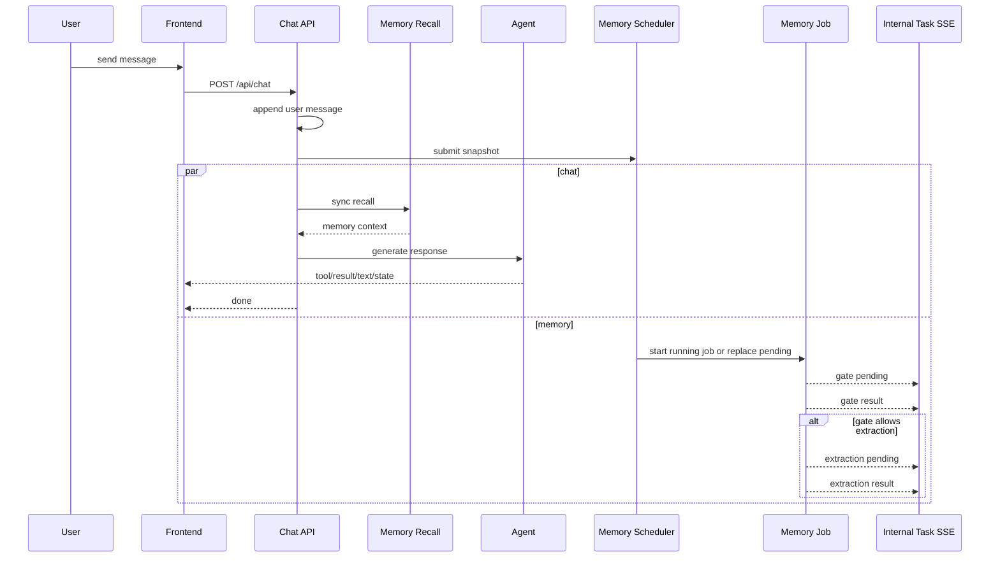

# Memory Async Extraction Design

## Goal

将记忆提取从“assistant 回复后、占用当前 chat SSE 尾部”的同步尾处理，改为“用户消息一进入 chat 就异步后台启动”的 session 级后台任务系统，同时支持：

- `memory_recall` 继续在主回复前同步执行
- `memory_extraction_gate` 与 `memory_extraction` 不再阻塞 assistant 收口
- 连续多条用户消息使用 `coalescing queue` 合并，而不是普通 FIFO
- gate 与 extraction 都使用“有阈值的用户消息窗口”，不再吃完整 message history
- 前端通过独立任务流实时接收后台任务状态

## Constraints

- 当前旅行事实仍以 `TravelPlanState` 为权威来源，不能把 tool / assistant 全量上下文重新塞回 extraction。
- `memory_recall` 与后台写入解耦，本轮 recall 不需要读到本轮刚启动的 extraction 结果。
- 不引入多 worker；每个 session 最多一个运行中的 memory job。
- 保留现有 `InternalTask` UI 卡片语义，避免新增一套前端展示模型。

## Recommended Approach

### 1. Chat 与 Memory Job 解耦

`POST /api/chat/{session_id}` 在收到用户消息后做两件互不阻塞的事：

1. 把用户消息 append 到 `messages`
2. 立刻向 session 级 memory scheduler 提交一个 snapshot

然后主链路继续：

- 同步执行 `memory_recall`
- 启动 agent 回复
- 回复结束后立即发送 `done`

后台 memory job 的任何状态变化都不再依赖当前 chat SSE 尾部输出，而是通过独立的 internal task SSE 推给前端。

### 2. Session 级 Coalescing Queue

每个 session 维护一个 memory scheduler state：

- `running_job: asyncio.Task | None`
- `pending_snapshot: MemoryJobSnapshot | None`
- `last_consumed_user_count: int`
- `active_tasks: dict[str, InternalTask]`
- `subscribers: set[asyncio.Queue[str]]`

规则：

- 没有 `running_job` 时，新 snapshot 立刻启动 job
- 有 `running_job` 时，不追加 FIFO 队列，只覆盖 `pending_snapshot`
- `running_job` 结束后，如果存在 `pending_snapshot`，只启动最后一份最新 snapshot

这保证 memory job 不会在连续消息场景中无限堆积。

### 3. Gate 与 Extraction 的上下文窗口

#### Gate

用途：判断最近新增表达是否值得执行正式 extraction。

输入：

- 当前 snapshot 中最近最多 `3` 条用户消息
- 总字符数上限 `1200`
- 当前 `plan_facts`
- 精简 memory 摘要：
  - profile key 列表或 bucket 计数
  - 当前 session working memory 的摘要

Gate 不读取完整 history，不读取 assistant/tool 原始消息。

#### Extraction

用途：把“自上次消费成功/跳过以来”的新增用户表达写入 memory。

输入：

- `last_consumed_user_count` 之后新增的用户消息
- 最多 `8` 条
- 总字符数上限 `3000`
- 当前 `plan_facts`
- 完整 profile / 当前 session working memory（沿用现有 v3 schema）
- gate reason

消费规则：

- gate `skipped`：更新 `last_consumed_user_count`
- extraction `success`：更新 `last_consumed_user_count`
- gate / extraction `warning` 或 `error`：不更新 `last_consumed_user_count`，允许后续 job 重新覆盖处理

### 4. 独立 Internal Task Stream

新增只读 SSE：

- `GET /api/internal-tasks/{session_id}/stream`

作用：

- 实时推送 `memory_extraction_gate` / `memory_extraction` 的 pending/success/warning/error/skipped 生命周期
- 新连接建立时只回放当前仍 active 的 memory tasks，不回放历史已完成任务，避免页面刷新后重复堆积

数据协议继续复用：

```json
{"type":"internal_task","task":{...}}
```

不新增新的前端事件类型。

### 5. Frontend 合并策略

前端保留现有 `internal_task` 渲染逻辑，但拆成两条流：

- `chat stream`
- `memory task stream`

为了让后台任务在 chat 结束后还能正确更新原卡片，需要把 `internalTaskMessageIds` 从“单次 chat stream 的局部 state”提升为组件级 `ref`。

这样独立 memory SSE 到来时可以：

- 找到已有同 task id 的卡片并更新
- 如果不存在，就在消息列表末尾追加一个新的系统任务卡片

### 6. Why Not Full Message History

不使用完整 history 的原因：

- 成本高，直接放大 gate 和 extraction 延迟
- 容易把旧 trip state 与旧偏好反复提取
- 与 `coalescing queue` 的增量语义冲突
- assistant/tool 原始输出会增加当前 trip facts 被误写成 memory 的概率

## Data Flow



## Testing Strategy

后端重点覆盖：

- chat SSE 在 assistant 完成后不再等待 memory job
- internal task SSE 可以收到后台 gate / extraction 生命周期
- 连续两条消息时只保留最新 pending snapshot
- gate 只收到短窗口用户消息
- extraction 使用增量窗口，而不是完整消息历史

前端重点覆盖：

- chat 结束后，独立 memory SSE 仍能更新同一张 internal task 卡片
- 输入框在 chat `done` 后恢复，不再被后台 extraction 锁住

## Risks

- 需要明确 `last_consumed_user_count` 的推进规则，否则会出现反复重提取或漏提取。
- 独立 SSE 连接需要在 session 切换和组件卸载时正确清理，避免重复订阅。
- 如果 gate/extraction 非常慢，后台任务会落后于对话，但 `coalescing queue` 应能把堆积控制在 1 个 pending snapshot。
